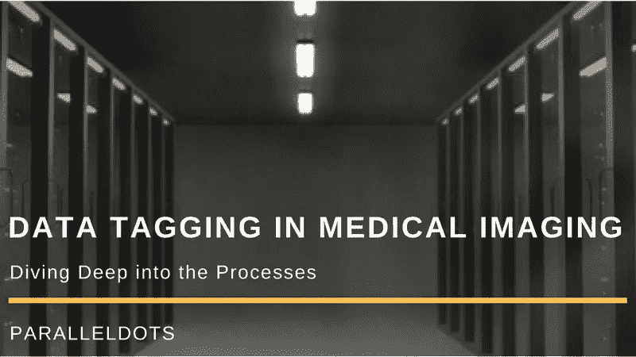

# 医学成像中的数据标记—深入研究流程

> 原文：<https://medium.com/hackernoon/data-tagging-in-medical-imaging-diving-deep-into-the-processes-67bee10f94ec>

*注意:这是医学成像数据标记系列的第二篇文章。你可以在这里找到第一帖***。**

**

*在本系列的上一篇文章《医学成像中的数据标记》中，我们概述了在扩展数据标记引擎时必须实施的流程。在这篇博客中，我们将彻底讨论如何提出这些过程，以及在最终确定和制定这些过程之前需要考虑的事情。我们将讨论这些过程是什么，以及它们如何影响数据标记过程。*

*首先，你需要一些资源来设置这些流程。要设置它们，您需要确保以下各项的可用性:*

*   *可以注释数据的医疗专业人员团队*
*   *数据注释软件，医疗专业人员将在其中注释数据*
*   *而且很明显…数据！*

*所以，让我们深入研究这些过程；它们是什么，它们在高效数据标记中的重要性和作用是什么。我们列出了三个主要过程。理想情况下，这是一个大型工作流程，旨在帮助您以更快、可扩展和准确的方式注释医疗数据集。*

*   *数据流*
*   *质量保证/质量控制*
*   *向数据科学家提供数据*

*让我们在下面详细讨论上述过程:*

*数据流*

*定义数据在不同阶段如何流经所有利益相关者是非常重要的。*

*   ***数据存储:**
    由于构建现实世界 AI 解决方案的数据需求巨大，你需要知道将在哪里存储万亿字节的数据。你可以使用一些冷存储设备，比如 Google Coldline、Google Nearline 和 Amazon Glacier 等，将它存储在云上。或者选择将其存储在本地— *然而，在您拥有强大的可扩展本地基础设施和完善的电源备份之前，我们建议您对所有数据流使用云。云为您提供了很大的灵活性，而且存储成本也不是很高。*在决定您的存储设施时，还应考虑其他因素，如您存储的数据量以及从存储中检索数据的次数等。值得注意的是，冷存储是用来存储非活动数据的，因此，它们极具成本效益。但是对于冷存储平台，数据检索的成本更高。因此，建议使用 NAS(网络附加存储)等设备在本地保存一定量的训练数据，这样可以更容易地检索少量数据。*

**

*   ***提供数据:**
    医学专家对提供给他们的数据进行注释。这些数据由您的软件开发团队开发的数据注释软件提供。所有要对数据进行注释的医疗专业人员都应该有适当的登录凭证，以获得更好的可视性和进度跟踪。在根据医疗专业人员的经验向他们提供数据时，有许多注意事项需要考虑。在我们的数据标记引擎中，基于定义的角色，高级放射科医师将拥有与初级放射科医师不同的权限。类似地，您还必须确保所有的涉众看到他们需要在软件中看到的信息。例如，关于受试者的非个人信息，如年龄段、性别、糖尿病等发病率。这为医疗专业人员提供了额外的信息。因此，允许他们准确地注释。*

*质量保证/质量控制*

*这可能是你工作流程中最重要的过程。本练习的全部目的是创建一个可用于训练机器的数据集。您创建的模型仅与训练数据集一样准确。以下是您可以在工作流程中创建强大的 QA/QC 层的方法。*

*   ***注释验证:** 每一个标签都需要由具有不同权限级别的医学专家进行彻底验证。这种双重验证确保了带注释的数据集中较低的错误率。*
*   ***对医疗专业人员的反馈:**
    持续监控医疗专业人员的表现并随后向他们提供反馈至关重要。可能会发生这样的情况，一些医学专家非常擅长注释 NCCT 头，但不擅长注释 MRI 头。这些事情需要学习，然后据此采取行动。*

*向数据科学家提供带注释的数据:*

*这是最后一层——这一层很容易出现沟通失误。注释所有医疗数据的全部目的是将数据提供给数据科学团队，以便他们构建模型。数据科学团队总是在进行大量实验，他们需要不同数量的数据。在所有实验之间，数据科学家很容易迷失在来自标记引擎的带注释的数据流中。这使得数据流日志的维护变得非常重要。*

*在这篇博客中，我们讨论了设置一个可伸缩的标签引擎的初始要求和涉及的核心过程。数据流、QA/QC 和医疗专业人员培训等流程对于部署智能标记引擎至关重要。为实现这一目标，正确制定上述流程至关重要。*

*在本系列的下一篇博客中，我们将讨论数据标记功能最重要的方面，质量控制。你可以在这里找到这个系列[的第一篇博客。更多信息请查看此空间。](http://blog.paralleldots.com/healthcare/data-tagging-medical-imaging-overview/)*

*[parallel dots AI API](https://www.paralleldots.com/)，是由 [ParallelDots Inc](https://paralleldots.xyz/) 提供的深度学习支持的 web 服务，可以理解大量的非结构化文本和视觉内容，为您的产品提供支持。您可以查看我们的一些[文本分析 API](https://www.paralleldots.com/text-analysis-apis)并通过填写此处的表格[联系我们，或者在 apis@paralleldots.com 给我们写信。](https://www.paralleldots.com/contact-us)*