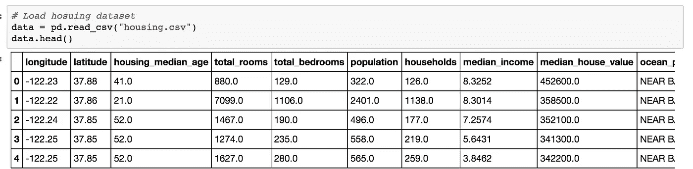
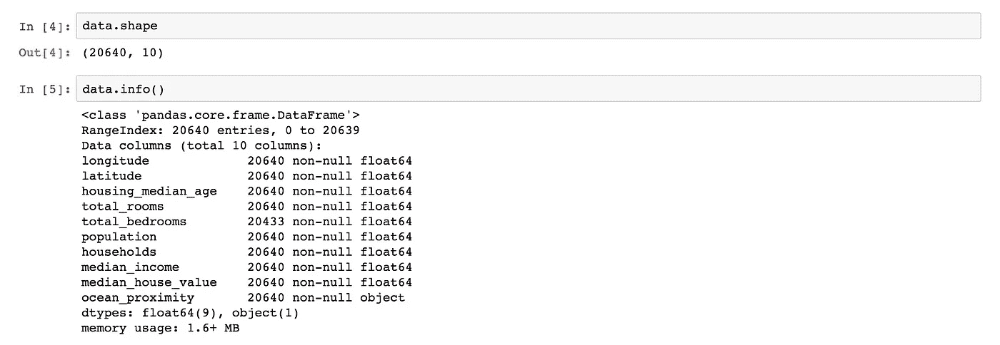
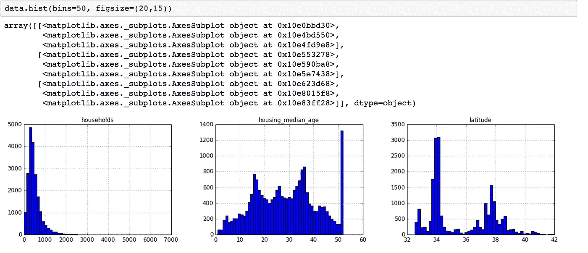
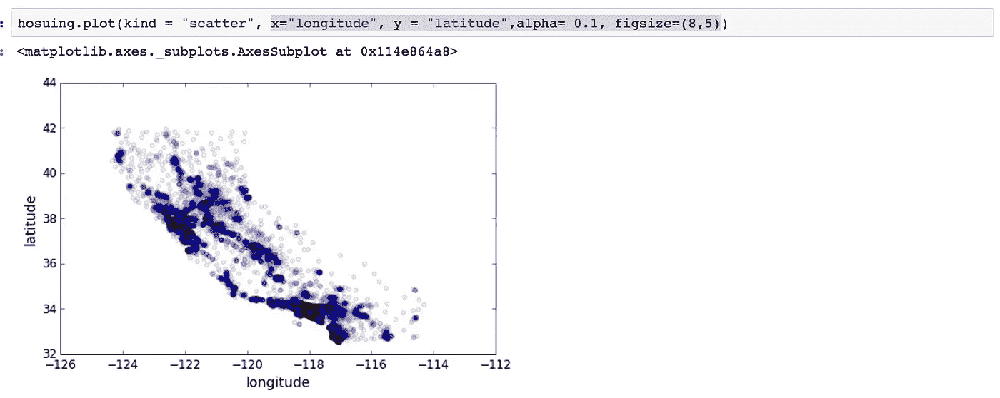

# 探索性分析第一部分

> 原文：<https://medium.com/hackernoon/data-visualisation-using-matplotlib-6383381eac2>

我一直觉得讲述数据故事是数据科学家生活中非常重要的一部分。无论何时，我们都必须讲述数据故事，我们需要数据可视化工具来探索数据。在市场中，我们有大量的工具来可视化数据。今天我们要去探索 python 的熊猫和 Matplotlib 库。

数据集=加州住房数据集

**使用熊猫加载数据集**

在加载数据之前，我们需要导入所有的库。我们将在数据[探索](https://hackernoon.com/tagged/exploration)中使用。

在熊猫库(housing.csv)中加载住房数据集之后。我们可以使用 data.head()看到前五条记录

如果我们使用 function (data.shape ),那么我们将计算出数据集中有多少行和列。在我们的数据集中，我们有 20640 行和 10 列，在加载数据集后，我们可以研究熊猫数量函数来找出列中缺少的值。这是官方熊猫各种活动的链接([http://pandas.pydata.org/pandas-docs/stable/](http://pandas.pydata.org/pandas-docs/stable/))

为了查看数据的偏斜度，我们使用直方图来查看数据的分布。

在绘制了每一列的直方图之后，我们将会知道数据的异常值和总体分布。在上图中，住户向右倾斜。

**散点图:**

我们将在经度和纬度之间绘制散点图，以查看加州地图。阿尔法参数用于找出地图中更密集的部分。

在第 2 部分中，我们将使用更多的 matplotlib 函数，并更多地探索数据以找出见解，并将在提供给机器学习算法之前创建新的功能。

请继续收听第 2 部分

参考:

书:用 scikitlearn 和张量流实践机器学习