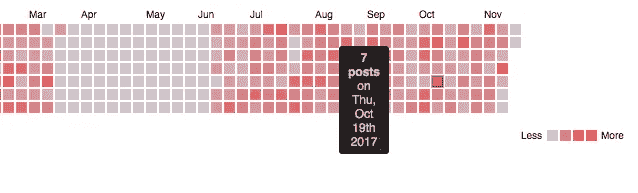

# 数据可视化—实验 2

> 原文：<https://medium.com/hackernoon/data-visualization-experiment-2-1809f9a05ad4>

好吧。第二轮。战斗！

所以，最后一次，我无意中发现，我的大多数帖子都是在一天中的什么时候发布的。这一次，我再次意外地得到了与我计划的不同的结果——我想我最终会得到这个结果，但是现在，我的目标是获得一个我每天发布的帖子数量的度量，从而看看我是否能找出一周中哪一天是最多的(最少的？)有成效。当然，这离我的最终目标还有一步之遥(希望实验 3 能解决这个问题)。让我们来看看方法论——

***第一步——我如何获取数据？***

还记得我上次是如何下载我的全部数据并用 scrapy 在网上搜集的吗？好吧，这次我使用 API 来获取数据，因为对于更高层次的特定性，有时仅仅 HTML 抓取是不够的。从前面的例子中可以很容易地获取时间戳，但是这里我需要很难从下载的 Data.zip 文件中获取的日期值。因此，这些数据将包括我从 2008 年加入 FB 到 11 月 23 日的所有帖子，直到我检索我的帖子细节。

a)获取您的用户访问令牌—
我确信有一种 OAuth API 方法可以做到这一点，但我是通过从 Graph API explorer 或访问令牌工具手动生成访问令牌来做到这一点的。前者允许您选择对访问令牌的权限，以及可以打开令牌的 API，还允许您查看令牌的到期时间(从创建之时算起大约一个小时)。这才是烦人的地方。除了安全性之外，我真的很喜欢访问令牌有更长的过期时间，但是我确信一旦我找到了生成访问令牌的 API，我就可以让我的脚本——见下文——在每次遇到 401 时自动获取它)

b)获取必要的 API—
鉴于我的 pivot 的性质，只需要 feed API 就可以完成这项工作。但是在我的下一篇博文中，我将使用 reactions API 的结果，所以这也是我最后在这里使用的，与 feed API 结合使用。

典型的 feed API 调用如下所示—
[https://graph.facebook.com/v2.5/10152460834423273/feed?limit = 25&access _ token = eaacedeose 0 cbani6 uzbb 77 zeueopknhxyzauljozw 2 uq 18 bniw 18 qp 1 zxsuh 6 ozc 0 gon p3b 5 zczabqdqwxkg 9 rcvdleay 0 bvcizcza 46 tmgyog 60 rzbdnwfpzaavvmhmkgn 90 rlmaejwokk 1 ebydwxza u 16 ozcmocf 1 bpclkk 3 e 4 kugudmmv 11 zbphzaobyfugybgzd【中](https://graph.facebook.com/v2.5/10152460834423273/feed?limit=25&access_token=EAACEdEose0cBANI6UZBB77zEUEOpKNhxyZAuLJozw2uQ18bNIW18Qp1zxSUh6OZC0gONp3B5ZCZCZABqdqWxkg9rcvdleay0BVciZCZA46TMkYog60RZBdnwfpZAaVVMhMKgN90RLMAeJWoKk1eBydwXZAU16oZCmoCF1BpCLKK3e4kUGudMHMV11ZBPHZAobYwFUgybgZD)

*   版本号很重要，因为有些 API 是依赖于版本的。例如，reactions API 需要 v2.6 或更高版本。
*   第二个 URI 参数是用户 ID，也可以从 Graph API explorer 中获得。
*   第三个参数 limit 是可选的，因为默认值是 25。如果您想要指定更高的值，例如每页获取更多的结果，您可以包括它。
*   第四个参数是在步骤(a)中获得的访问令牌本身
*   第五个参数“直到”是用词不当。它实际上指示了当您想要获取#limit 帖子时的起始日期时间对象。

该 API 的响应形式如下:

> {
> " data ":[
> { " message ":" FB _ Post body _ 1 "
> " created _ time ":" 2017–11–27t 12:47:50+0000 "
> " id ":" 1012460834423273 _ 10156427233338273 " }，
> { " message ":" FB _ Post body _ 2 "【T10
> 。
> 25 个条目】、
> “分页”:{
> “上一个”:“长讨厌的 link1”、
> “下一个”:“长讨厌的 link 2”}
> }

我认为，如果您可以自己找出该页面上最后一篇文章的日期，将其转换为纪元时间，并在上面提到的“until”参数中使用该值，那么看似有用的“next”链接就没有必要了。

还有，在回复里是一个不显眼的小“ **id** ”。这个小怪物实际上是你的*用户 id* 和帖子的 *id* 本身的合并，产生了另一个唯一的 *id* 。这是在 Reactions API 中使用的 *id* ,它导致获得该帖子的所有反应，这些反应被枚举为

> {“喜欢”、“生气”、“哇”、“哈哈”、“喜欢”}

一个典型的反应 API 是这样的——

[https://graph . Facebook . com/v 2.6/10152460834423273 _ 10156395770753273/reactions？limit = 25&access _ token = eaacedeose 0 cbani6 uzbb 77 zeueopknhxyzauljozw 2 uq 18 bniw 18 qp 1 zxsuh 6 ozc 0 gon p3b 5 zczabqdqwxkg 9 rcvdleay 0 bvcizcza 46 tmgyog 60 rzbdnwfpzaavvmhmkgn 90 rlmaejwokk 1 ebydwxza u 16 ozcmocf 1 bpclkk 3 e 4 kugudmmv 11 zbphzaobyfugybgzd【中](https://graph.facebook.com/v2.6/10152460834423273_10156395770753273/reactions?limit=25&access_token=EAACEdEose0cBANI6UZBB77zEUEOpKNhxyZAuLJozw2uQ18bNIW18Qp1zxSUh6OZC0gONp3B5ZCZCZABqdqWxkg9rcvdleay0BVciZCZA46TMkYog60RZBdnwfpZAaVVMhMKgN90RLMAeJWoKk1eBydwXZAU16oZCmoCF1BpCLKK3e4kUGudMHMV11ZBPHZAobYwFUgybgZD)

答案是—

> {
> "数据":[
> {
> " id ": " 1022218239209614 "，
> "姓名": "姓名 1 "，
> "类型":"哈哈"
> }，
> {
> "id": "86372147016752 "，
> "姓名":"姓名 2 "，
> "类型":"哇"
> }，"
> 。
> 
> ]、
> "分页":{
> "光标":{
> "之前":" tvrv nu 9 ezazbnamn 5 tlrvee 5 urxnakeyttvrfmu 9 qyzrprfkwt 0 rbek 56 a3 hnek 14 twc 9 pqzdzd "、
> "之后":" TLR jmk 1 ewxpnvff 6 T2 pfmu 1 urxdneke 0 mpnnk 1 qvtbnrgsytvrzaee 13 pt 0 ZD "
> )、【T2access _ token = eaacedeose 0 cbani6 uzbb 77 zeueopknhxyzauljozw 2 uq 18 bniw 18 qp 1 zxs uh 6 oz c0 gonp 3 b5 zczabqdqwxkg 9 rcvdleay 0 bvcizcza 46 tmgyog 60 rzbdnwfpzaavvmhmkgn 90 rlmaejwokk 1 ebydwxza u 16 ozcmocf 1 BPC lkk 3 e 4 kugudmmv 11 zbbhzaobyfugybgzd&pretty = 1【t33

还记得以前只有一个相似按钮的美好时光吗？现在已经没有了，所以即使是简单的 Like API 也只返回你在帖子上得到的“喜欢”反应的数量。所以如果你想知道你的帖子的总反应数，上面提到的 API 就是你想要的。

无论如何，就像我前面提到的，为了跟踪帖子的数量，我可以使用 Feed API，但是使用 Feed，然后是 Reactions API，并煞费苦心地进行 API 调用，每次只限于 25 次(我不想因为进行太多的 API 调用而被 FB 阻止——事后看来这很愚蠢，因为网站上的每次点击都是 API 调用)， 获取每页的最后一个日期，并在下一个 API 调用中替换它，我最终生成了一个包含大约 4500 个条目的{每个帖子的总反应，日期}的 CSV。 接下来，我计算了每个日期的帖子数量，并从中获得了另一个 CSV—{ # posts per Date，Date}。

我在整个过程中使用了**Python**——请求、Numpy 和 CSV。对于一些测试图，我也使用了 matplotlib。下面提供了相同的 IPython 笔记本。

> 现在数据准备好了。

***第二步——以一种漂亮的格式绘制所有这些内容***

上次，我用了一个气泡图来突出最大使用时间。这一次，考虑到它要平移很长一段时间，我决定使用 D3 再次渲染日历热图。JS。现在我意识到有很多不同的方法来可视化这些数据。但这是我选的。很快就要和别人一起玩了:)

为此，我使用了[1]的变体，将时间段从 2008 年的 Q1 开始，而不是像[1]中那样从去年开始。此外，我修改了一些更多的参数，以适应我的用例，在平移的宽度，地图的颜色范围，标题等方面。

结果就是这张热图——下面是其中的一个例子。

***第三步:假装这并没有浪费太多时间，并试着证明所有这些潜在告诉我的东西——***

这仍然是我最终目标的中间步骤。但这告诉我的是一周中的哪几天我在 FB 上最活跃，这并不能说明什么，因为我在过去的 90 天里一直在发帖子。但是较暗的红色确实表明有大量的创意帖子(上下文——我在我的 feed 上发布原创内容——双关语、涂鸦；出于谦逊，我不会对质量发表评论。啊，元讽刺。).

这也让我能够证实我所知道的事情——那些我在脸书完全不活跃的日子。上图前半部分相对广阔的空地表明我暂时没有使用社交网络这个浪费时间的工具。

> 但我并不嫉妒。它为我提供了一个实践和扩展我的数据可视化(并最终有望预测)知识的途径。

***笔记、坑洼、补充学习—***

*“不是每个 API 调用都有好结果。其中一些变坏了"*:当我获得 401 时，我遇到了一些解析错误，因为我使用的 *id* 是由于朋友在我的时间线上的帖子。在那之后，我只过滤了我的 *id* 上的呼叫，并验证了 200 个 OK 状态代码，只有在这些代码之后才应该进行解析。

> *实用性:*这项研究可能会扩展到数字营销用例，营销人员可以计算出他们在页面上最活跃的时间，而不是他们的个人资料。

*学习:*热图很酷。但是，如果能够点击每个部分并展开它，每天都能获得更多见解，那就更酷了。我还不知道该怎么做。我会在以后的实验中学习并记在这里。

***接下来是什么？***

*   我生成的热图和我粘贴到下面的链接需要大约 45 秒的时间来加载，因为它加载了大量的数据。我需要阅读关于缓存和加载页面，以加快速度。我知道我最终会想出办法的，但是专业人士的建议将是最受欢迎的。
*   希望不会再有偏差，我将最终真正挖掘并观想“我最初想要的”。

***参考资料—***

【https://developers.facebook.com/tools-and-support/】
https://github.com/DKirwan/calendar-heatmap

***源代码和其他中间数据—***

 [## abhiii 5459/FB _ 用法

### 在 GitHub 上创建一个帐户，为 fb_usage 开发做贡献。

github.com](https://github.com/abhiii5459/fb_usage/tree/master/Experiment_2_PostsVisualized/Facebook_Analysis_19_11_2017) 

我将很快展开自述文件，指出哪些文件需要关注，以防有人有兴趣投稿。现在可以说，“Reactions1.ipynb”、“后处理. ipynb”和 FB-FrontEnd 文件夹在这里起主要作用。

**仔细看看热图**——(等 45 秒:-/嘿，你等爆米花等了整整两分钟，不是吗？)—不过说真的，需要加速。

 [## D3.js 日历热图

### 编辑描述

cdn.rawgit.com](https://cdn.rawgit.com/abhiii5459/fb_usage/468c834f/Experiment_2_PostsVisualized/Facebook_Analysis_19_11_2017/FB-FrontEnd/fb_results_viz.html) 

感谢阅读！