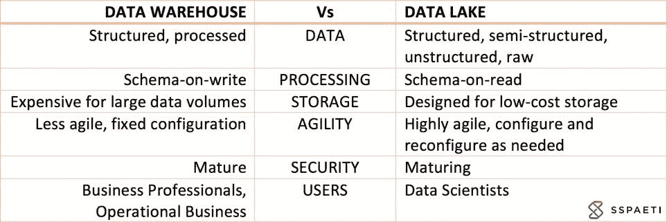
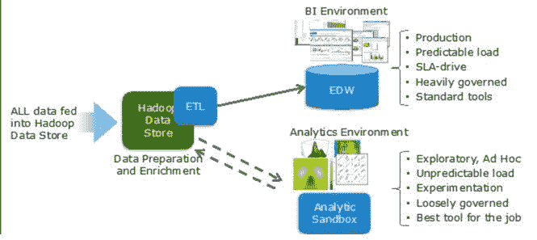

# 数据仓库与数据湖

> 原文：<https://medium.com/hackernoon/data-warehouse-vs-data-lake-etl-vs-elt-8258a2cc53d6>

数据仓库和数据湖或者 ETL 和 ELT 之间有点混淆。我听说数据仓库不再被使用，它们完全被数据湖所取代，但这是真的吗？我们为什么需要数据仓库呢？我将深入研究这两个加号的定义，并解释它们之间的区别。

# 数据仓库与数据湖

## 数据仓库定义

数据仓库，简称 DWH，也称为企业数据仓库(EDW)，是我们从 31 年前开始收集数据的传统方式。DWH 的目的是集成来自许多不同来源的数据，单点真实和数据管理意味着清洗，历史化和数据连接在一起。它通过管理仪表板、报告或特别分析，让管理层更深入地了解企业绩效。

使用数据仓库分析各种类型的业务数据。当分析需求与操作数据库的持续性能相冲突时，对它的需求就变得很明显。在数据库上运行复杂查询需要数据库进入暂时固定的状态。对于事务数据库来说，这通常是站不住脚的。使用数据仓库来完成分析工作，让事务数据库可以专注于事务。

其他特征是分析来自多个来源的数据的能力(例如，您的 Google Analytics 和您的 CRM 数据)，并且由于 ETL(提取转换加载)过程，这是高度转换和结构化的。

## 数据湖定义

数据湖是充满非结构化和结构化数据的存储，按原样存储，没有特定的目的，可以基于多种技术构建，如 Hadoop、NoSQL、亚马逊简单存储服务、关系数据库或各种组合和不同格式(如 Excel、CSV、文本、日志等)。).

根据 [Hortonworks 数据湖白皮书](http://hortonworks.com/wp-content/uploads/2014/05/TeradataHortonworks_Datalake_White-Paper_20140410.pdf)，数据湖的出现是因为企业需要捕获和利用新类型的数据。随着这些数据变得越来越可用，早期采用者发现他们可以通过为服务于业务而构建的新应用程序来获取洞察力。数据湖支持以下功能:

*   以低成本大规模采集和存储原始数据
*   在同一个存储库中存储多种类型的数据
*   对数据执行转换
*   为了定义当时数据的结构，它被使用，在阅读上被称为模式
*   为了执行新型的数据处理
*   基于特定用例执行单一主题分析

## 数据仓库和数据湖的区别

我喜欢 Pentaho 创始人兼 CTO James Dixon 的定义和比较:

> *如果你把一个******桶装水想象成一个经过清洗、包装和结构化的便于饮用的****—****数据湖*** *是一个* ***大型水体处于一种更加自然的状态*** *。数据湖的内容从一个源头流入湖中，湖的各种用户可以来检查、潜水或采集样本。***

## **不同的类比**

**正如您在下图中看到的，这两种技术是为不同的目的而创造的:**

****

## **什么时候用什么？**

**正如简介中提到的，公司正在从数据仓库转移到数据湖，尽管这是两码事，但仍然有意义。特别是当您需要实时数据时，因为数据仓库通常以批处理方式工作，所以数据湖接近实时地工作并处理大数据。它专为海量数据而设计，能够轻松快速地存储非结构化数据。那么什么时候该用什么呢？**

*   ****数据仓库**是为*缓慢变化的数据*而设计的:**
*   **+已知的每日摘要、每周摘要和每月摘要**
*   **+结构化数据**
*   **+方便快捷地访问许多运营业务用户**
*   ****另一侧的数据湖**是为*快速改变数据*而设计的**
*   **+告诉您一分钟或五分钟前发生了什么的数据**
*   **+原始、非结构化和半结构化数据**
*   **+轻松快速地接触到少数超级用户和数据科学家**

## **现代数据和分析环境**

**这种情况很常见，尤其是在中型或大型组织中。下图说明了如何将其与企业数据仓库和数据湖集成:**

****

**[戴尔 EMC](https://infocus.emc.com/william_schmarzo/how-ive-learned-to-stop-worrying-and-love-the-data-lake/)**

# **ETL 与 ELT**

**ETL(提取转换和加载)和 ELT(提取加载和转换)就是上面所描述的。 **ETL 发生在数据仓库中，ELT 发生在数据湖中**。**

**ETL 是将数据从源系统转移到数据仓库时最常用的方法。在这个过程中，你将数据加载到你的 DWH 的 stage-layer， [clean](https://en.wikipedia.org/wiki/Data_cleansing) ，并将其转换到[维度模型](https://en.wikipedia.org/wiki/Dimensional_modeling)(事实和维度)，最后，你将数据加载到最终的数据集市或立方体，以进行进一步的数据可视化。**

**如果你想使用 ELT，那就是你想建立一个**数据湖**的时候了。您提取数据，大部分是通过物理文件完成的，将其加载到云存储中的数据湖中，然后才开始转换和清理数据。自然的过程是，你开始探索和分析你的数据，发现数据是脏的，然后你开始清理它。**

# **大数据**

**[大数据](https://en.wikipedia.org/wiki/Big_data)和这个话题有什么联系？大数据或多或少是从物联网(IoT)等设备收集海量数据(每秒几百万行)，从每部智能手机收集不同的数据点等。借助特定的大数据基础架构和算法(例如 map-reduce)，您可以收集数据并将其存储到数据湖中。大数据最适用于数据湖。**

**随着新技术的出现，旧技术被取代，这可能就是为什么许多技术专家和思想领袖宣布数据仓库已死。他们说在大数据时代它不再重要**。但是为什么呢？问题是，你是否仍然有一个带有 ETL 工具的传统数据仓库，你对它百分百满意吗？很有可能你不是。由于传统 ETL 工具需要大量的编码，您的 ETL 工具可能在您准备部署它之前就已经过时了。****

**但是这些预言家错了。**大数据可以扩展和丰富一个数据仓库，但不能取代它**。死亡的不是数据仓库，而是设计和构建数据仓库的传统方式。一种更好的新方法是使用数据仓库自动化(DWA)工具，该工具自动化开发数据仓库的重复部分，以[将开发时间减少 40–60%](http://www.sspaeti.com/blog/why-data-warehouse-automation-is-not-more-popular/#Speed)。在 [DWA 博客文章系列](http://www.sspaeti.com/blog/data-warehouse-automation-dwa/)中找到更多信息，或者直接[为什么我们应该使用 DWA 工具](http://www.sspaeti.com/blog/why-automate-what-does-dwa-for-us/)。**

# **数据库**

**适应大数据和快速变化的数据连接点的另一种方式是 [Data Vault](https://danlinstedt.com/solutions-2/data-vault-basics/) 建模和方法，它使您能够以更加动态和灵活的方式实施对数据仓库的添加。最近，**出现了一个有趣的趋势，使用数据仓库作为受治理的数据湖**，因为它解决了我们在数据仓库中发现的问题的元素:**

*   **它适应不断变化的商业环境**
*   **它支持巨大的数据集**
*   **它简化了数据仓库设计的复杂性**
*   **它增加了业务用户的可用性，因为它模仿了业务领域**
*   **它允许在不影响现有设计的情况下添加新的数据源**

**这种技术进步已经被证明是非常有效和高效的。易于设计、构建、填充和更改。应该用这种方法创建新的数据仓库，这也是[数据仓库自动化](http://www.sspaeti.com/blog/why-automate-what-does-dwa-for-us/)帮助您的地方。**

# **结论—数据湖会取代数据仓库吗？**

**我不这么认为。如上所述，在很长一段时间内，两者都需要。两者都是为不同的目的而设计的，并且具有不同的优点。我认为我们应该小心数据湖，因为更多的数据总是更好，但也可能导致更混乱的数据存储，没有人知道那里有什么，每个人都需要花费大量时间来获得所需的数据。**

**在我看来，让两种环境都灵活地适应数据湖中的快速变化和分析是有意义的。但是仍然能够通过仪表盘和报告为运营业务用户进行非常结构化的分析。这就是为什么我建议将您在数据湖中发现的模式和基本分析导入到您的数据仓库中，使每个人都能以标准的方式和用户知道的工具轻松访问它。**

**谢谢你读到这里。请随时添加评论或任何不同意的内容。**

***原载于 2017 年 10 月 26 日*[*【www.sspaeti.com】*](https://www.sspaeti.com/blog/data-warehouse-vs-data-lake-etl-vs-elt/)*。***