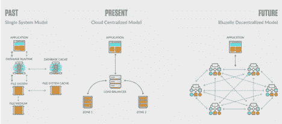
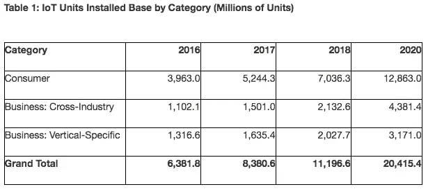

# 未来的数据库将是分散的

> 原文：<https://medium.com/hackernoon/databases-of-the-future-will-be-decentralized-d6d9887c494e>

我们正在进入一个令人兴奋的数据库模型的新进化阶段。前一阶段将我们从单一系统模型带到了集中式云模型。这一进步是巨大的:一举减少了故障点，并提供了增强的性能。

The evolution of the Database Models

分散式数据库模型现在有望取得更大的成就，**使我们能够消除所有故障点，更高效地扩展，提供更高的隐私性和数据不变性，并进一步提升性能**。最重要的是，这种模式正在帮助开发者克服区块链技术的局限性，构建可扩展的高效应用。

区块链技术正在为下一代互联网提供动力。以太坊这样的协议提供了一个平台来启动分散式应用程序(dApps ),这将改变我们消费产品和服务的方式。这些 dApps 将交换大量需要存储和管理的数据。

要了解这一需求的巨大程度，只需看看物联网(IoT): [Gartner 预测](https://www.gartner.com/newsroom/id/3598917)到 2020 年，将有 200 亿台联网设备投入使用，这需要生成、管理、存储和检索大量数据。

Source: Gartner 2017

**基于区块链的协议的问题在于，它们缺乏高效、可扩展的存储能力，无法管理如此庞大的数据量**。dApp 开发者正在区块链上构建世界上的下一代应用，但使用传统的基于云的数据库来驱动它们，这就像试图将一个大的方形钉子滑入一个小的圆孔。

**分散式数据库模型消除了这一限制**，满足了 dApp 开发人员的需求，并提供了高水平的性能、可靠性、安全性和可伸缩性。

以下是一些使用案例，展示了这一区块链突破带来的好处:

**预测市场**

为了运行，以太坊上的分散预测市场需要管理和存储大量数据，包括:

1.  问题
2.  不同的可能答案或结果
3.  预言
4.  实际事件的原始信息

**分散式数据库可以根据每个产品的需求进行扩展**。快速可靠的数据访问对于任何预测市场的成功、吸引新客户和增加参与度都至关重要。存储在分散数据库中的历史数据将增加一个新的预测类别，可以利用过去的事件来确保更好的预测，减少更高风险的人类投机。

**货币兑换协议**

中继站是货币兑换协议的关键组成部分；他们使制造商和接受者通过非连锁订单联系起来。中继站必须能够快速、高效、可靠且轻松地提供基础订单。这可能很困难，因为每个继电器以自己的方式存储他们的订单簿。分散式数据库使货币兑换协议能够为中继站提供一个现成的、标准的、一致的、无处不在的数据库，他们可以毫不费力地访问该数据库。**这种摩擦的减少最大限度地提高了服务水平和质量，因为网络仍然由继电器供电**。

**数据流网络**

数据流网络将数据消费者与数据生产者匹配起来。例如，一辆汽车使用来自数据流网络的实时交通数据，并在行驶中收集实时数据。这辆车既为它“购买”的数据付费，也从它“出售”给网络的数据中“获利”。所有数据点必须是可读写的，具有高性能、可用性、可伸缩性、安全性和可靠性。为了满足这些要求，分散式数据库模型提供了一种基础结构，允许数据流网络存储其所有数据。

我们现在拥有强大的工具，使我们能够建立一个高效、可扩展的去中心化互联网。我们在过去十年中遇到的所有性能和安全问题都可以得到解决。这很令人兴奋。