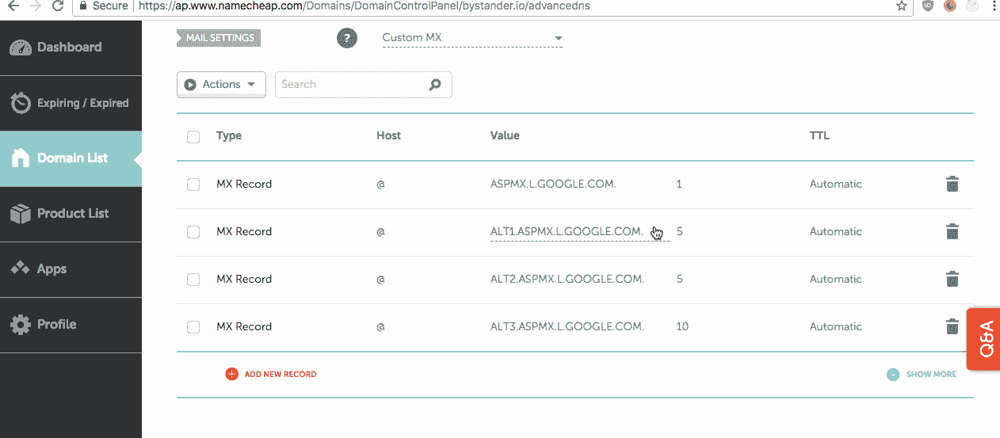
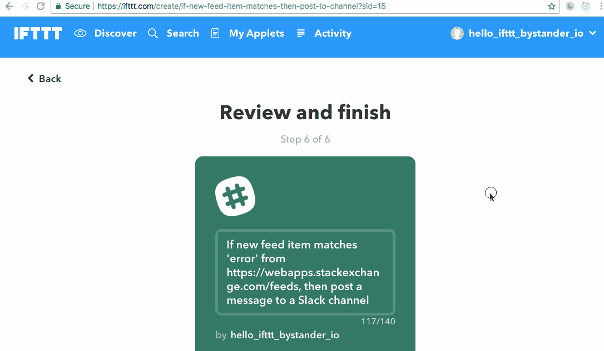
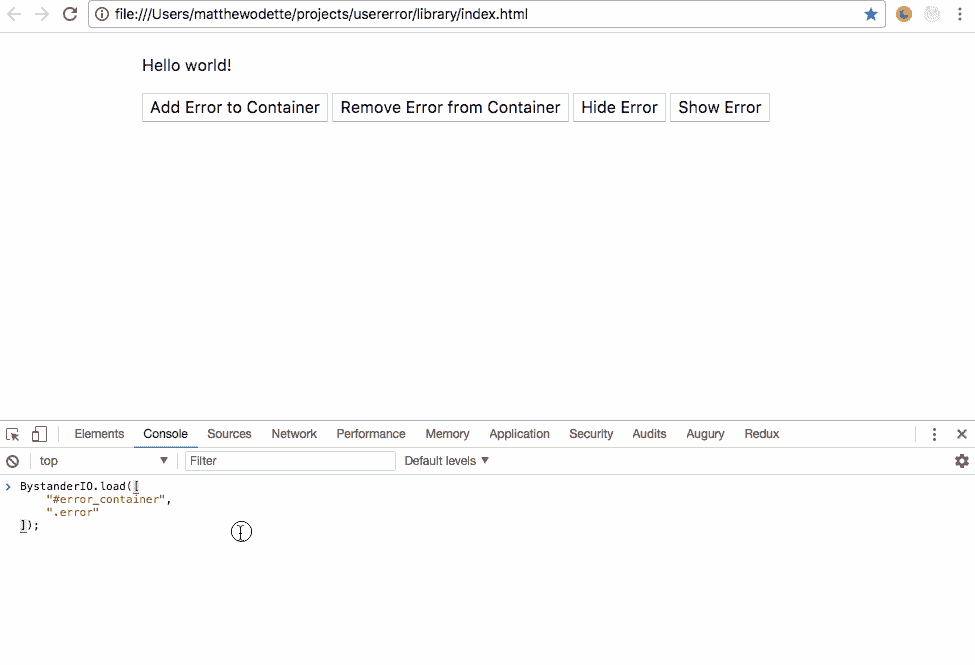

# [第一天]30 天内从零到最有价值球员:第一个想法

> 原文：<https://medium.com/hackernoon/day-1-zero-to-mvp-in-30-days-idea-number-1-18536868e282>

其他部分:
[第 0 天:制定一些基本规则。](/@modette/day-0-zero-to-mvp-in-30-days-31c83db6aadf)
[第二天:开始验证和 app 构建](/@modette/day-2-zero-to-mvp-in-30-days-beginning-validation-and-app-buildout-c70dddcf2d44)

对于第一个想法，我将使用“挠自己痒痒”的方法。

在我担任高级支持工程师的最后一个角色中，一个反复出现的模式是:祝酒，那些弹出的错误框，导致客户沮丧和困惑。

客户会写信进来，通常还会附上同样错误的截图。支持团队会尝试找到一个解决方法，让我们的客户克服错误。为了看看这是什么样子，[去 Twitter 上搜索“错误消息”](https://twitter.com/search?f=tweets&vertical=default&q=%22error%20message%22&src=typd)——这是源源不断的支持。

**这些重复的支持接触正在降低客户的终身价值**(他们与支持人员交谈得越多，他们花费的支持时间就越多)，可能会导致客户流失，甚至会在您的支持团队记录重复或不必要的问题时占用一点工程时间。

现在。有很多[工具](https://hackernoon.com/tagged/tools)用于记录脚本错误，无论是客户端还是服务器端。但是追踪我们自己创作并呈现给用户的视觉错误是另一回事。

我向你介绍第一个想法:**旁观者。io 一个跟踪面向用户的视觉错误的工具，它们让你付出了多少代价，以及一个附带分析的框架来降低这些错误的成本。**

# 一些用例？当然可以！

我打算跑到 Twitter 或 Google 去寻找一些糟糕的错误体验的例子，看看这项服务能带来什么直接的好处。但幸运的是，今天我遇到了一些设置 DNS 记录和其他账户的完美案例。

对于这些例子，我没有特别挑任何人，而是使用了我遇到的及时和真实的例子。我们在日常使用的服务中都见过类似的错误。

# Namecheap —示例用例 1:

在 name price 中设置 DNS 记录时，我遇到了这个好东西:
*(注意:删除记录中的尾随句点只是为了重新创建屏幕截图的错误)*

那么，我们的应用程序在这里起什么作用呢？**旁观者. io 会检测并提醒你向你的客户显示的空白错误**。当库处于活动状态时，您将能够重放用户的会话，就像您在 gif 中看到的那样。这将让您确切了解客户正在经历什么，以及他们如何试图解决问题。

然后查看附带的日志，您的团队可以看到我们试图用过期的身份验证令牌更新记录。

这样，您可以让您的团队推出一项更改，改为显示一个解释会话已过期的模块，并将它们发送到登录页面进行重新身份验证。

# IFTTT —示例用例 2:

在这里，我试图返回编辑一个 If This Then applet 上的设置。但是，出于某种原因，我的简单改变没有被保存。(更多关于这些 IFTTT 的用途，请见明天的帖子！)

这样，我们就有了一个很好的错误消息。**但它被隐藏在折叠上方**，没有任何迹象表明我有一个提醒来帮助我解决问题……实际上一开始我不确定是否有问题。

旁观者. io 能帮上什么忙？通过几种不同的方式，我们可以检测到用户多次点击 save，**，并且我们可以检测到在用户的视窗之外加载的唯一错误消息元素**。多酷啊。

你的团队会如何解决这个问题？摇动保存按钮，禁用它，并使用提交按钮附近的消息让我们知道我们需要修复上面表格中指出的问题。

太棒了。但是我需要我的潜在客户让他们的工程团队接受，增加一个新工具对他们来说是更多的工作，对吗？

# 让我们来看一些概念证明

下面是我对旁观者. io 库团队需要在他们的站点上安装的技术概念的基本证明。

**对库的初始要求:**

*   安装如此简单，一个副本和贴纸就能搞定。**检查。**
*   跟踪客户需要的可视元素(警告框、表单错误等)何时出现在 dom 中。**检查。** [变异观察者的](https://developer.mozilla.org/en-US/docs/Web/API/MutationObserver)很酷。
*   跟踪这些目标元素何时真正出现在用户的视口中。**检查。** [交叉观测者的](https://developer.mozilla.org/en-US/docs/Web/API/Intersection_Observer_API)很酷。
*   如果需要，记录所有 dom 更改和按键/点击以重放用户的会话，并查看他们是否/如何解决错误、联系支持或放弃他们的任务。
*   如果需要，记录所有控制台错误和网络请求，以了解完整情况。

让我们看看。
注意:这个库对用户来说是不可见的，**它只是记录和传输我们需要的会话和数据，以帮助您从错误中恢复价值**。

我们在这里用一组 CSS 选择器初始化这个库，这些选择器针对我们应用程序的特定错误容器。

当一个目标元素被添加到 dom 或者在隐藏后向用户显示时，我们记录会话和数据。我们将使用我们的 IntersectionObserver 来确保我们不会重复完整记录用户移动和查看的问题。

而这就是旁观者. io 的库的大致开始！我们可以让它在技术上工作，这是这次练习的目标。

# 现在来看看验证。

**我们将探索并用于验证的收益假设:**

*   减少由面向用户的错误导致的需要支持的次数。通过减少支持时间来节省团队资金。
*   减少错误消息给用户带来的压力，希望减少客户流失，保持甚至提高客户满意度。
*   通过减少支持团队创建的重复或不必要的错误报告，节省一些工程时间。

谁:

最初，我怀疑目标是拥有超过 40 名员工的 SaaS 公司？)且超过一定年龄(> 1 岁？)将是我时间的最佳利用。团队需要足够大，应用程序需要足够老，这样他们才能在短时间内意识到这种错误跟踪的好处。

有一件事让我困惑，我需要通过接触人们来测试一下:在一个组织中，谁是我们最有可能接触到买家的切入点？

1.  **支持领导？**他们已经接近问题的症结所在，应该对面向用户的错误可能给他们的组织带来的摩擦有所了解。
2.  **UX 成员？当用户遇到错误时，他们可能非常想看看他们实际上是如何操作的。并需要一种工具来分析和改进这种交互。**
3.  **项目经理？**在 Twitter 上输入一个关键词，很容易看到很多人写下错误信息。也许联系组织内的相关项目经理会有帮助？
4.  **工科？我的直觉是排除它们，但我还是应该试一试。他们已经有了需要运输的物品清单和需要解决的问题清单。只要向用户显示错误消息，并且错误没有使用户的应用程序崩溃，他们可能不会立即对进一步的分析感兴趣？**
5.  **管理者/创始人？**我认为这可能适用于我的目标客户中较小的一方，但不适用于较大的组织，除非我能找到公开表达需求/兴趣的人。

我应该优先考虑谁？

# 明天，第二天。

咻！跑了很久，我也是(到目前为止！)需要把这些帖子赶出门外，所以当我对这个有了新的看法时，我可能会做一两个编辑。

明天，我们会找到一些人并给他们发信息，开始我们的验证之旅。**计划在明天**向 10 位潜在客户发送信息。10 可能听起来有点低，但我会利用一些时间来微调我的来源或哪里可以找到潜在的客户，并开始规划一个可重复的规模验证尝试。

**我也将着眼于搭建实际应用方面的技术**。现在，我们知道我们可以很快扼杀这个想法。这个脚手架将是我们登陆的任何应用程序都需要的无聊东西:身份验证、用户角色、前端框架/库等。

如果你在一家 SaaS 公司工作，或者有一个项目的用户遇到了错误，你觉得这个想法怎么样？很高兴和你聊天，[我的电子邮件在我最初发表这篇文章的网站上。](http://matthewodette.com/day-1-zero-to-mvp-in-30-days)

感谢阅读！

[前进到第 2 天。](/@modette/day-2-zero-to-mvp-in-30-days-beginning-validation-and-app-buildout-c70dddcf2d44)