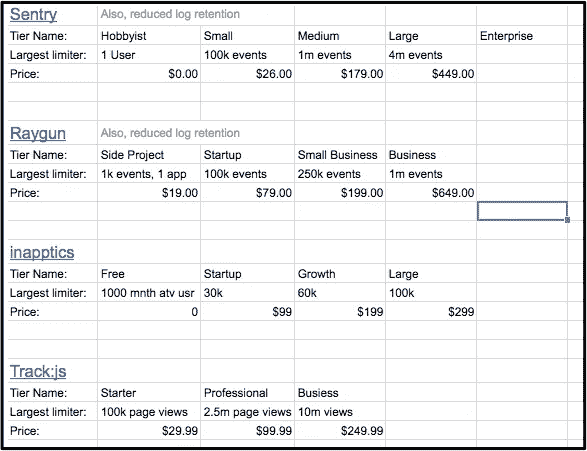
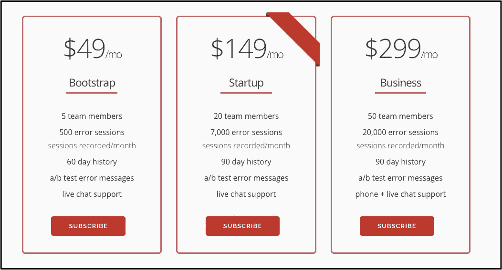

# [第 10 天]30 天内从零到 MVP 让我们来谈谈定价

> 原文：<https://medium.com/hackernoon/day-10-zero-to-mvp-in-30-days-lets-talk-pricing-a58babe464ad>

你好。

如果这是你第一次来这里，你可能会对第零天的感兴趣，我会在第一天的向[描述我现在的想法。我](https://hackernoon.com/day-1-zero-to-mvp-in-30-days-idea-number-1-18536868e282)[文档](https://hackernoon.com/tagged/document)，每天一点，我在做什么。

# 先说定价吧！

我们昨天讨论过，我们现在正在寻求说服一些企业放弃他们的现金，以推动这个项目从"*我得到一些(真棒！)电子邮件订阅者* " to " *嘿，这实际上是向可持续发展的业务迈进了一步*

前一段时间，我无意中看到一个黑客新闻帖子:“[问 HN:有哪些‘必看’的演讲？在这个帖子中，帕特里克·麦肯齐(patio11)提供了一个由杰森·科恩(Jason Cohen)主持的*精彩的* MicroConf 演讲。](https://news.ycombinator.com/item?id=13574916)

如果你有一个小时的时间，并且对定价感兴趣，我绝对认为 Jason 的演讲值得一看。他是一个迷人的演讲者，时间会过得很快:

[https://vimeo.com/74338272](https://vimeo.com/74338272)

当谈到这个早期版本的旁观者定价时，我赞同 Jason 的许多策略。

我现在只能用餐巾数学来估算我的成本。但我也会研究类似的公司及其定价策略。我关注的是他们提供的定价层、价格和主要的计量“东西”(浏览量、事件、存储的用户会话等)。)

这个电子表格很长，但它看起来很简单:

我发现有几个存储的数据类似于我的会话跟踪的样子(我的主要计量“东西”)，这有助于根据类似空间中少数企业的生产情况检查我的成本估计。

谈到定价，我必须提醒自己，我们是在向企业销售。很容易戴上我的消费者帽子，甚至在我把这个东西拿出门之前就开始哄抬价格。

另外，如果根本没有人认为你的定价太高，你的价格可能不够高。

也就是说，早期的定价迭代看起来像:

我还是想加一个年选入，价格优惠两个月。年度选择加入背后的想法是:现在更多的钱*比未来多一点的钱更好——我可以将更大的年度选择加入金额用于定制采购。*

当然，这有点超前了，但是尽早在头脑中建立这个策略是很好的。

连接 [Stripe](https://hackernoon.com/tagged/stripe) 并为早期用户提供 50%的折扣预购从明天开始。

我还没有关于昨天测试的[广告的任何更新。我没有预料到新广告客户账户的审核过程需要多长时间。](https://hackernoon.com/day-9-zero-to-mvp-in-30-days-torching-some-cash-97c655b46fed)

可以理解！我可以想象他们会吸引大量的人通过网络星期一在黑色星期五做广告。仔细想想，我敢打赌这也解释了我这个周末看到的虚高的投标价格。因此，延迟可能会节省我们一点钱！

# 明天，第 11 天

*   我们正在连接 Stripe，并加入预订流程
*   很多推广活动，我现在想大力推动
*   在我的 [day 8 帖子](https://hackernoon.com/hello-all-e902e4dfb147)和我的[独立黑客帖子](https://www.indiehackers.com/forum/rip-my-landing-page-to-shreds-please-778ed64f8a)的登陆页面上，我收到了很多来自 Medium 上一些好心人的反馈。我想组织这些反馈，列出我想测试的东西，并开始计划一些我确实想开始的改进。

我明天来找你！感谢阅读。当然，如果有任何问题或反馈，请随时给我发电子邮件！我的电子邮件可以在我最初发布的个人网站上找到。

[前进到第 11 天](/@modette/day-11-zero-to-mvp-in-30-days-checking-in-31c6858e47b7):签到
[回到第 9 天](https://hackernoon.com/day-9-zero-to-mvp-in-30-days-torching-some-cash-97c655b46fed):点一些现金