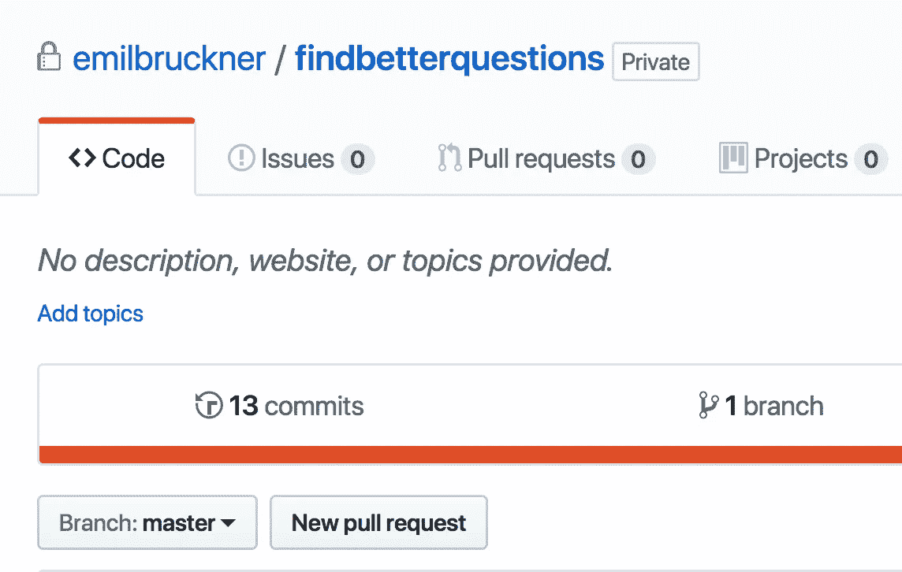

# [第 10 天]30 天内从零到 MVP 这是我目前学到的

> 原文：<https://medium.com/hackernoon/day-10-zero-to-mvp-in-30-days-what-i-learned-so-far-ead68f633d85>

在过去的 10 天里，我绝对比一般人学到了更多。我现在将试着分享我到目前为止还没有写的东西。

在这个系列中，我将验证一个新的想法。在这里阅读概念[(第 0 天)](/@EmilBruckner/day-0-zero-to-mvp-in-30-days-what-its-all-about-c39215a531f7)和想法[(第 1 天)](https://hackernoon.com/day-1-zero-to-mvp-in-30-days-idea-plan-69db96f62b3f)。

# 谈话验证

人们真的以很多不同的方式使用 Quora，尽管我接触的所有潜在客户都以某种方式使用 Quora 来获得与营销相关的利益。
请记住，我想创建的工具将有助于[找到更好的问题](https://findbetterquestions.com/) /搜索和过滤 Quora 中的相关问题。有些人实际上做了大量的研究来寻找正确的问题，而另一些人根本不做，只是依靠 Quora 和其他人来问他们某些问题。这意味着我必须接触更多的人，看看这个想法是否有意义。我不希望这只是猜测。需求肯定是有的，但我想确保它足够高。

到目前为止，人们都很乐于助人。有些人真的花时间去思考他们在 Quora 上的体验如何才能更好。

# 使用的产品和服务

## 登录页面模板

因为我想快速使用它，我在 Themeforest 上买了一个 HTML 模板。事后看来，我对此并不满意。下一次，我将再次自己建造一切。最后，它可能没有节省我任何时间，但仍然花费了一些钱(只有 10 美元),最糟糕的是，使用了 jQuery 和许多不必要的代码。这就是 MVP 预发布网站的情况。

## 勘探

*   我主要使用 hunter.io 查找电子邮件地址
*   Streak 是我使用的免费“Gmail CRM”
*   我也试过 HubSpot CRM

上述工具帮了我很大的忙，尽管当你在更大的范围内做这件事时，它们真正的潜力可能会显现出来。我只使用 Streak 来延迟电子邮件，所以它们会在更好的时间到达。该工具还允许你使用模板，在 Gmail 中批量发送电子邮件(遗憾的是不能在收件箱中发送)。

我还刚刚建立了 HubSpot CRM。似乎是免费解决方案的最佳选择。我还有一张我开始时用过的电子表格。目前这方面的信息有点满天飞。我得把事情理清楚…

我也使用了 Segment，只是为了尝试一下，但我会远离它，因为我不会在分析上花太多时间，所以我觉得这个价格不值得。

# 营销

到目前为止，我所做的工作明确证实了我的信念，即营销是关于人和谈话的。我希望我不会陷入其他模式，但这仍然是一条漫长的路，我甚至不确定我会走。

我不能告诉你任何关于使用分析工具和其他相关工具的事情，因为我真的没有使用过任何工具。

# 产品

[**登陆页面**](https://findbetterquestions.com/) 静态托管在 Netlify 上。他们也处理表格。客户端会跟踪注册信息以进行分析。

我[做了很多研究](https://hackernoon.com/day-3-zero-to-mvp-in-30-days-first-doubts-pivot-1fae3d7f19c8)如何创建应用程序本身。我首先想抓取 Quora 服务器端，但这不起作用，因为当你没有登录时，Quora 只给你有限的信息。所以我会在客户端做。这也有一个好处，Quora 不能只屏蔽我。问题是，由于它的跨源策略，站点不能在 iframe 中加载。解决方案是 Electron，它是 Chromium 和 Node.js 的组合。它创建桌面应用程序，所以我基本上可以创建一个单独的浏览器实例，而不是 iframe，并且仍然可以与它对话。

## 明天的计划

我来写点代码。我从第 0 天就已经预料到了，但我仍然对自己在过去几天里编写的代码如此之少感到惊讶。

希望很快能分享一张 app 的截图。

如果您对该产品感兴趣，请[注册提前获取](https://findbetterquestions.com/)。

> [←第 9 天——我的第一次实时聊天](https://hackernoon.com/day-9-zero-to-mvp-in-30-days-my-first-live-chat-3a16fa02f4c1)
> 
> [→第 11 天——创建漏斗](/@EmilBruckner/day-11-zero-to-mvp-in-30-days-creating-a-funnel-b8fd1e2908a)