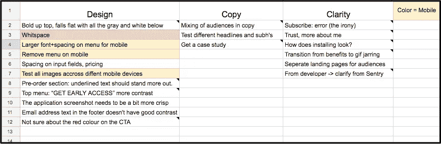

# [第 11 天]30 天内从零到 MVP 登记入住

> 原文：<https://medium.com/hackernoon/day-11-zero-to-mvp-in-30-days-checking-in-31c6858e47b7>

你好！如果你是这个系列的新手，我在第一天制定了一些基本规则[，而](https://hackernoon.com/day-0-zero-to-mvp-in-30-days-31c83db6aadf)[在第一天](https://hackernoon.com/tagged/explain)解释了我的第一个项目[的想法](https://hackernoon.com/day-1-zero-to-mvp-in-30-days-idea-number-1-18536868e282)。我每天记录一点我正在做的事情。

今天将是一个快速的签到方式更新，因为我今晚还有很多事情要做。

首先，我要向那些花时间评论我的登陆页面并给我发邮件反馈的人保证，我会把所有事情都记下来。当我有机会的时候，变化会慢慢地渗透进来并被测试。所有的东西都被分解成电子表格:

很多单元格都有一个完整长度的注释列表，其中某个内容被多次提及，或者如果[反馈](https://hackernoon.com/tagged/feedback)附带了很多不想放错位置的额外上下文。

今天，实际上这一周的大部分时间，我将花在寻找潜在客户和给追逐预购订单的人发电子邮件上，或者我将讨论相关的问题，看看是否需要探索小支点或重新定义我们的重点，以进行一些预购验证。

发电子邮件需要一点时间，但是到下周末，我希望公开分享一些数据:

*   发出的电子邮件总数
*   答复(否定和肯定)
*   计划的呼叫
*   讨论的痛苦

明天我将分享一些我正在发送的电子邮件。我将举例说明向热情的潜在客户和冷淡的潜在客户发送电子邮件的流程。

在为明天的帖子做准备时，如果你有兴趣给人们发关于验证的邮件，这两个演讲很棒，也是我这次策略的主要依据:

1.  pawel Brzeminski——12 分钟—“[如何在没有想法或关系的情况下在任何市场开创一家 SaaS 企业，仅仅使用 excel、电子邮件&电话](https://vimeo.com/130797716)
2.  Rob Walling — 1 小时—“[如何验证您的想法并实现 7，000 美元的经常性收入](https://vimeo.com/96267945?width=800&height=450)

# 明天！

*   我将检查登录页面反馈待办事项列表中的一些事项
*   我一直在抱怨的那些拓展，是时候验证或者找到一个我可以验证的相关问题了。
*   [船页](https://www.producthunt.com/upcoming/bystander-io)明天升职，很好奇。

感谢您的阅读！当然，如果有任何问题或反馈，请随时给我发电子邮件！我的电子邮件地址是我的个人网站上的[，这篇文章最初是在这个网站上发表的](http://matthewodette.com/day-11-zero-to-mvp-in-30-days)。明天见！

[前进到第 12 天](/@modette/day-12-zero-to-mvp-in-30-days-a-look-at-cold-validation-479f6ec2a76d):一看冷验证
回到第 10 天:我们来谈谈定价