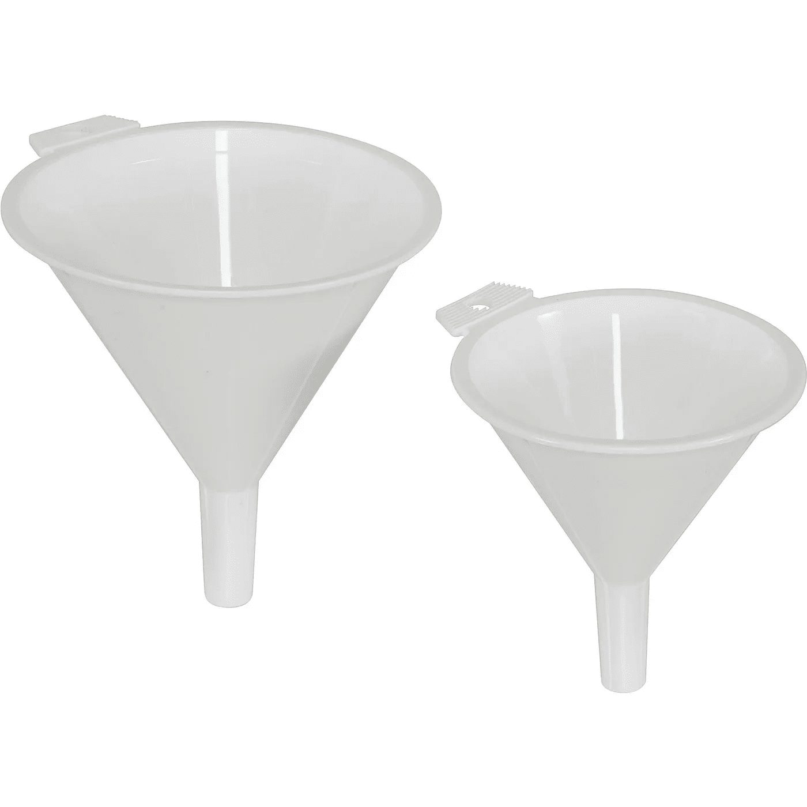

# [第 11 天]在 30 天内从零到 MVP 创造一个漏斗

> 原文：<https://medium.com/hackernoon/day-11-zero-to-mvp-in-30-days-creating-a-funnel-b8fd1e2908a>

在这个系列中，我将验证一个想法。在这里阅读概念[(第 0 天)](/@EmilBruckner/day-0-zero-to-mvp-in-30-days-what-its-all-about-c39215a531f7)和想法[(第 1 天)](https://hackernoon.com/day-1-zero-to-mvp-in-30-days-idea-plan-69db96f62b3f)。

让我从抄一本书开始。我强烈推荐它:

> “每个漏斗都有始有终。一开始，我们有大量从未听说过我们产品的人。最后，我们拥有最小的数量——这个星球上所有购买我们产品的人。
> 
> 所以，一个完美的漏斗的图形表示是一个始端和末端直径相同的管道。这意味着 100%的人买了你的产品。
> 
> 最好的漏斗中最好的是一个永无止境的管道。这意味着人们总是一次又一次地回来购买你的产品。
> 
> 增长黑客的最终目标是始终争取最佳漏斗中的最佳漏斗。如果你的漏斗在某个地方变窄了或者不是无限的，那么这就是它需要改进的地方。"

*摘自:《阿拉丁幸福》。“我如何用 10，000 美元为初创公司制定增长黑客计划:+300 个你可以立即付诸实践的增长黑客。”*

我们的目标是最终拥有尽可能多的付费客户。那么他们是如何到达那里的呢？(以下几点没有提到保留，因为这不在讨论范围之内。)步骤是向后的，以“:”开始的步骤可能是第一步:

*   使用它(入职)
*   下载应用程序
*   开始免费试用
*   [:访问登陆页面](http://findbetterquestions.com)
*   :访问登录页面→订阅时事通讯/提前获取→通过电子邮件点击
*   :点击广告，链接内容，跟我说话…

对于除第一步之外的每一步，一旦我们有了一些数据，我们将能够检查我们的转换。现在，我们必须尽可能地提高意识，收集电子邮件。

## 对此我有什么计划？

*   我想创建一些内容。我还会做一些关键字研究，也许我可以找到一些会在谷歌查询的第一页排名的东西。
*   勘探
*   广告:我会花几块钱，但还没有任何想法
*   Quora:
    为了营销，让已经对 Quora 感兴趣的人购买我的产品要容易得多，所以把 Quora 作为一个渠道可能是个好主意。这肯定是一个长期的游戏，我想看到立竿见影的效果。也许这就是为什么我还没有开始。

## 明天的计划

写电子邮件
(是的，我知道，很无聊，但我从中获得了很多见解。稍后我可能会分享一些细节)。

> [←第 10 天——到目前为止我学到了什么](/@EmilBruckner/day-10-zero-to-mvp-in-30-days-what-i-learned-so-far-ead68f633d85)
> 
> [→第 12 天——反思&策划](/@EmilBruckner/day-12-zero-to-mvp-in-30-days-reflecting-planning-e2d276b1dec1)