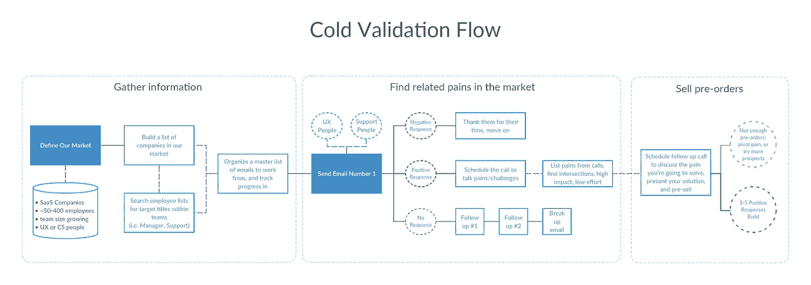
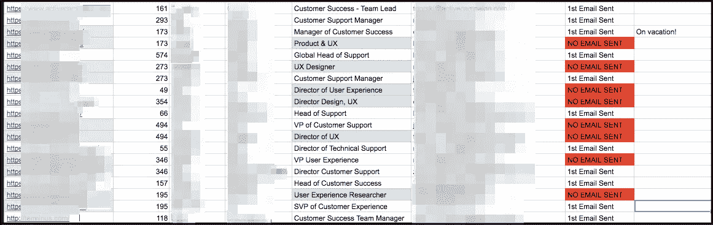
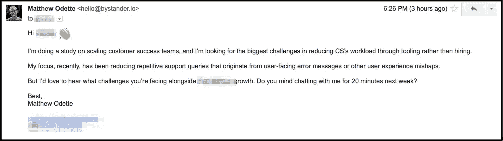

# [第 12 天]30 天内从零到 MVP 看看冷验证

> 原文：<https://medium.com/hackernoon/day-12-zero-to-mvp-in-30-days-a-look-at-cold-validation-479f6ec2a76d>

你好。如果你是这个系列的新手，我在第一天制定了一些基本规则[，并在第一天](https://hackernoon.com/day-0-zero-to-mvp-in-30-days-31c83db6aadf)解释了我的第一个项目[的想法。我每天记录一点我正在做的事情。](https://hackernoon.com/day-1-zero-to-mvp-in-30-days-idea-number-1-18536868e282)

今天，正如承诺的那样，我们非常重视重新审视和推出新一波冷(和一些温暖)的验证电子邮件，我们将看到这些原始电子邮件。

如果你有机会查看昨天帖子中链接的两个视频[，我们的战略应该看起来像是这两个来源之间的](https://hackernoon.com/day-11-zero-to-mvp-in-30-days-checking-in-31c6858e47b7)[联姻](https://hackernoon.com/tagged/marriage)。该流程最终看起来像:

# 收集信息:

在本系列的前面，我们已经定义了我们想要的市场。但这一次，我把范围缩小了一些:

*   SaaS 企业
*   员工人数在 50-400 人之间
*   在过去的 6 个月中，员工增长超过 10%(我正在寻找不断增长的支持或 UX 团队)
*   资历应该是领导(或相当于领导)或更高，但不一定是最高的

因为我们正在引导这个东西，我保持工具最少。因此，我们更新的，没有多余的，潜在客户名单看起来像这样:

这非常简单，我只想知道我现在需要做什么:

*   公司链接
*   公司规模
*   名字
*   标题
*   电子邮件
*   状态
*   笔记
*   社交账户(无图片)

**因此，为了收集信息**，在我们定义了我们的市场之后，我们需要从一个公司列表开始，然后我们可以研究他们的团队，寻找理想的前景。大多数市场都有目录。幸运的是，SaaS1000 承担了我们需要的大量繁重工作。

从你的公司列表中找到合适的员工，就像在 LinkedIn 上打开公司页面，按职位搜索一样简单。就我而言，我输入“客户”或“用户”,然后从列表中决定我想接近哪个级别的职位。我在这里选择的立场是混合的，因为我想测试不同标题的反应。

查找电子邮件地址是我最不喜欢的部分。前 10 分钟我感觉自己像夏洛克·福尔摩斯，然后我会停下来，去查看任何邮件。

# 冰冷的邮件和寻找痛点

现在，我绝对不是发邮件的专家。以下是我目前正在测试的和从[学到的](https://hackernoon.com/tagged/learning),我建议你四处搜索一下，看看你最喜欢的有影响力的人是如何处理冷冰冰的电子邮件的，并找到一种你觉得舒服的格式。

**主题行**:我发电子邮件的方式是尽可能诚实、中肯，并且用对话的语气。没有人喜欢被骗打开电子邮件。因此，我的第一封电子邮件通常是“*关于客户成功团队如何扩展的问题*”因为我正在调查他们的支持团队在扩展方面面临的挑战。

**个人:**很多资料都推荐以一些个人的东西作为开场白(*我真的很喜欢你的《XYZ》*)。现在，我同意了，但前提是这些东西是我真正感兴趣并真正喜欢的。我不试图以任何方式强迫这一点，并且会经常忽略它。

那么，让我们来看看我今天发送的一封示例电子邮件:

我今天发了 10 封类似的邮件(另外还有 20 多封格式不同的邮件)。但是这个特别的人正在测试“引导证人”讨论他们团队中的困难。我希望*谈论他们遇到的每一个挑战，但我也播下了对我的特定想法感到好奇的种子。*

我怀疑，与只有一个问题的电子邮件相比，这个群体的表现会差一些，但如果你不测试，你就不知道。

**没反应？没关系，我不知道你不回复是不是意味着你现在很忙。我会跟进三次，最后一封邮件是分手邮件，这是仿照 Steli 在 Close.io 的博客上写的[方法。如果你觉得他的博客文章有帮助，就给他讲讲他卖手表的经历。](http://blog.close.io/cold-email-follow-up-plan)**

最终目标是让我们的潜在客户打电话讨论他们面临的挑战。这一次，在我有了新的上线之后，我会深入讨论这个问题。但是，我想*倾听*，通过提问让他们继续谈论他们的痛苦，并以询问他们的完美解决方案是什么样的结束。

# 预售

我不知道那感觉或看起来如何，所以还没有评论**😂希望不久我会让你知道。**

**我会说:我们的目标是从有交叉困难的人那里获得 3-5 个预订单(希望与我们一直在削减的东西密切相关)。它们需要是年度合同，但要比我的计划价格低 50%。**

# **明天的待办事项**

*   **恐怕还会有更多的相同！我们已经到了需要专心致志一段时间的地步。**
*   **当我需要休息时，我会继续使用登录页面反馈列表作为我的创意出口。**

**一如既往的感谢阅读！如果有任何问题或反馈，请发邮件给我！我的电子邮件地址是我的个人网站上的[，这篇文章最初是在这个网站上发表的](http://matthewodette.com/day-12-zero-to-mvp-in-30-days)。明天见！**

**[前进到第 13 天](/@modette/day-13-zero-to-mvp-in-30-days-some-calls-scheduled-4e06b34ebc16):部分预定通话
回到第 11 天:签到**