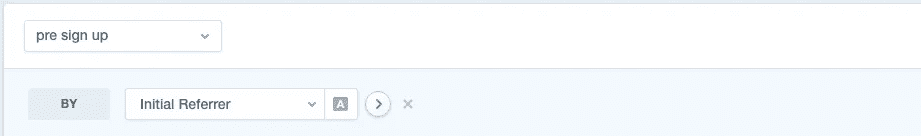
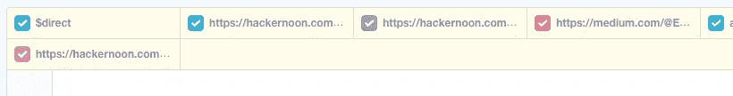
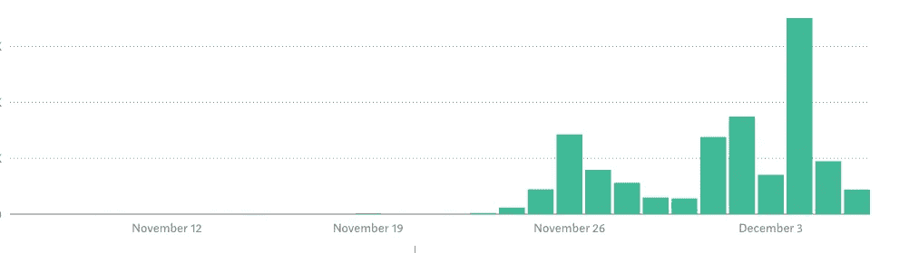

# [第 14 天]30 天内从零到 MVP 请增加流量

> 原文：<https://medium.com/hackernoon/day-14-zero-to-mvp-in-30-days-more-traffic-please-9b398a6b2013>

在这个系列中，我将验证一个新的想法。在这里阅读概念[(第 0 天)](/@EmilBruckner/day-0-zero-to-mvp-in-30-days-what-its-all-about-c39215a531f7)和想法[(第 1 天)](https://hackernoon.com/day-1-zero-to-mvp-in-30-days-idea-plan-69db96f62b3f)。

我将在发布时通知的大多数人来自我手动收集的潜在客户邮件列表。只有大约 50 人在登陆页面注册(包括产品搜索)。我肯定需要想办法增加更多的内容。我也担心线索很薄弱，因为很多线索可能来自这个博客，我不知道你们真的有兴趣为我提供的东西付费。今天我只能收到一封邮件:(

一个有趣的事实:一些媒体文章比其他文章带动更多的相对注册。PS: [在这里报名](https://findbetterquestions.com/)(但前提是你对 Quora 有兴趣做营销；-) )

哦，奇怪，我今天在媒体上得到的评价也很低。

让我对这种情况感到有点不舒服的是，我已经进行了一半。我想写一些博客，但这需要时间，就像其他事情一样。甚至设置广告也需要时间。

## 明天的计划

计划一下我能做些什么来增加交通流量。

> [←第 13 天——写一些代码](https://hackernoon.com/day-13-zero-to-mvp-in-30-days-writing-some-code-6b110de7aaa8)
> 
> [→第 15 天——定义使命陈述](/@EmilBruckner/day-15-zero-to-mvp-in-30-days-defining-the-mission-statement-8c9485110c3d)