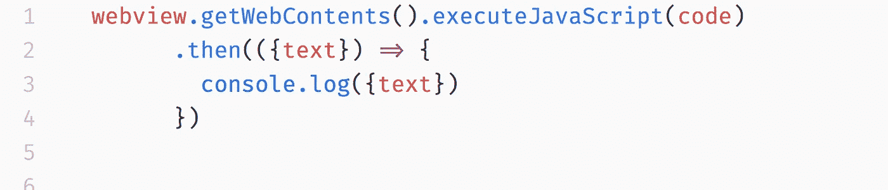
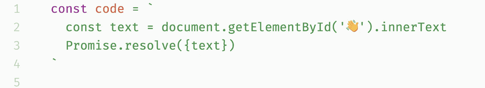

# [第 19 天]30 天内从零到 MVP 完全获得第三方服务

> 原文：<https://medium.com/hackernoon/day-19-zero-to-mvp-in-30-days-getting-full-access-to-a-third-party-service-2d2d26603e9c>

在这个系列中，我将验证一个新的想法。在这里阅读概念[(第 0 天)](/@EmilBruckner/day-0-zero-to-mvp-in-30-days-what-its-all-about-c39215a531f7)和想法[(第 1 天)](https://hackernoon.com/day-1-zero-to-mvp-in-30-days-idea-plan-69db96f62b3f)。

由于我对这个项目没有太多的了解，所以今天我想和你分享一些具体的东西。

为了[找到更好的问题](https://findbetterquestions.com/)我不得不刮 Quora。特殊的挑战是用户必须通过**登录**才能这样做。

# 用电子网络视图抓取 Quora 用户

Electron(用 JS 构建桌面应用的框架)提供了一种叫做 webview 的东西。它基本上是一个浏览器视图，可以从你的应用程序中控制。

电子保存 cookies 和其他临时数据，所以你只需要要求你的用户在正常的地方登录一次。无需管理任何用户数据和第三方密码。

This is executed in the main Node.js environment

只需编写你的 JS 代码，抓取你需要的数据。

This code is executed in the webview (Browser)

# 忠太🎉

您的应用程序现在可以完全访问第三方应用程序。

## 明天的计划

恐慌，我快没时间了

> [←第 18 天—谈论产品](https://hackernoon.com/day-18-zero-to-mvp-in-30-days-talking-about-the-product-f4f096168181)
> 
> [→第 20 天——定义方案](/@EmilBruckner/day-20-zero-to-mvp-in-30-days-defining-a-schema-1d67f171da19)