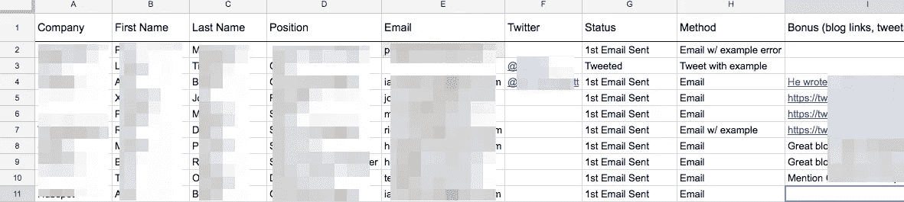

# [第 2 天]30 天内从零到 MVP:开始验证和应用构建

> 原文：<https://medium.com/hackernoon/day-2-zero-to-mvp-in-30-days-beginning-validation-and-app-buildout-c70dddcf2d44>

前几期:
[第 0 天:地面规则](/@modette/day-0-zero-to-mvp-in-30-days-31c83db6aadf)
[第 1 天:想法一号](/@modette/day-1-zero-to-mvp-in-30-days-idea-number-1-18536868e282)

今天会很短，因为我还在忙着给人们发电子邮件。此外，在我尝试了更多的渠道后，我很乐意在几天后就我的早期验证尝试做一个全面的帖子。

# 验证的开始

在验证的早期阶段，我有三个主要目标:

1.  找出哪一组人的回复率最高
2.  找出哪种渠道可以获得最好的回应率
3.  当然，要对我的想法真正感兴趣

#1 和#2 是让我找到一个或两个在回应率方面有效的特定渠道，并在有效的渠道上加倍努力。

昨天，我提到了我可能会向 5 个不同的群体销售这款产品。今天，我将我的努力集中在我认为会有最佳反应的两个群体上: **UX 领导层/高层和产品经理**。

我达到了接触 10 个目标潜在客户的目标，即使是这个小数字也是寻找我的观众的一个很好的练习。在前几轮中，**我将测试两个不同的冷观众频道**:

*   **利用 Twitter 搜索**
    (您可以搜索包含图片的推文，这对我来说非常方便: [*过滤器:图片“错误消息”*](https://twitter.com/search?f=tweets&q=filter%3Aimages%20%E2%80%9Cerror%20message%E2%80%9D&src=typd) )
    利用这一点，我发现最近有大量客户 ping support with errors pandore . io 可以帮助修复错误。
*   关于错误消息的博客帖子这有助于确定谁对这些面向用户的错误消息的思考最多——作者都是 UX 人。我循着这条线索看作者或感兴趣的评论者属于什么样的[企业。](https://hackernoon.com/tagged/business)

因此，对于我的冷外展，我有一个博客帖子来讨论或来自他们客户的真实示例用例。

这是我的潜在客户电子表格的像素化视图:

有更好的方法来跟踪这一点，但在这种早期规模的谷歌文件会做得很好！

明天，既然我已经有了展望这两个渠道的方法的开端，我将向另一组人推送消息。我会在一个新的频道给 10 个人发消息，开始测试这两个频道不同来源的回复率。

# 搭建实际的应用程序。

昨天我还提到我想为应用程序本身提供一个种子。在这一点上，我们希望管道可以在我们可能转向的任何想法中得到利用，所以如果我们扼杀了第一个想法，我们会尽可能少地浪费开发时间。

我最初是一名前端开发人员，我最喜欢使用 [JavaScript](https://hackernoon.com/tagged/javascript) 。因此，我们将使用我最熟悉的技术，使用全栈 JS 来确保我可以快速移动(有一个例外，我们将会谈到它！)

(平均值+额外值)堆栈:

*   **Angular 5+** 在前端(一个需要打字稿的前端在我们构建时会是一个很好的帮助)
*   **引导**:看起来我们将以[星云主题](https://github.com/akveo/nebular)为起点。
*   **节点**在后端与**快递**
*   **MongoDB**+**mongose**(托管在 MLabs 上，用于免费开发层，同时我们一起开发东西)
*   **Auth0** 对于认证来说，这样会节省一吨的时间，而且他们的技术内容团队很厉害。
*   现在，对于不熟悉的人来说，我真正想在项目中使用的东西是 **Redux** 。我知道它只推荐给较大的应用程序，因为有很多样板文件和一点学习曲线。但是，这是一个有趣的挑战。并且具有单一状态源的调试选项非常棒。我们就用 [**NgRx**](https://github.com/ngrx) 。

# 明天，第三天！

当然，更多的验证。

我想我会扣动 [Product Hunt 的船](https://www.producthunt.com/ship)的扳机。我不喜欢放一个完整的登陆页面，除非我有静态的截图模型，所以我想测试 Ship 作为一个正式登陆页面前的解决方案。

我将在 Angular 中设置我的认证服务来连接 [Auth0](https://auth0.com/) ，使用一些 [Kim Maida 的精彩帖子](https://auth0.com/blog/real-world-angular-series-part-1/)来帮助加速这个过程。

我会试着修好我的柴炉，因为这里很冷。

一如既往，如果你有任何反馈或想聊天[我的电子邮件在我的网站上](http://matthewodette.com/day-2-zero-to-mvp-in-30-days)或在这里发表评论:-)感谢阅读！

[回到第一天。](/@modette/day-1-zero-to-mvp-in-30-days-idea-number-1-18536868e282)
[前进到第三天。](/@modette/day-3-zero-to-mvp-in-30-days-product-hunts-ship-and-communities-4b3057551a40)