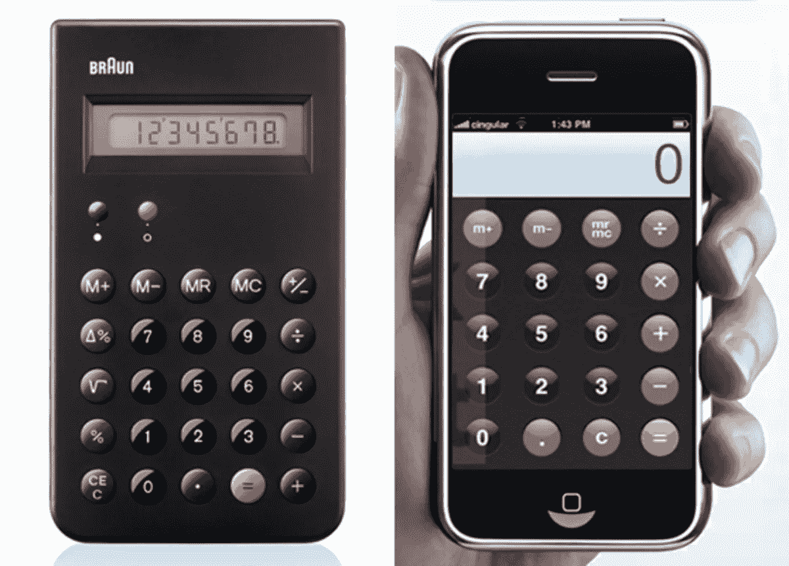

# [第 23 天]30 天内从零到 MVP 我对此感到尴尬

> 原文：<https://medium.com/hackernoon/day-23-zero-to-mvp-in-30-days-minimum-viable-service-9b4b8920a77a>

在这个系列中，我将验证一个新的想法。在这里阅读概念[(第 0 天)](/@EmilBruckner/day-0-zero-to-mvp-in-30-days-what-its-all-about-c39215a531f7)和想法[(第 1 天)](https://hackernoon.com/day-1-zero-to-mvp-in-30-days-idea-plan-69db96f62b3f)。

我正面临一个不舒服的情况。时间越来越紧，我必须运送一个 MVP。但是我已经知道[我将交付的产品](https://findbetterquestions.com/)并不是我特别引以为豪的东西。它只是没有提供它应该提供的良好体验。但这很好。

> “如果你不为你产品的第一个版本感到尴尬，那你推出的太晚了”——雷德·霍夫曼

Photo by [Namroud Gorguis](https://unsplash.com/photos/FZWivbri0Xk?utm_source=unsplash&utm_medium=referral&utm_content=creditCopyText)

# 为什么是 MVP？

*   它必须为创造者提供价值
*   它必须为用户提供价值

让我稍微解释一下:

## 对创作者有价值

MVP 有一些好处，包括:

*   获取反馈…
*   …寻找适合的产品/市场
*   没有猜测
*   为你的用户构建，而不是为你自己
*   …

还有一些担心:

*   这会损害我的名誉吗？
*   它会关掉前景吗？…

## 对用户有价值

产品做它应该做的，它提供一些好处。它做得越好，感知价值就越高。当你创造一个独特的产品时，这是非常容易的。假设计算器还没有发明出来，而你发明了一个可以进行基本数学运算的计算器。用户界面很难看(甚至是中性的💅)，但是很清楚因为特征很少。人们会喜欢的。你可能有一个完美计算器的路线图，使用语音输入，机器学习和更多，但这将需要数百年的发展，所以请继续下去，尽快发布第一个版本。

> **“好的设计让产品有用”——迪特·拉姆斯**

# 定义鸿沟

产品必须足够好，才能让用户理解。请记住，您的第一批用户将是早期采用者，他们渴望您的解决方案，即使有些细节并不完美，他们也会使用它。
你也要问问自己，你要那些用户做什么？如果只是为了获得反馈，那么他们甚至不需要爱你的产品爱到向他们的朋友推荐它。

> 你不想从 MVP 那里得到成长。而是找到产品/市场的契合度。没有一个好的产品，你无法实现这个目标。

# 没有一个 MVP

MVP 方法并没有说你应该只有一个 MVP，过一段时间再发布版本 1。我们毕竟是在 SaaS 做生意。这一点尤其重要，因为使用你的初始版本的人可能不会看到足够的价值来购买它。他们可能会发现它非常有用，但是如果你做得对，人们可能就不想为它付钱了。这就是为什么你必须一步一步来，建立信任，让人们知道它有一天会成为一个成熟的产品。

# 这对[发现更好的问题](https://findbetterquestions.com/)意味着什么？

我不怕运送一个相当糟糕的产品。我确实发现，你可能会因为一个非常糟糕的产品而毁掉自己的声誉。我不是在说我个人的名誉，但是如果有人下载了 Find Better Questions 的第一版，并且不喜欢它，她可能就再也不会回来了。但是只有很少人会使用 MVP，因此只有极小一部分潜在客户会被关掉。我只需要对产品**不能**做什么做到透明，这样人们就会提前知道它将来会变得更好。我不会开空头支票。更多关于空头承诺的明天。

## 明天的计划

该产品可能明天就可以使用，但目前还只是一个桌面应用。接下来是围绕它的基础设施。

如果你想用我说的那个糟糕的 MVP，早点去 https://findbetterquestions.com/的。

> [←第 22 天——这只是为了不打破记录](https://hackernoon.com/day-22-zero-to-mvp-in-30-days-this-is-just-for-not-breaking-the-streak-5f661a67049d)
> 
> [→第 24 天—在介质上书写](/@EmilBruckner/day-24-zero-to-mvp-in-30-days-on-writing-on-medium-efb62acd274b)