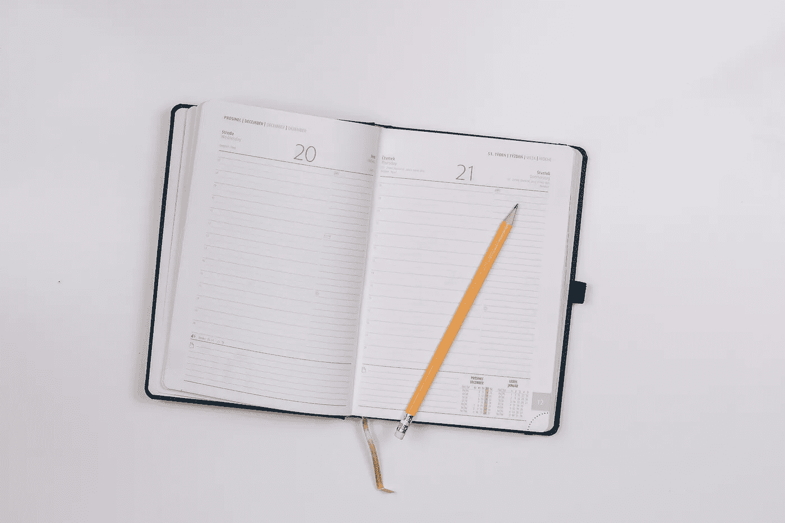

# [第 24 天]30 天内从零到 MVP 在媒体上写作

> 原文：<https://medium.com/hackernoon/day-24-zero-to-mvp-in-30-days-on-writing-on-medium-efb62acd274b>

在这个系列中，我将验证一个新的想法。在这里阅读概念[(第 0 天)](/@EmilBruckner/day-0-zero-to-mvp-in-30-days-what-its-all-about-c39215a531f7)和想法[(第 1 天)](https://hackernoon.com/day-1-zero-to-mvp-in-30-days-idea-plan-69db96f62b3f)。

这太激励人了。每天继续这个系列有好有坏。由于我今天没有太多关于产品的分享，所以我将写一些关于写作的内容。明天会有更详细的报道。

# 为什么这是这个项目最好的部分

这是我每天都要完成的一件事。每天晚上吃一点多巴胺。
在某些方面，这个博客的反馈也比产品本身更好。与人谈论产品只是让可能的功能列表变得更大，而这些文章的反馈一点也不负面(除了一条我仍然非常喜欢的评论)，这让我有一种解脱感，并确认写作是值得的。

# 为什么这是这个项目中最累人的部分

为一篇文章想出一个点子需要很多精力。我试着每天都有一个主题，但有时我实际做的工作并不令人兴奋，更不用说那些我根本找不到时间做的日子了。这是我每天做的最后一点工作，所以大多数时候我很累，宁愿做其他事情，比如睡觉，或者做一些看起来更重要的事情。

> 我做了承诺，我会遵守的。

真正让我坚持下去的因素是你。令人惊讶的是，这么多人阅读我要说的话，我不想浪费你的时间写无趣的东西，所以我至少试着写一些值得一读的东西。非常感谢你的时间。

## 明天的计划

只剩 6 天了！如果你已经[给了我你的电子邮件地址](https://findbetterquestions.com/)，那么你就可以提前看到我正在建造的东西。

> [←第 23 天——我对此感到尴尬](https://hackernoon.com/day-23-zero-to-mvp-in-30-days-minimum-viable-service-9b4b8920a77a)
> 
> [→第 25 天——你在乎找到更好的问题吗？](/@EmilBruckner/day-25-zero-to-mvp-in-30-days-do-you-care-about-finding-better-questions-7f10566b446b)