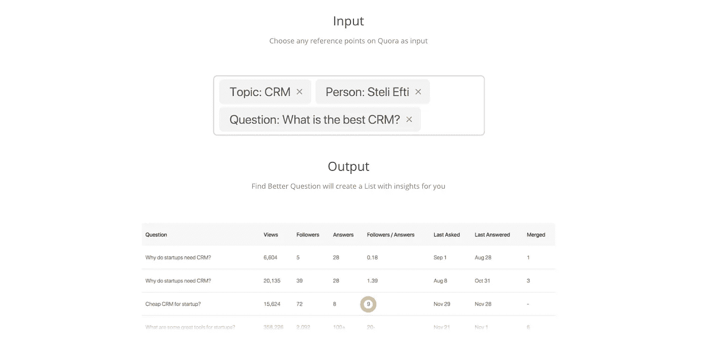
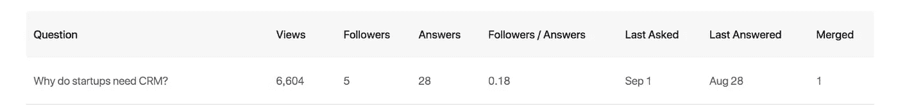

# 【第 25 天】30 天内从零到 MVP 你在乎找到更好的问题吗？

> 原文：<https://medium.com/hackernoon/day-25-zero-to-mvp-in-30-days-do-you-care-about-finding-better-questions-7f10566b446b>

在这个系列中，我将验证一个新的想法。在这里阅读概念[(第 0 天)](/@EmilBruckner/day-0-zero-to-mvp-in-30-days-what-its-all-about-c39215a531f7)和想法[(第 1 天)](https://hackernoon.com/day-1-zero-to-mvp-in-30-days-idea-plan-69db96f62b3f)。

我想借此机会问你，我的媒体读者，你是否有兴趣实际使用该产品，通过要求一些反馈。我知道如果你是，你会在几天内拿到产品，但如果你感兴趣，这仍然是一个影响产品的好机会。

该产品的第一个版本将会做[登陆页面](https://findbetterquestions.com/)所说的事情。没有一个额外的功能(嗯，你可以保存这些列表…)。

我的问题是:

> 您希望这些表格中包含哪些数据？

实际上，我今天正在努力获取这些数据。还得考这么多，哇。

## 明天的计划

熟悉交付工具、更新等

还有一点:我已经有 100 封邮件了。这是提前进入的人数。但是如果只有一小部分人给了我反馈，我肯定会接受更多的反馈…

> [←第 24 天—在介质上书写](https://hackernoon.com/day-24-zero-to-mvp-in-30-days-on-writing-on-medium-efb62acd274b)
> 
> [→第 26 天——工作量很大&很有趣](/@EmilBruckner/day-26-zero-to-mvp-in-30-days-its-a-lot-of-work-it-s-fun-ff30f0fe2337)