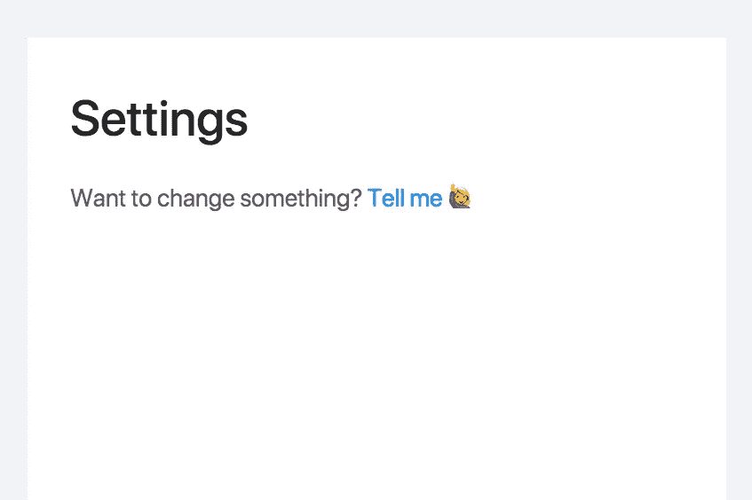

# [第 27 天]30 天内从零到 MVP 很快

> 原文：<https://medium.com/hackernoon/day-27-zero-to-mvp-in-30-days-quick-one-4377340b7044>

在这个系列中，我将验证一个新的想法。在此阅读概念[(第 0 天)](/@EmilBruckner/day-0-zero-to-mvp-in-30-days-what-its-all-about-c39215a531f7)和想法[(第 1 天)](https://hackernoon.com/day-1-zero-to-mvp-in-30-days-idea-plan-69db96f62b3f)。

这东西在工作，但有很多小问题需要解决。微小有时候并不是那么微小。还没有登录功能，例如，你只能注册和退出，但永远不会回来…不要担心。我会全力以赴。

代码库太可怕了。我应该学会如何保持代码的整洁。

有趣的事实:这个 MVP 有 5 个菜单项，但是其中只有一个提供了功能视图，所以实际上还不需要这个菜单。

> 你就是这样创造 MVP 的，不是吗？

这是今天的快速更新。

## 明天的计划

继续

我真的很怀念营销/与人交谈。
有了这类的下一个项目，我会更好地知道如何分配我的时间。

> [←第 26 天——工作量很大&很有趣](https://hackernoon.com/day-26-zero-to-mvp-in-30-days-its-a-lot-of-work-it-s-fun-ff30f0fe2337)
> 
> [→第 28 天—入住](/@EmilBruckner/day-28-zero-to-mvp-in-30-days-checking-in-9c6c4c2d95bf)