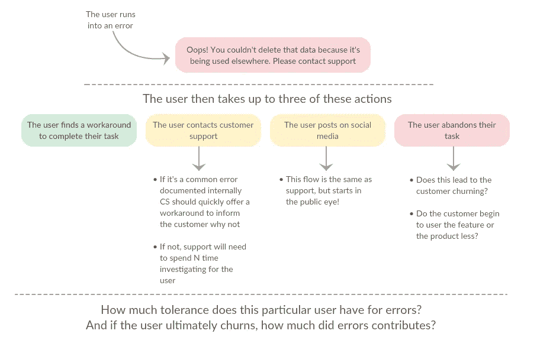
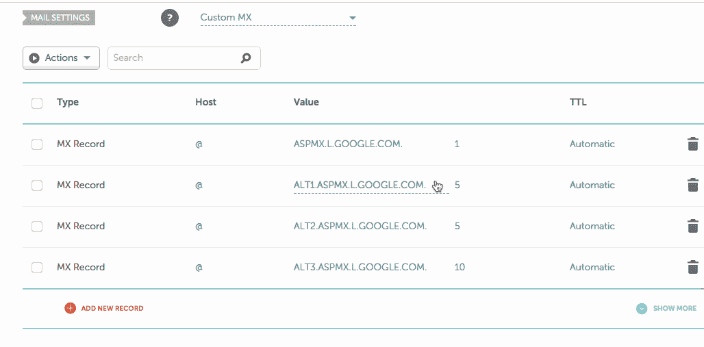

# [第 5 天]30 天内归零至 MVP 重新思考验证

> 原文：<https://medium.com/hackernoon/day-5-zero-to-mvp-in-30-days-rethinking-validation-3b2f20ba399f>

你好。首先，我想感谢所有发现这个小系列的人。掌声、评论，甚至几封电子邮件都令人难以置信地振奋，意义重大！

今天是沉重的后端开发，努力工作，让一切都在适当的地方，我可以填写用户界面组件，我们需要截图。我不介意为了一个早期的登陆页面而嘲笑 UI，但是我确实希望它是我们正在进入的一个真实的表现。

但是退一步说，专注于一些技术上的挑战给了我喘息的空间，让验证的想法在一天中无所事事。**我决定在我们的战略中做一个小小的中枢！**

当然，这还为时过早，我们并没有放弃我在第 2 天概述的渠道，我们只是改变了一些策略，看看是否能提高我们的回应率。

一个小中枢的时间再好不过了，因为明天是美国的感恩节。(我不想给那些想和家人在一起的人发邮件！)这会给我几天压力，让我在内容上有所进展，并克服我面临的一些困难的技术挑战。

# (小的)验证中枢

我们的目标是重新定义我们在第一天概述的旁观者观点的核心，然后制定三个新的策略来达到我们的目标受众。

现在，我们已经花了几天时间来宣传这个想法，并深入挖掘了一些社区，让我们看看是否可以更好地定义我们的产品。

回到[第一天](/@modette/day-1-zero-to-mvp-in-30-days-idea-number-1-18536868e282)我把旁观者定义为:

> 旁观者. io 一个[工具](https://hackernoon.com/tagged/tool)来跟踪面向用户的视觉错误，它们要花费你多少钱，以及一个框架和附带的分析来减少这些错误的花费。

就电梯间距而言，这可能需要一点工作。

首先，让我们看看如何定义旁观者的利益。在独立黑客对布兰登·邓恩的采访中，他很好地总结了一家公司的采购决定:

> [……]如果企业能够通过**赚更多的钱**或**亏损更少的钱**，那么他们就能为这些事情买单。

我们将融入硬币的“少赔点钱”。但是怎么做呢？以下是当客户面对您的应用程序中的错误时，我们假设的用户流的简化版本:

因此，我们希望通过以下方式回收公司成本:

1.  减少客户支持小时数错误增加
2.  减少客户因错误而降级或取消计划

我们怎么做？

1.  在有意义的地方改进可操作的错误。应该像我们的行动号召、营销文案等一样，对错误进行迭代和测试。
2.  让错误消息保持信任，而不是降低信任
3.  使用分析来帮助有效地识别和修复新的或麻烦的错误消息，并为您的团队建立一个框架，以便在内部记录客户支持或改进错误

那么这个迭代中的旁观者. io 是什么呢？请记住，我们希望获得以下内容的浓缩版本:

> 旁观者 io 是一个跟踪面向用户的可视化错误的工具，它们让你付出了多少代价，以及一个附带分析的框架来降低这些错误的成本。

这是一个很长的答案——我可以理解人们对第一个逗号感到厌烦。

我们正在优化+记录您的错误。

太好了！但是提炼我们的产品希望如何定义我们验证工作的方向呢？

不，我们有(希望有！)更清楚地了解谁最接近我们希望解决的有形难题。

1.  在联系**用户体验专家**时，我会要求他们依次联系客户支持团队，以获取导致客户联系的错误信息示例。然后我会用我们的 SaaS 最终会用的方式来研究它。**我会帮助他们从给他们带来痛苦的错误中恢复价值。**做不成规模的事情。
2.  终身客户支持前线**:他们可能没有购买力，但我们会尝试一种更传统的销售渠道，在目标公司内创造一个粉丝，为前线提供类似我们对 UX 专业人士所做的价值。在那里工作。**
3.  **公司社交媒体账户**:把握趋势错误很容易。这将给我一个及时的错误来提供价值，并且对一家公司的每一次@提及都会被阅读，所以我想测试一下这是否有效。

因此，我们将尽可能接近问题，并提供即时价值，而不是要求讨论。

让我们停止错误消息**降低长期客户价值**和**增加客户支持成本**。

让我们永远不要再给他们这个:

现在，亲爱的读者们，我有一个请求！如果你在一家足够大的 SaaS 公司工作，有一个客户支持团队，或者你和一些可能受益的人是朋友，问问你的客户支持团队是否有用户写的错误信息。

明天见，如果你在美国，明天正忙着吃火鸡——祝你假期愉快！(祝你们其他人也有愉快的一天！！)

像往常一样，随时给我发电子邮件或信息，我的电子邮件是在我的主页上最初发布的上的[。👋](http://matthewodette.com/)

[第四回](/@modette/day-4-zero-to-mvp-in-30-days-landing-page-delays-3e05c38fdaea)
第三回[第六回](/@modette/day-6-zero-to-mvp-in-30-days-a-first-look-at-bystander-io-80ebf900a727)