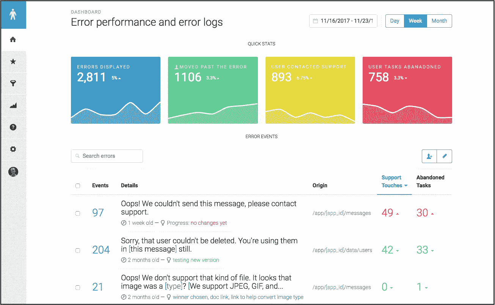

# [第 6 天]30 天内从零到 MVP 旁观者第一眼

> 原文：<https://medium.com/hackernoon/day-6-zero-to-mvp-in-30-days-a-first-look-at-bystander-io-80ebf900a727>

大家好！

本着感恩节的精神，今天我会抽出一些额外的时间与朋友和家人在一起。尽管如此，我今天还是想贴一个小小的帖子！

尽管这是我最短的帖子，但它可能是我迄今为止最喜欢的——第一次看到我正在构建的东西！如果你刚到这里，[第一天解释了我们的概念](/@modette/day-1-zero-to-mvp-in-30-days-idea-number-1-18536868e282)。

这是旁观者在 alpha 测试前仪表盘上的第一张截图:

因此，我对初始仪表板的目标是:

1.  我想立即展示价值，并尝试让用户感受到某种版本的:“*哇，这就是我们使用这个*的原因。”我希望顶部的“快速统计”有所帮助，看看你在客户支持时间或更多用户成功完成任务方面节省了多少钱。
2.  炫耀我们在这里的原因，错误日志。这应该可以让他们立即清楚地确定从错误消息中收回成本的优先顺序。例如，您可以看到我正在对表格进行排序，以查看哪个错误导致了本周最多的客户支持沟通。
3.  *在我们的第一次演示中，尽量不要表现得太过火。我们希望它看起来、感觉起来和*第一眼看起来*有用，而不是让新用户感觉他们需要立即跑去文档。*

当然，这需要设计师的参与。但这是第一次尝试，我对此很满意！

# 明天，第七天

*   我会把我们第一个真正的登陆页面拼在一起
*   将旁观者. io 从 GitHub 页面切换到 DigitalOcean droplet
*   把幽灵放到旁观者博客的子目录中
*   展望一个列表，以测试我们昨天的新验证计划，并安排周一上午的邮件

感恩节快乐！

如果这篇文章太短，另一位创造者埃米尔已经开始了他自己的 30 天零 MVP 挑战，[在这里看看他神奇的第一天](/@EmilBruckner/day-1-zero-to-mvp-in-30-days-idea-plan-69db96f62b3f)。

当然，如果您有任何反馈[或问题](https://hackernoon.com/tagged/feedback)或其他想法，请随时给我发电子邮件，我的电子邮件在我的个人页面[上，这里是本文最初发表的地方](http://matthewodette.com/day-2-zero-to-mvp-in-30-days-copy)！

[向前第 7 天](/@modette/day-6-zero-to-mvp-in-30-days-on-landing-pages-and-prospecting-453a00cd1f9b)
[向后第 5 天](/@modette/day-5-zero-to-mvp-in-30-days-rethinking-validation-3b2f20ba399f)

[https://upscri.be/hackernoon/](https://upscri.be/hackernoon/)