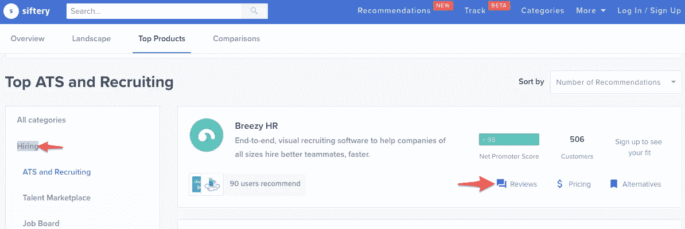
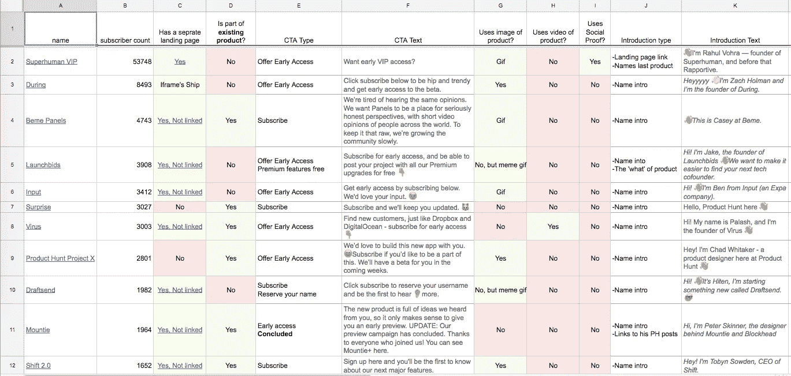

# [第 7 天]30 天内从零到 MVP 登录页面和潜在客户

> 原文：<https://medium.com/hackernoon/day-6-zero-to-mvp-in-30-days-on-landing-pages-and-prospecting-453a00cd1f9b>

你好。

如果你是这个系列的新手，我在第一天制定了一些基本规则[，并在第一天](https://hackernoon.com/day-0-zero-to-mvp-in-30-days-31c83db6aadf)解释了我的第一个项目[的想法。我每天记录一点我正在做的事情。](https://hackernoon.com/day-1-zero-to-mvp-in-30-days-idea-number-1-18536868e282)

# 关于登录页面的快速思考

我目前正致力于从 [Github](https://hackernoon.com/tagged/github) 页面转移到[数字](https://hackernoon.com/tagged/digital) Ocean droplet，从旁观者. io 上的 iframing[my Product Hunt Ship page](https://www.producthunt.com/upcoming/bystander-io)切换到我们登陆页面的自托管版本 1.0。我还会将 [Ghost](https://ghost.org/) 放在一个`/blog`子目录中，开始发布一些针对旁观者. io 客户的长篇内容。

对于登陆页面，我仍然选择自托管，因为托管非常便宜，而登陆页面即服务选项相当昂贵，我可以通过从 [Themeforest](https://themeforest.net/) 抓取一个静态模板在几乎相同的时间内完成。

在选择主题时，我会考虑以下几点:

1.  有各种各样的部分和元素可供选择，让切割页面来满足我的需求变得轻而易举。
2.  当我向下滚动演示页面时，我不需要 10 只手和 13 英尺来用足够的手指和脚趾来数有多少图标和文本块飞入视图。
3.  通常在这个阶段，我会对文件夹上方的内容有一个大致的构想，我会努力找到一个与这个构想相匹配的模板。
4.  主题的作者建立在平台上或其他地方。
5.  最后，从我的手机上看他们的演示页面，以确保他们的响应式设计不仅仅是由 Bootstrap 构建造成的意外。

当使用模板时，我认为重要的是避免让你的登陆页面内容适合模板，而是让模板适合你的内容。仅仅因为一个主题有一堆漂亮的元素，并不意味着我们应该把它们都用上。

我还会去主题存储图片的目录，删除所有的库存照片。或者，如果我需要保存它们的尺寸以便稍后填充我自己的图像，可以把它们拖到别的地方。

如果你打算使用库存照片，我认为应该[是一个深思熟虑的选择](https://www.seguetech.com/stock-photos-vs-real-photos/)，符合你对自己品牌的设想，并且[不会对你大喊“我是库存照片”](https://marketingexperiments.com/digital-advertising/stock-images-tested)。

如果你需要登陆页面内容的灵感，我总是喜欢去 [Lings Cars](https://www.lingscars.com/) 。然后，我抓起一杯威士忌，以平静我的神经。

然后在你喝完最后一口威士忌后，为了获得真正的灵感，你可以看看[询问关于登陆页面的黑客新闻帖子](https://hn.algolia.com/?query=%22ask%20hn%22%20best%20%22landing%20page%22&sort=byPopularity&prefix=false&page=0&dateRange=all&type=story)。

哦！在你将登陆页面推送到你的主机之前，一定要添加所有你感兴趣的追踪像素，以便立刻开始收集广告重定向的数据。

# 勘探

我还想分享我今天在建立潜在客户名单时使用的一个快速小策略。冷接触是有效的，但这是一种折磨，我喜欢在我的接触中尽可能地个人化——所以我可能花了比我应该花的更多的时间来把人们放在一起。但是我发现像这样的小技巧加快了我的工作流程。

这种方法利用了人们留下他们在业务中使用的 SaaS 产品评论的网站。Siftery 是这种服务的一个很好的例子。当我们耗尽 Siftery 的资源时，Product Hunt [有一个替代网站的列表](https://www.producthunt.com/alternatives/siftery)。

举个例子，一个创客伙伴最近正在寻找通过基于招聘/雇佣的 SaaS 来验证想法的创业公司。

我们可以导航到 Siftery 的招聘类别，并开始点击每个 SaaS 的评论:

评论通常包括评论者的姓名和公司。所以现在我们知道 X 公司使用我们感兴趣的软件，我们可能知道我们至少可以开始与该公司的谁进行一些冷接触。

从这里开始，我会在 LinkedIn 上做一些常规的研究，然后试着找到与这个人有联系的东西，并追踪公司的电子邮件格式(如果你在这方面有困难，Hunter.io 或类似的工具很好)

我知道我们有一个快速的方法让我们的潜在客户名单中的一些人真正使用我们感兴趣的软件或竞争对手。

我很好奇，当其他人开始为他们自己的项目寻找冷外联时，他们是否有一个可去的来源？

# 明天，第八天

我想，这个周末我们有点像自动驾驶仪。

我需要继续寻找在推广和验证方面的巨大推动力。我还需要打开主机来放置我的新登录页面——我们将在假期周末后开始发送我们不断增长的潜在客户名单时开始测试。

如果明天我有空闲时间，我会开始通过用户体验博客寻找客座博客的机会。我有一些关于错误消息的长格式草稿，我想尝试一两篇客座博文，以补充旁观者自己的博客即将发布的内容。

内容营销是一个长尾游戏，但我希望有一些有意义的东西可以尽早提供，以帮助建立信任和权威。

哦！如果你对拥有 1000 多名订阅者的产品搜索页面感兴趣，[我有这个电子表格](https://docs.google.com/spreadsheets/d/16eTsqYLK695K_SnOI6sE3mhww0P3b_8CRebH-SApcOw/edit#gid=0)——我还画了第 4 天的[:](/@modette/day-4-zero-to-mvp-in-30-days-landing-page-delays-3e05c38fdaea)

数据是 3 天前的，所以一些页面和统计数据可能已经改变。

感谢阅读。当然，如果有任何问题或反馈，请随时给我发电子邮件！我的电子邮件是在我的个人页面上的[，这是本文最初发表的地方。](http://matthewodette.com/day-2-zero-to-mvp-in-30-days-copy)

[向前第 8 天](/@modette/hello-all-e902e4dfb147)
[向后第 6 天](https://hackernoon.com/day-6-zero-to-mvp-in-30-days-a-first-look-at-bystander-io-80ebf900a727)

[https://upscri.be/hackernoon/](https://upscri.be/hackernoon/)