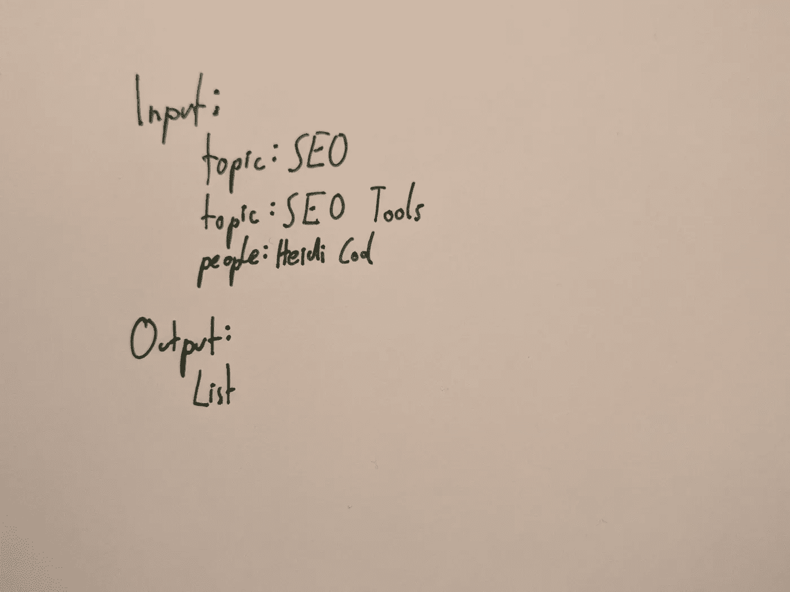
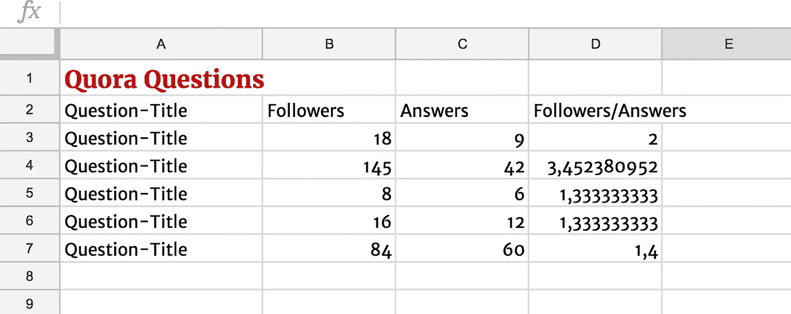

# [第 6 天]30 天内从零到 MVP 撰写登录页文案

> 原文：<https://medium.com/hackernoon/day-6-zero-to-mvp-in-30-days-writing-landing-page-copy-d5df22fa2192>

撰写文案是创建登录页面的第一步。和我一起写 findbetterquestions.com 的一首歌。

在这个系列中，我将验证一个新的想法。在这里阅读概念[(第 0 天)](/@EmilBruckner/day-0-zero-to-mvp-in-30-days-what-its-all-about-c39215a531f7)和想法[(第 1 天)](https://hackernoon.com/day-1-zero-to-mvp-in-30-days-idea-plan-69db96f62b3f)。

所以让我们写一些副本。下面是第一个版本:

# 1.解决棘手问题

> 在 Quora 上找到最好的问题
> 
> 通过选择最佳问题从您的答案中获取流量

上面的标题和副标题应该引起注意。如果一个登陆页面不能在那里引起人们的兴趣，那它就是失败的。

它们应该包括:(我从贾斯廷·杰克逊的[开发者营销中偷来的)](http://devmarketing.xyz/)

1.  这是给谁的？
2.  他们对美好生活的梦想是什么？
3.  他们的道路上有什么障碍？
4.  你如何帮助他们克服障碍？

> Quora 提供的搜索功能非常有限，所以找到好问题是一件痛苦的事情。你通常会在网站上冲浪，直到你神奇地找到正确的问题。我们自动完成这项任务。

## 你怎么想呢?

这样会引人注意吗？你了解 findbetterquestions.com 的原因、人和事吗？

# 2.展示产品如何处理图像

*这是或多或少的特征部分* **输入**可以是话题、人物、其他问题和列表…

**输出**为您提供一个指标列表。我还没有最终确定应该使用哪些指标，但这很容易更新。

我想用这个例子来突出一些问题的对比。

## 该不该加福利？

*   节省时间
*   被听到
*   内心的宁静

# 3.发布前注册表单

我也要上面那个。

> 想免费试试这个吗？前 100 名用户将获得早期接入。

## 4.链接此系列

我认为如此公开地写这个项目会产生信任，所以我将包括一个很小的部分，在那里我链接到一些文章。

## 5.使用实时聊天联系我

# 少了什么？

社会证明。后面会补充。

## 明天的计划

*   构建登录页面
*   寻求反馈

> [←第五天](https://hackernoon.com/day-5-zero-to-mvp-in-30-days-how-to-validate-67cc7f0f76b8)
> 
> [→第七天](/@EmilBruckner/day-7-zero-to-mvp-in-30-days-what-a-bad-landing-page-1f3dd843b991)