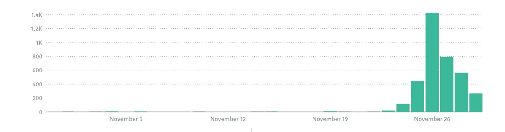

# [第 7 天]30 天内从零到 MVP 多么糟糕的登陆页面

> 原文：<https://medium.com/hackernoon/day-7-zero-to-mvp-in-30-days-what-a-bad-landing-page-1f3dd843b991>

我现在想睡觉了，但还是会写这篇文章。[登陆页面](https://findbetterquestions.com/)已经上线，但是我还没有测试是否所有的按钮&都可以分析。

在这个系列中，我将验证一个新的想法。在这里阅读概念[(第 0 天)](/@EmilBruckner/day-0-zero-to-mvp-in-30-days-what-its-all-about-c39215a531f7)和想法[(第 1 天)](https://hackernoon.com/day-1-zero-to-mvp-in-30-days-idea-plan-69db96f62b3f)。

很抱歉，这个会很短，但我想我至少可以给你一个我今天所做的事情的概述。

我创建了登陆页面。比预期的时间要长。内容已经在那里，截图只需拍摄(表创建的内容)。然后我不得不编辑一些关于我买的 HTML 模板的东西。我发现它附带了用于表单处理的 PHP 文件:(
但是 Netlify 表单集成得很快:)

使用 Segment 轻而易举。我喜欢它。一切都在一两分钟内设置好了，包括 Mixpanel，GA，Drift。我还复制了一些代码，以便当有人点击导航中的联系人时打开 Drift。但是当我达到免费计划限额时，我该怎么办呢？那会很快…

我想念一个图标。我也还没有一个标志，但我喜欢我现在拥有的，因为我也将为应用程序使用系统字体。我明天试试用旧金山(mac 的系统字体)登陆页面是什么样子的。

明天还会跟人说[登陆页](http://findbetterquestions.com)的事。

## 明天的计划

产品工作
与人交谈

我基本上一直都是这样，有时候超级无聊，有时候很刺激。当我分享产品时，我会分享更多关于产品的信息。如果你想成为第一个测试它的人，请确保在下面输入你的电子邮件地址👇

到目前为止，大约有 18 人注册了产品搜寻船。
本博客的一些统计数据:

你对这个项目的哪些方面感兴趣？营销，开发，产品本身，…

> [←第 6 天—撰写登陆页文案](https://hackernoon.com/day-6-zero-to-mvp-in-30-days-writing-landing-page-copy-d5df22fa2192)
> 
> [→第 8 天——反思 UX](/@EmilBruckner/day-8-zero-to-mvp-in-30-days-rethinking-ux-b46ead84e3d9)