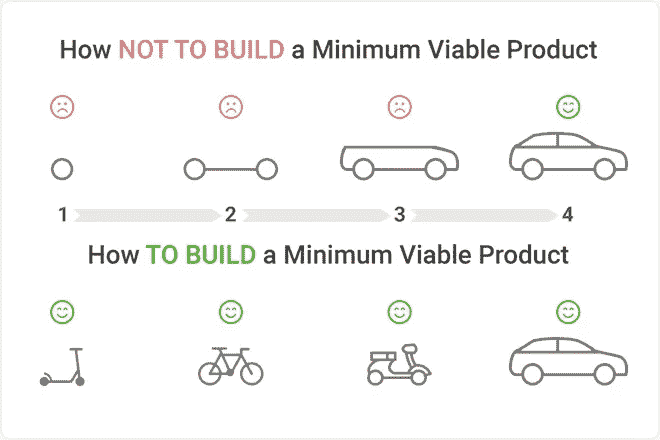

# [第 8 天]30 天内从零到 MVP 重新思考 UX

> 原文：<https://medium.com/hackernoon/day-8-zero-to-mvp-in-30-days-rethinking-ux-b46ead84e3d9>

在这个系列中，我将验证一个新的想法。在这里阅读概念[(第 0 天)](/@EmilBruckner/day-0-zero-to-mvp-in-30-days-what-its-all-about-c39215a531f7)和想法[(第 1 天)](https://hackernoon.com/day-1-zero-to-mvp-in-30-days-idea-plan-69db96f62b3f)。

今天没有一个特别精确的任务清单，我开始着手[的应用](https://findbetterquestions.com)。这种方法是错误的，至少对我来说是这样。

当你不知道你要去哪里的时候，总是朝着正确的方向前进是非常困难的。因为没有人能预测未来，所以不可能直线前进，但是如果你有目标，你可能只会原地打转。你越清楚自己想去哪里，就越容易到达那里。

我已经开始编码，一些非常详细的细节，但我甚至不知道应用程序应该是什么样的感觉。我只创建了一些线框。这种快速 MVP 的方法可能让我跑得太快，或者我可能只是不习惯。我不知道。

> 经常反思并看到全局是很重要的

I have no idea where this image is stolen from

从现在开始，我会确保不只是日复一日，而是每天重温 30 天计划。

该应用的 UX 阶段还远未结束。我想花更多的时间在这上面是好的。

## 明天的计划

这太无聊了。同昨日。等等，我想更准确地定义这个。明天的前景将是面向内容营销机构。一个小时。

想谈谈这个项目吗？在此评论或谈论[。
想成为第一个使用产品的人？在](https://findbetterquestions.com/)[https://findbetterquestions.com/](https://findbetterquestions.com/)报名

> [←第 7 天——多么糟糕的登陆页面](https://hackernoon.com/day-7-zero-to-mvp-in-30-days-what-a-bad-landing-page-1f3dd843b991)
> 
> [→第 9 天——我的第一次实时聊天](/@EmilBruckner/day-9-zero-to-mvp-in-30-days-my-first-live-chat-3a16fa02f4c1)