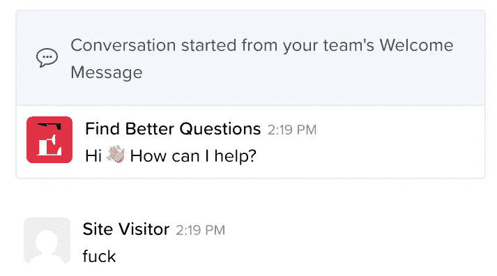

# [第 9 天]30 天内从零到 MVP 我的第一次实时聊天

> 原文：<https://medium.com/hackernoon/day-9-zero-to-mvp-in-30-days-my-first-live-chat-3a16fa02f4c1>

在这个系列中，我将验证一个新的想法。在这里阅读概念[(第 0 天)](/@EmilBruckner/day-0-zero-to-mvp-in-30-days-what-its-all-about-c39215a531f7)和想法[(第 1 天)](https://hackernoon.com/day-1-zero-to-mvp-in-30-days-idea-plan-69db96f62b3f)。

今天非常无聊。我只有 1 小时来做这个项目。我基本上只是在交流。
正如昨天提到的([第八天——重新思考 UX](https://hackernoon.com/day-8-zero-to-mvp-in-30-days-rethinking-ux-b46ead84e3d9) )，我给**内容营销**机构发了一些冷冰冰的邮件。让我们看看这是如何实现的。我真的不明白这些机构为什么以及如何运作。

如果你对如何做**冷 email**感兴趣(并且想看的不止是这篇短文)，可以去[马修的](https://hackernoon.com/day-12-zero-to-mvp-in-30-days-a-look-at-cold-validation-479f6ec2a76d)(那个[启发我](https://hackernoon.com/day-12-zero-to-mvp-in-30-days-a-look-at-cold-validation-479f6ec2a76d)做这个系列的家伙)[帖子](https://hackernoon.com/day-12-zero-to-mvp-in-30-days-a-look-at-cold-validation-479f6ec2a76d)看他是如何做冷 email 的。顺便说一句，他写了很棒的文章。在那个话题上你从我这里学不到很多东西，我是第一次做这个。在这个系列的后面，我可能会分享一些数字。

## 我和 Drift 的第一次实时聊天

这是我从 findbetterquestions.com 那里收到的第一条信息。有人还告诉我，我的登录页面在移动设备上看起来很糟糕。谢了。当命名第 7 天的帖子时，我知道我在说什么:[多么糟糕的登陆页面](/@EmilBruckner/day-7-zero-to-mvp-in-30-days-what-a-bad-landing-page-1f3dd843b991)。

## 关于查找更好的问题

它让你在 Quora 上找到最好的问题，这样你就能从你的回答中获得流量。如果你对此感兴趣，请在 findbetterquestions.com[报名提前参加](https://findbetterquestions.com/)

> [←第 8 天——反思 UX](https://hackernoon.com/day-8-zero-to-mvp-in-30-days-rethinking-ux-b46ead84e3d9)
> 
> [→第 10 天——到目前为止我学到了什么](/@EmilBruckner/day-10-zero-to-mvp-in-30-days-what-i-learned-so-far-ead68f633d85)