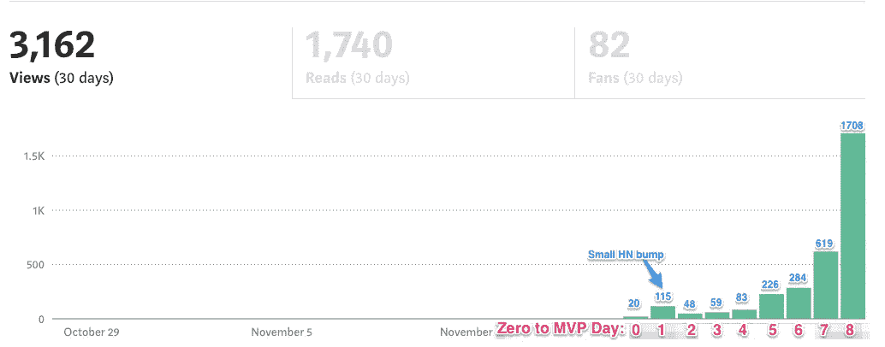
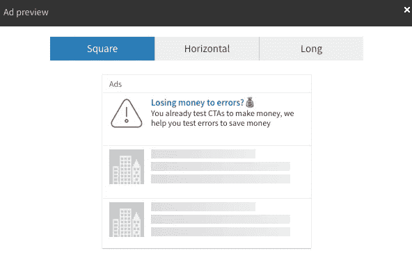
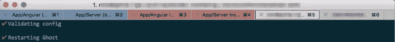
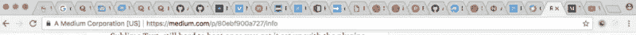
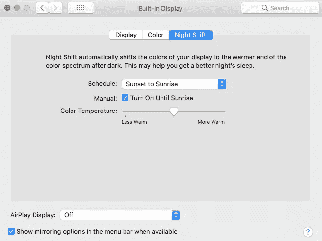

# [第 9 天]30 天内从零到 MVP 烧钱

> 原文：<https://medium.com/hackernoon/day-9-zero-to-mvp-in-30-days-torching-some-cash-97c655b46fed>

你好。如果你是这个系列的新手，我在第一天制定了一些基本规则[，并在第一天](https://hackernoon.com/day-0-zero-to-mvp-in-30-days-31c83db6aadf)解释了我的第一个项目[的想法。我每天记录一点我正在做的事情。](https://hackernoon.com/day-1-zero-to-mvp-in-30-days-idea-number-1-18536868e282)

我已经意识到，特别是在今天的更新中，我正在讨论在社交广告和 Nginx 样板上投入一些资金，我有时会向你扔一些奇怪的大杂烩。我几乎把这篇文章编辑成一个主题，但我认为这种随机想法的混合是我在这次挑战中每天最诚实的表现。

所以让我们开始吧。

Image credit: CC0 [https://pixabay.com/en/users/Intellectual-4717896/](https://pixabay.com/en/users/Intellectual-4717896/)

# 像小丑一样烧些钱，但是我老婆不会因为这个把我从床上踢下来

首先，让我引出*为什么*我在广告实验上烧钱。对于一个星期天来说，今天相当热闹:

*   在[上聊天旁观者. io](http://bystander.io/) 正在工作。我今天和可爱的人进行了令人惊奇的实时聊天。这听起来可能没什么。但这是一个 B2B SaaS 登陆页面，上线不到 24 小时，除了与这个小系列相关的内容之外，没有任何广告或反向链接。
*   今天，我在登录页面上有 7 个新注册的早期访问表单。这些不包括我通过冷接触争取到的少数注册。
*   登陆页面的流量和这个博客的统计数据持续增长。虽然这个系列的统计数据在验证旁观者方面可能没有太大意义，但它对我来说确实意义重大，让我非常有动力(说真的，感谢所有阅读和给我发消息的人)

对于那些好奇的人来说，这个记录我旅程的小系列是如何从第一天开始在媒体上发展的:

Moving the series into Hacker Noon has been great

现在，回到主题扔掉一些现金的主题。

这种对旁观者的兴趣让我有信心走得更远。未来两天的一个大目标是建立一个预订选项。预订将为企业节省 50%的购买时间。我从来没有尝试过预先订购的验证方法，我想看看我们是否能让它在这里工作。

我现在的假设是，一个为预订而跳跃的企业是我正在积极沟通的人。我不指望一个单独的登陆页面能够将某人转化为 B2B SaaS 解决方案的预付款。

那么为什么是广告呢？

对我来说，这是一种廉价的方式，可以在比我目前能做的更大的范围内测试我的文案和假设。为了让人们提前预定，我想用我目前的资源和流量，尽可能地拥有最好的文案和价值主张。

现在，第一次做广告的客户通常会提供相当丰厚的奖金。我想把我在这里的花费控制在 200 美元以下。但是，例如，LinkedIn 会给你 50 美元的积分，利用这一点和类似的奖金，可以将小额测试预算用得更远。

T2 脸书 T3 和 LinkedIn T4 的每场竞选都有 3 个不同的广告 T5。

对于每个添加集，我测试两种不同的东西:

1.  我的标题和副标题
2.  我的受众按职位分类:用户体验专家与支持主管和项目经理

这里有一个用户体验营的 LinkedIn 广告示例:

我不指望在这种小规模的广告中会有转变。我的支出规模很小，这是我第一次去做广告旁观者，我的主要目标是看看我是否能在我的受众和头条新闻上确定一个可衡量的差异，以帮助我集中精力做早期工作。

另外，我不能仅仅通过阅读来了解广告，我需要开始学习。至少，我为你的娱乐花了一点钱😂

# 进入旁观者的堆栈中的一些细节和小变化

一些人友好地表达了对我正在为[旁观者. io](http://matthewodette.com/bystander.io) 工作的堆栈的兴趣。我在第 2 天简要地谈到了这一点，但我认为它可能会引起一些人的兴趣，让他们更详细地了解我日常使用的堆栈和工具。

我本来是前端开发出身。但最近在客户支持部门担任高级工程师。支持工程是一个奇怪的野兽，你会获得大量技术和客户堆栈方面的广泛知识。但这就像探索脚踝深的技术海洋——你可以在任何环境下快速找到东西，并解决它们。您通常不需要进一步探索代码(或者时间！)

独自完成一个项目时，我通常会坚持我所知道的，可能会把我感兴趣尝试或学习的一个新作品扔进堆栈。毕竟你必须保持兴趣和兴奋！当你尝试新事物的时候，时间是漫长的。

我以前犯过几次错误，试图用所有新的很酷的东西来构建一个项目，但进展如此缓慢，以至于我失去了动力，弃船而去。

所以！这个[旁观者](https://bystander.io/)的筹码…

**后端:**

*   **节点**最新稳定用 [**表达**](https://expressjs.com/) 。
*   **MongoDB** 带[猫鼬 ](http://mongoosejs.com/)
*   [**Auth0**](http://auth0.com/) 对于认证和访问控制来说，认证是已经解决了一百万次的事情。但是在一个单独的项目中，身份验证即服务节省了我大量的时间。它让我在一个可怕的空间里充满自信。他们的内容团队也是一流的，如果你对此感兴趣，可以看看他们的博客。

express+mongose+auth 0 让我以令人难以置信的速度制作具有受保护端点的 API。

**在前端:**

*   [**棱角 5**](https://angular.io/) ，这需要[打字稿](https://www.typescriptlang.org/)。我发现打字稿绝对是一种乐趣。它是 JS 的超集，让你可以用 JS 作为强类型语言进行开发。所以，使用 Angular in 和 IDE 比如 [Webstorm](https://www.jetbrains.com/webstorm/) 可以让你提前输入所有东西，让你捕捉编译错误。
*   对于一个设计和组件框架，我最初的计划是使用 [Nebular](http://akveo.com/ngx-admin/#/pages/dashboard) ，但我目前提供的截图实际上利用了一个 [**Bootstrap 官方主题**](https://themes.getbootstrap.com/products/dashboard) ，其中的组件我已经在之前的项目中分割成 Angular 组件/服务。我仍然被 Nebular 所吸引，因为它感觉更现代，但真的，我需要加倍努力，专注于功能而不是形式。
*   新(给我！)我在这个项目上玩的技术是 **Redux** ，虽然是以 [**NgRx**](https://github.com/ngrx/platform) (Angular 的 Redux 的味道)NgRx/Redux 的形式把你的应用程序的状态放到一个单独的对象中。所以在调试的时候，你会得到一些非常酷的好处。[Ngrx 维护者的这次谈话](https://www.youtube.com/watch?v=cyaAhXHhxgk)值得一看。另外，即使对 Redux 或 NgRx 不感兴趣，这也是我见过的两个开发者演讲的最佳形式。布兰登和迈克在这方面做得非常出色。

**主机相关:**

*   [数字海洋](http://digitalocean.com/)水滴:一个用于营销+博客，一个用于 app 的节点实例。当我真正拥有客户时，可伸缩性就来了。
*   [Nginx](https://nginx.org/en/)
*   [云闪](https://www.cloudflare.com/)。因为它很容易使用，而且他们的免费服务很有影响力。
*   [MongoDB 自己的数据库即服务](https://www.mongodb.com/cloud/atlas)(感谢[一位好心的读者](/@DaveThe0nly/looking-at-mlab-pricing-have-you-considered-mongo-atlas-https-www-mongodb-com-cloud-atlas-c029f92ff980)推荐他们而不是 MLab)

**我日常使用的应用:**

*   崇高的文本，一旦你用你的项目需要的插件设置好它，仍然很难被击败。虽然，因为 Angular 5，我花在那里的时间少了，花在…
*   我前面提到的网络风暴。
*   iTerm2 让你的终端如此牛逼。如果你还没有使用 iTerm2，我会谷歌一下，看看其他人是如何设置它的。这将为你节省一些视觉方面的时间。我喜欢标签和颜色编码，这样我就可以看到我在本地运行的不同服务:

Red, Blue two different running stances of an app on different ports so I can test two branches live. Which are my active tabs where I actually need to work in the console.

*   [Skitch](https://evernote.com/products/skitch) 拍摄截图并为其添加注释，以记录这一旅程。免费又神奇。
*   [Li 当我需要快速录制我的部分屏幕的 Gif 时，选择](https://www.cockos.com/licecap/)。也是免费的，使用起来超级简单。
*   我自己的空闲工作区将通知和数据传送给我。检查不同的电子邮件、来自旁观者 io 的聊天信息、跟踪推特、在媒体上关注……几乎所有我需要查看的东西，检查任何类型的通知，我只是把它们拉进一个空闲频道，以避免分心并节省大量时间。

此外，我在工作时没有空间放置新标签:

I know I need to close some tabs when the icons go away, or my laptop’s fan is giving me a headache

*   Spotify 听奇怪的东西。

我工作到晚上 11 点/午夜，所以我一直开着夜班，这对我很有帮助。对于任何不是基于 iOS 的屏幕，我使用 [Flux](https://justgetflux.com/) 来达到同样的目的。

Reduce some blue light to help me get to sleep after a late night working

这就是一切！在你的工作流程中哪些工具是必不可少的？你有什么可以帮我节省时间的吗？因为我确实需要更多的时间！

# 明天，第 10 天！

*   开始挂钩条纹添加预购选项。
*   很多很多的后续工作。我需要联系新订户、我正在发电子邮件的人，以及来自实时聊天的少数人。
*   更多冷漠的外联(它从未停止)
*   从今天的列表滚动，让旁观者的幽灵博客成为我喜欢的模板
*   五百万件我今天不能满足的事情

感谢阅读，这原来相当长！当然，如果有任何问题或反馈，请随时给我发电子邮件！[我的电子邮件在我的主页](http://matthewodette.com/day-9-zero-to-mvp-in-30-days)上，这是最初发表的地方。明天见！

[前进到第 9 天:](/@modette/day-10-zero-to-mvp-in-30-days-lets-talk-pricing-a58babe464ad) *我们来谈谈定价*
[回到第 8 天](https://hackernoon.com/hello-all-e902e4dfb147) : *请把我的登陆页面撕成碎片*