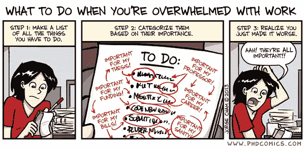

# 不知所措的技术工人的一天

> 原文：<https://medium.com/hackernoon/day-in-the-life-of-an-overwhelmed-tech-worker-a23ddb5df672>

Courtesy of [PhDComics](http://www.phdcomics.com)

醒来后，从床上摔了下来。该死，已经早上 8 点了。只有半个小时准备赶末班车。昨晚真的不应该在外面呆到很晚，但是经过昨天漫长的一天，绝对需要发泄一下。冲个澡，吃点熏肉和鸡蛋，我就出门了。几秒钟内就赶上了公共汽车！

糟糕，我忘了把房租支票放在房东的邮箱里。我应该设置提醒的！为什么我的手机不在每个月的第一天告诉我呢？

啊，那杯热腾腾的蓝瓶咖啡真的很有帮助，很高兴这家公司欣然接受。之后，我真的需要开始写第三季度末的报告了。我还没有收到卡尔关于那些数字的回复，我需要问问他。**低头看着电话**，叹了口气，我收到了 20 封新邮件。让我快速浏览一下…哦，嘿，苏西，是的，我马上就站起来。

好吧，我离下次会议还有一个小时，是写报告的时候了！我想知道我的房东是否会对我的支票晚了一点不予追究。他有点固执，但我以前从未迟到过。你猜怎么着我应该给他发封邮件。很好，还有 45 分钟。我们走吧！

哦，那是什么？又是卢克拿着甜甜圈。多好的人啊，但是真的需要注意那些卡路里。好了，继续工作。我给卡尔发了邮件，告诉他我需要的报告数据。我很确定他在某个时候和我分享了它，但对我来说，我找不到它。好吧，当我在 Gmail 的时候，不妨浏览一下这些未读邮件…该死，我只剩下 15 分钟了！卡尔刚刚给我回复了链接，但我现在得走了。我下午去看一下。

开会，吃午饭，开会，喝咖啡，然后回去工作。等等，今天不是阿曼达的生日吗？上次我忘了的时候她很生气。得送些花给她。好了，我们回来了。一小时后还有一个会议，但我能挺过去！我只需要找到那份关于我们招聘策略的文件。

嗯，搜索不到。我知道 Greg 通过 Slack 给我发了链接，但是我也找不到。我刚刚浏览了所有的谷歌文档，但是没有找到！会在哪里呢？**走向格雷戈。嘿，你能把招聘策略文档的链接发给我吗？哦，是在收纳箱里！嗯，现在得等等了，我 10 分钟后还有一个会议，审查我们手机应用发布的项目计划。不过，我应该好好研究一下。**

嗯，那是没用的。我真的应该准备好去参加那个会议，但是其他人也没有准备好！好吧，我得去看看这些信息。苏西想要海斯谷的一家餐馆的推荐。Souvla 太棒了！

呃，已经五点半了。我答应妈妈和她一起吃晚饭。我想我们可以重新安排…我必须完成这份报告。是的，妈妈，我知道这是我第三次改期了，而你已经一个多月没见到我了。不过，我真的必须完成这个！还有那张房租支票…

这和我最难熬的日子相差不远。你有同感吗？留言或推文(或 DM)我[**@ samiur 1204**](https://twitter.com/home?status=%40samiur1204%20)**。也想听听你的故事。**

> [黑客中午](http://bit.ly/Hackernoon)是黑客如何开始他们的下午。我们是 [@AMI](http://bit.ly/atAMIatAMI) 家庭的一员。我们现在[接受投稿](http://bit.ly/hackernoonsubmission)并乐意[讨论广告&赞助](mailto:partners@amipublications.com)机会。
> 
> 如果你喜欢这个故事，我们推荐你阅读我们的[最新科技故事](http://bit.ly/hackernoonlatestt)和[趋势科技故事](https://hackernoon.com/trending)。直到下一次，不要把世界的现实想当然！

