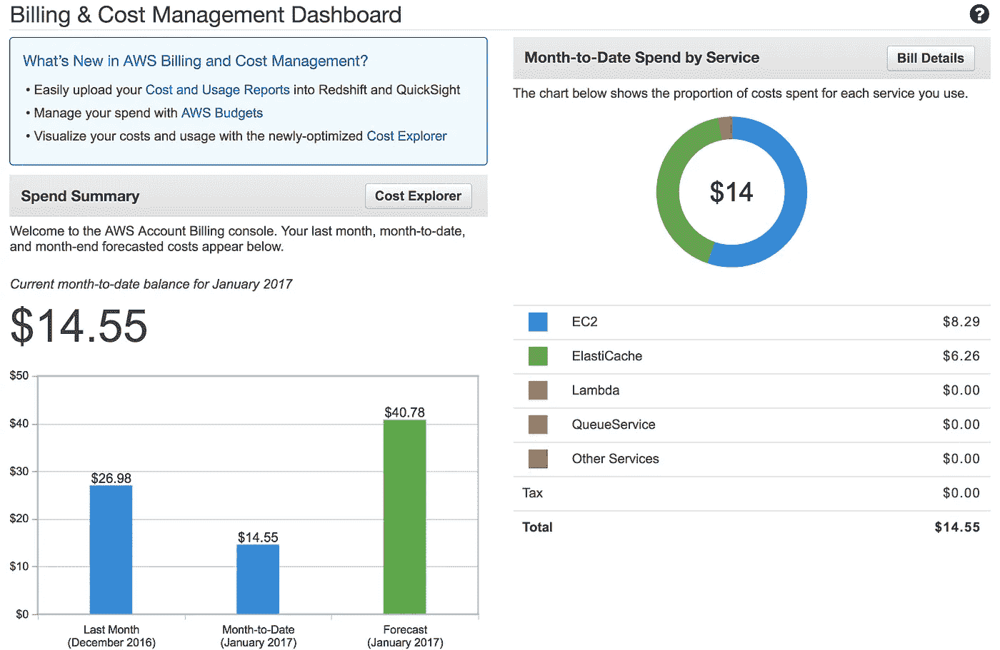
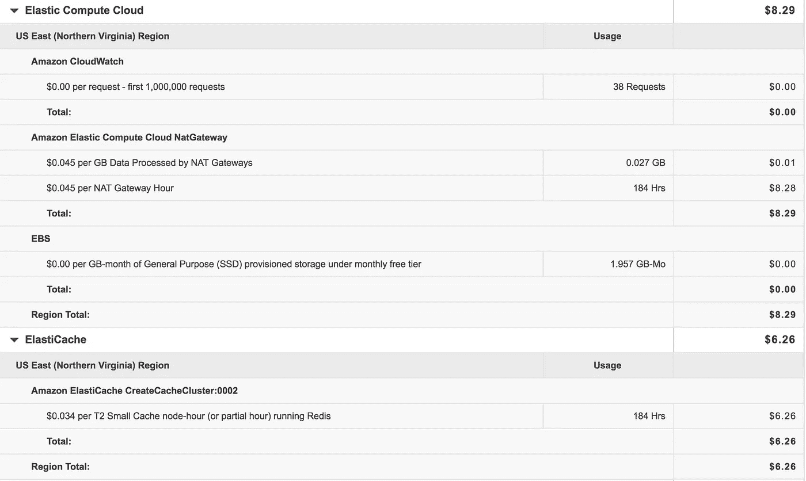
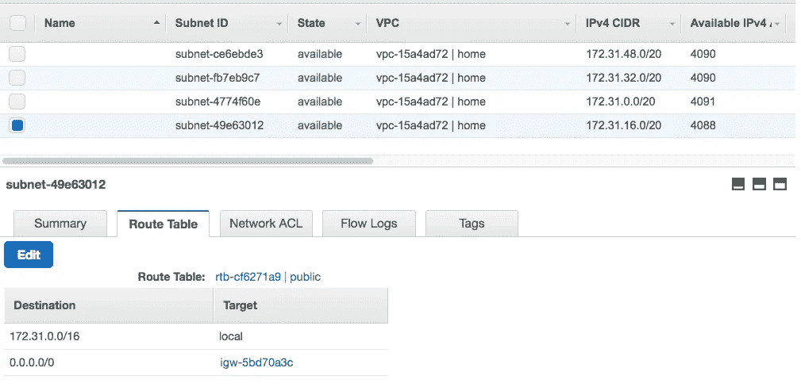

# 处理令人讨厌的 AWS 账单惊喜:当心违约。

> 原文：<https://medium.com/hackernoon/dealing-with-an-aws-billing-surprise-beware-the-defaults-d8a95f6635a2>

我的亚马逊 Web 服务应用程序的[架构](https://hackernoon.com/tagged/architecture)应该是 [*简单的*](https://github.com/antsankov/MrRoadboto) *。这是两个独立的 Lambda 函数，它们之间有一个 Redis 缓存用于持久化。通过购买毫秒级的 Lambda 计算能力，我认为我的应用程序会非常便宜，甚至可能是免费的！当我收到我半个月开发的第一张账单时，我甚至还没有投入生产:26.97 美元，如果这还不够糟糕的话，我对下个月的预测应该是 40.78 美元，甚至没有人使用我的应用程序！*

这个发现的震惊给我上了宝贵的一课，告诉我如何在 [AWS](https://hackernoon.com/tagged/aws) 上创建爱好项目:**小心过度供应**。在本文的其余部分，我将介绍我是如何确定我的应用程序中成本较高的部分，以及我是如何削减成本的。

**转到计费控制台！**当我收到一封来自亚马逊的意想不到的讨厌账单时，我的第一反应是一边咒骂一边不要重新打开邮件。“一定是弄错了……”我完全否认地说。第一步应该是使用 AWS 网站上的计费控制台来确定成本的实际来源。我去我的时候发现了下面这张吓人的图:



$40 for an app I haven’t even launched, yikes!

从那里，我注意到两个直接的成本中心:EC2 和 Elasticache。我觉得这很奇怪。我甚至没有使用任何 EC2 实例，我只使用 Lambda，我在 Elasticache 中的 Redis 节点只存储 5 个字符串。这怎么会让我每月花费 41 美元呢？！

我从主页跳转到仪表板，在那里我可以清楚地看到是什么花费了我的钱:



Aha! My two targets.

我可以看到，这显然是两个有问题的服务，我的 NAT 网关和我的 Redis 节点。考虑到降低成本，我知道我有自己的工作要做。

**推出我自己的 NAT 网关:**我的第一份工作是更换昂贵的 NAT 网关，它允许我的 Lambda 连接到外部网络。亚马逊提供这些网关来处理高达 10 Gbps 的突发数据。对于我的简单需求来说，这是一种过度的供应。所以我找到了一个有趣的[解决方案](https://forums.aws.amazon.com/thread.jspa?threadID=234959):用 NAT AMI 设置一个免费的 t2.micro。幸运的是，亚马逊为此提供了一个预配置的映像(**amzn-ami-VPC-NAT-hvm-2016 . 03 . 0 . x86 _ 64-EBS**)**)。**我创建了一个实例，并把它放入我的 VPC，放在一个有互联网网关的子网中。



The new instance goes into the subnet with the internet gateway as a default route.

令人惊讶的是，它开箱即用！我很感谢 Amazon 提供了一个机器镜像来复制他们的 NAT 网关功能，但是我发现很不幸的是，设置一个 Lambda 函数来发出出站请求是如此的困难。如果你在 Lambdas 和 VPCs 方面有问题，我推荐你看看这篇 AWS [文章](https://docs.aws.amazon.com/AmazonVPC/latest/UserGuide/VPC_NAT_Instance.html)，以及文森特·德拉加贝非常有用的 StackOverflow [回答](http://stackoverflow.com/questions/35455281/aws-lambda-how-to-setup-a-nat-gateway-for-a-lambda-function-with-vpc-access)。

运行新 t2.micro 实例的成本: **$0**

**以低成本运行 Redis**:第二个成本中心是我的 Elasticache Redis 实例。它花费我 6 美元的原因是它运行在一个 t2.small 实例上。考虑到我的简单用例，我只需要将它移动到 t2.micro 实例中。只是在 Elasticache 控制台中更改机器类型对吗？*错了*。我不知道，我在一个 t2.small Elasticache 集群上使用了 Redis 的默认配置，这个集群有两个节点。一个 t2.micro 只支持一个节点。

这在任何地方都没有记录，更令人沮丧的是，AWS 控制台允许我更改集群机器类型，但在列表中的任何地方都没有显示 T2.micro。我直接从 AWS CLI 运行命令，发现实际上我不能将节点类型更改为 micro:

```
aws elasticache list-allowed-node-type-modifications — cache-cluster-id roadbotomicro
```

解决方案就是简单地在 t2.micro 实例**上建立一个全新的 Elasticache 实例**和一个节点**。**

t2.micro 上 Redis 的成本: **$o**

故事的寓意:AWS 是爱好者的绝佳平台。它也是一个金融巨兽，通过为大公司过度提供资源来赚取大量金钱，而这些大公司却忘记了这些小支出加起来有多少。然而，作为一个业余爱好者，你需要格外小心自己的预算。就像我们已经学会要小心安装程序或下载按钮一样，我们需要小心 AWS 产品的默认配置。


When you avoid the shiny defaults…

[](http://bit.ly/HackernoonFB)[](https://goo.gl/k7XYbx)[](https://goo.gl/4ofytp)

> [黑客中午](http://bit.ly/Hackernoon)是黑客如何开始他们的下午。我们是 T21 家庭的一员。我们现在[接受投稿](http://bit.ly/hackernoonsubmission)并乐意[讨论广告&赞助](mailto:partners@amipublications.com)机会。
> 
> 如果你喜欢这个故事，我们推荐你阅读我们的[最新科技故事](http://bit.ly/hackernoonlatestt)和[趋势科技故事](https://hackernoon.com/trending)。直到下一次，不要把世界的现实想当然！

