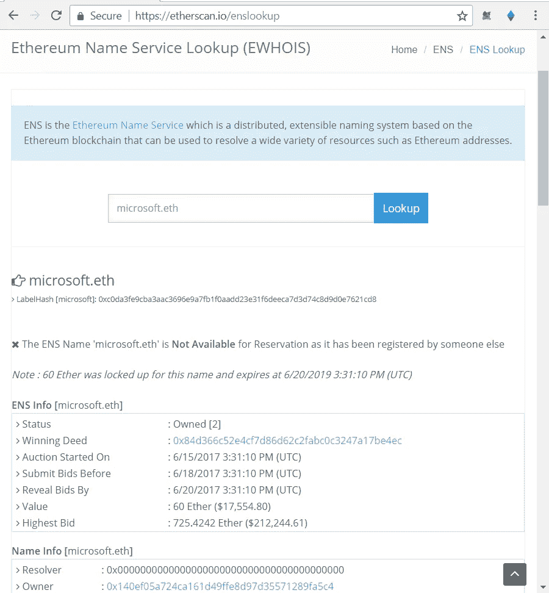
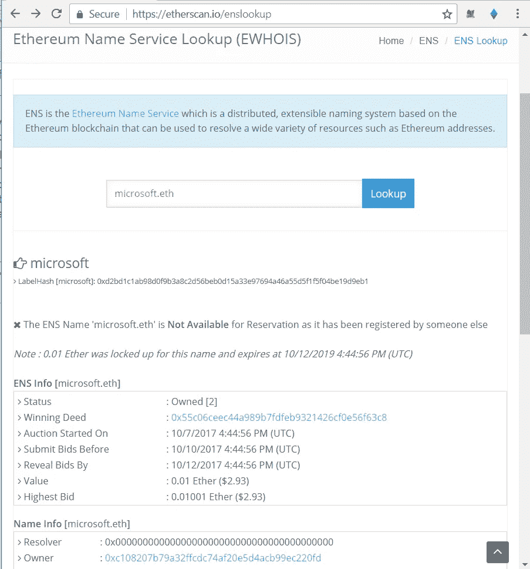

# 处理 ENS 名称？小心这种网络钓鱼攻击…

> 原文：<https://medium.com/hackernoon/dealing-with-ens-names-beware-of-this-phishing-attack-6936f6b8b9e4>

汇款到. eth 域名而不是普通以太坊地址？通过公开访问智能合同。eth 名称？或者，在像[https://enslisting.com 这样的售后拍卖平台上买一个梦寐以求的名字？](https://enslisting.com?)您需要注意这种攻击媒介。

名字并不像他们看起来的那样。

这是一个小小的热身练习。从下面的列表中找出被感染的名字:

1a。微软。古英语字母ð或-D

1b。微软公司

1c。微软. eth

2a。黑市. eth

2b。黑市. eth

如果你回答 1b，错了！

micorsoft 是 microsoft 的拼写错误，但是如果你小心的话，至少你可以发现它。如果我告诉你 1a 和 2a 也被感染了呢？

这是下一个练习。

打开 https://etherscan.io/enslookup 的[的多个窗口，复制 1a 和 1c 并粘贴到两个不同的窗口(搜索框上)。仔细查看名称哈希、所有者和最高出价:](https://etherscan.io/enslookup)

注意，一个名字是 60 ETH 买的，另一个是 0.01 ETH 买的。

如果让你把 5 ETH 发给微软，你会发给微软吗？eth 还是微软. eth？

其中一个名字末尾有一个零宽度字符，更像微软<invisiblecharacter>。古英语字母ð或-D</invisiblecharacter>

在所有的钱包客户端都注意到这一点并提醒用户之前，您需要保持警惕。

这里有一些你可以做的事情:

1.  首先，将地址复制到记事本中，并使用键盘上的箭头键从头到尾浏览一遍。名称是否在任何字符处暂停，并需要两次击键才能移动到下一个字符？你刚刚发现了一个不可打印的字符。
2.  现在，照原样复制地址，粘贴到 etherscan.io/enslookup.。打开另一个以太扫描窗口，自己输入正确的拼写。两个窗口上的 namehash 匹配吗？如果不是，您刚刚从网络钓鱼攻击中拯救了自己。

如果有帮助，请告诉我。我已经为此抛出了赌注[https://github.com/ethereum/ens/issues/240](https://github.com/ethereum/ens/issues/240)，这取决于你使用什么样的钱包客户端，你可能有风险，也可能没有风险。安全总比后悔好。

现在，最后一个练习。发现哪个版本的黑暗市场被感染，以及被感染的角色在哪里。

# **<2017 年 11 月 10 日>剧情变味了。**

看到这个名字有什么问题吗？

微软公司

这也是一个受感染的名字，试着找出它有什么问题(这一次箭头键不会切断它)。

完成你的研究了吗？根据 UTS46 标准，这显然是一个合法有效的名字，r 后面的 O 不是常规的 O，而是西里尔文小写字母 O[https://vazor.com/unicode/c043E.html](https://vazor.com/unicode/c043E.html)

巧合的是，Nick Johnson 提到了在 ENS 注册管理机构上运行的第二层黑名单/信誉 oracle，以通过共识机制清除这些名称，这可能会在优先级方面上升到顶部。视频链接见此处[https://medium . com/@ ens listing . com/ens-talk-at-devcon-3-the-un officel-summary-66 AfDB 2247 D1](/@enslisting.com/ens-talk-at-devcon-3-the-unoffical-summary-66afdb2247d1)

在那之前，不要复制/粘贴，请用旧键盘一个字母一个字母地输入 ens 名字！

马诺萨米