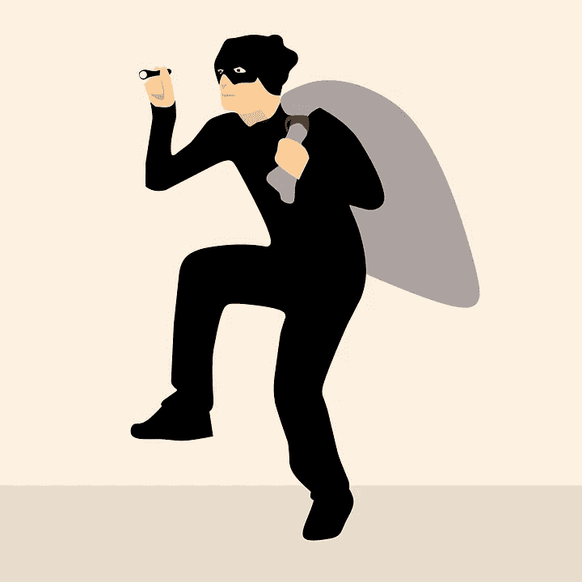

# ICO 内幕:如何应对骗子

> 原文：<https://medium.com/hackernoon/dealing-with-scammers-3201917e2ac3>

## 有着美好结局的艰难故事

对付黑客和骗子是加密最令人沮丧的方面之一。但是这个骗子犯了一生的错误。

当我们在 NXT 区块链上发行 IGNIS ICO token 作为货币时，我们将其命名为 **JLRDA，**选择这个相当复杂的名称，结果证明是一个错误。

在第一轮 ICO 活动的忙碌日子里，由于我们的代币在几秒钟内就被售出，大多数时候我们添加到钱包中的专用 ICO 页面上没有合法代币可供出售。

骗子们发现了这一点，并发行了他们自己的毫无价值的假代币，例如命名为 **JRLDA 或 JIRDA** ，并开始通过产生虚假交易来欺骗用户购买这些代币。这些代币没有列在专用页面上，而是分散在整个钱包中。这是最简单和最愚蠢的社会工程攻击，但它非常有效，在我们知道之前，[区块链](https://hackernoon.com/tagged/blockchain)充斥着各种形状和大小的假代币，看起来有点像真的。

在接下来的几天里，我们沮丧地看到，无知的用户高兴地购买这些假代币，而忽视了各地发出的关于这种风险的无尽警告。这些骗子冷酷无情，他们发行名称与真实代币非常相似的假货币、资产和商品，并将其发送给用户作为购买更多代币的诱饵，以创造性的方式滥用区块链的每一项功能来对付我们的买家。

然后那些被骗的可怜的用户，在意识到他们的错误后，很自然地来找我们投诉，这种情况令人心碎。

这个问题如此严重，以至于在某个时候，我们决定在购买每一种货币、资产或商品(包括诚实的商品)之前，发布一个带有可怕警告的特别版本，敦促用户仔细检查代币的合法性。这几乎已经结束了这个问题。然而，当尘埃落定，我们发现大量的 NXT 被盗的方式。

随着事态的发展，我们偷偷记下了骗子的账户，并开始追踪他们。他们中有不少人，但只有少数人真正成功。一些人通过 Bittrex、Poloniex 和 Shapeshift 等各种交易所提取赃物，但是，如果没有被骗用户的法律支持来追捕骗子，如果没有交易所的密切合作，我们几乎无能为力。

然而，一些骗子犯了一个巨大的错误，认为我们是完全的傻瓜，他们把他们偷的 NXT 投资到我们自己的 ICO 令牌。

我们发现总共有六个骗子账户投资了 ICO NXT-TN8U-RBVE-gbj 3–7 debn
NXT-V79Z-RQ5X-XXJR-h8p 87
NXT-BH28-pky 6-les 8–29 dbn
NXT-ZK v3-J2WN-T6VM-B28DA
NXT-ZPRA-ZDUQ-SYEL-7 aajm
NXT-UMZH-XL

在 2017 年 9 月期间，从这些账户中，超过 100 万新台币被用于购买 135 万+ IGNIS 代币。

总的来说，我们认为区块链开发者不应该对他们自己的令牌进行任何管理。然而，由于 IGNIS 还没有发布，而且我们有 100%的证据证明区块链上有小偷活动，我们决定采取行动。

骗子用来买 IGNIS 的 NXT 已经属于 Jelurida 了。现在，在 IGNIS 空投期间，我们还没收了使用偷来的 NXT 购买的 IGNIS，并将其发送到我们控制下的 JLRDA 发行者帐户。

稍后，我们会将被盗的 NXT 分发给任何能够证明他被这些骗子骗了的人，包括空投期间从每个 NXT 令牌中获得的 0.5 IGNIS。在任何情况下，我们都无意保留这一赃物。

不幸的是，不是每个被骗的人都能得到赔偿，一些骗子没有购买 IGNIS，所以我们需要继续追捕他们。然而，价值超过 100 万美元的 100 万 NXT 已被追回。

在接下来的几周和几个月，我们将提供更多关于被盗令牌回收流程的信息。一如既往，所有官方信息将只在 Jelurida 网站上发布。