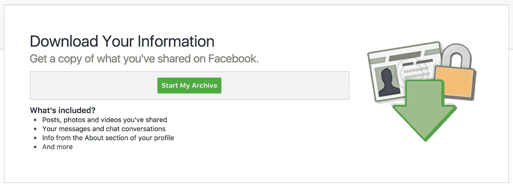
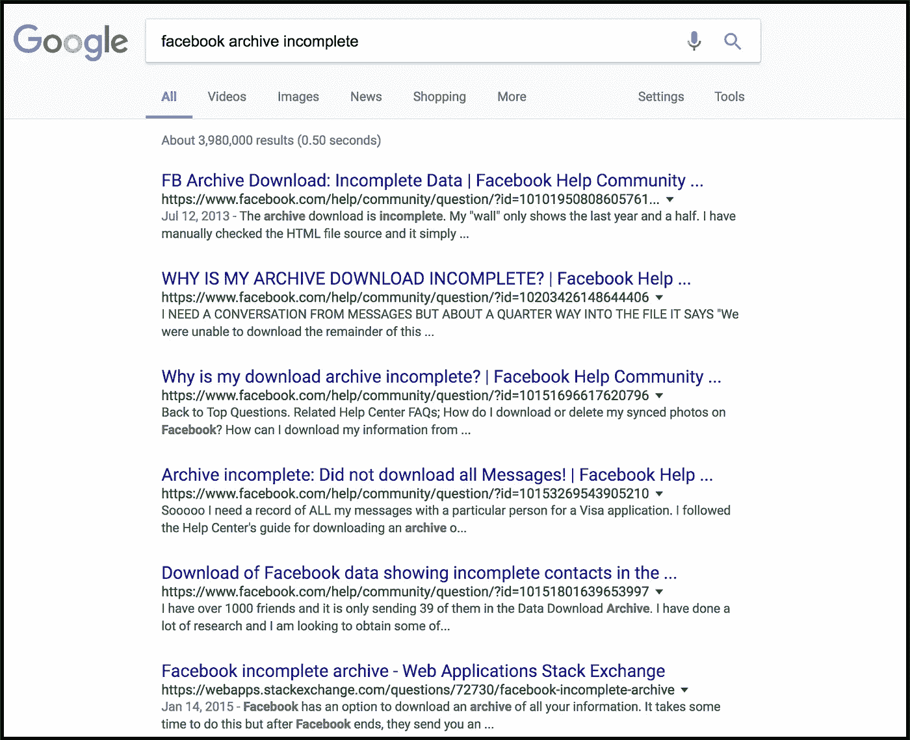

# 亲爱的脸书，“下载我的档案”坏了，这可不行

> 原文：<https://medium.com/hackernoon/dear-facebook-download-my-archive-is-broken-and-thats-not-okay-a1df2eb9e8a9>

## 脸书的“下载我的档案”功能是不完整和不可用的。我们有权使用我们的数据。

脸书有大量我们的数据。那次你和你的朋友卷入了一场巨大的政治辩论。你高中聊天群里的搞笑对话。当你意识到你爱上了你未来的丈夫。

作为平台的用户，我们有权使用我们的数据。从一开始，脸书似乎就遵从了。脸书有一个名为“下载我的档案”的功能，你可以进入设置->“下载我的脸书数据的副本”这是该功能的外观:

但是，有一个问题。

脸书实际上并没有给你所有的信息数据。

# 下载您的*不完整*档案

经过一番探索，Dillon Dixon 和我发现，聊天线程的一个重要子集确实从这些下载中消失了*——不仅仅是陌生人，还有一些我最亲密的朋友的聊天线程。不仅文件不完整，而且由于复制错误，一般人实际上也无法使用它。*

> *这是脸书方面的一个神秘问题。从轶事证据来看，似乎你的聊天档案中返回的内容通常是与你最近交谈过的人的对话。幸运的是，它似乎总是每个对话的完整历史，没有什么被截断。—来自 [Dillon 的 FB 存档解析器报告](https://github.com/ownaginatious/fbchat-archive-parser)*

*你可能想知道这是不是一个脸书没有意识到的新问题。可悲的是，这个问题在几年前*就已经浮出了脸书的水面，我自己也报告过这个问题，但没有任何答案:**

****

# **亲爱的脸书**

**用户信任和透明度非常重要，尤其是涉及到个人隐私数据的时候。这个错误意味着用户在过去几年里一直在下载他们的脸书档案，错误地认为它是完整的。**

**给脸书的一些产品建议:**

*   **立即在存档页面上放上免责声明，注明问题。**
*   **messages.htm 文件通常是 100MB 以上，没有顺序，并且包含重复错误。为了让普通用户也能读懂，这里需要做大量的清理工作。**
*   **解决后，提醒使用此功能的用户重新访问他们的无错误归档。**
*   **但最重要的是，请让我们知道你已经意识到这个问题，并将尽快解决它。如果你在 Twitter 上发邮件给我，我会很乐意更新这篇文章。**

> ***亲爱的读者——请支持我将此消息上报给脸书:***
> 
> ***拍手👏对于下面这个中等岗位。***
> 
> ***用标签#WeWantOurData 将这篇文章推送到*[*【https://twitter.com/facebook】*](https://twitter.com/facebook)*。***
> 
> **将这篇文章分享给你的朋友。**
> 
> ***如果您对如何升级此问题有任何其他想法，请告诉我，我很乐意与您合作，尽快解决此问题。***