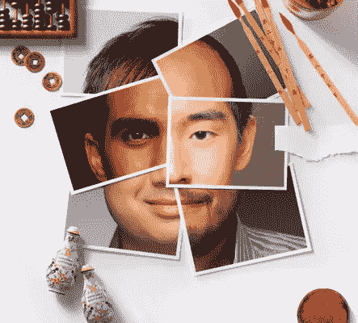

# 克里斯给你的亲爱的弗兰基

> 原文：<https://medium.com/hackernoon/dear-frankie-from-chris-a95fa0a53f14>

AANC / Via [aancinc.org](http://www.aancinc.org/uploads/8/6/6/9/8669813/4592903.jpg)

亲爱的西奥多，

我叫弗兰基，六个月前我从史岱文森高中毕业。我决定休学一年去追求一份职业。快进 6 个月，我在后台。我偶然发现了 Christopher Fung 的网站和他的[项目](https://hackernoon.com/tagged/project)“SHAM”。没有私人邮件，所以我发了一封给你，他的经纪人。如果这不是一个过分的要求，你能把这封邮件转发给克里斯托弗吗？

我知道我想从事电影表演。但是我有点气馁，有点犹豫，有点迷茫。我父母不理解也没用。从克里斯托弗的简历中，我看到他在冒险成为一名企业家之前，大部分时间都在走传统的道路。我在寻求帮助，一些建议。

你的工作一定非常忙，但是如果你能在接下来的几周里抽出半个小时的时间，你有时间去喝杯咖啡吗？我很想问你关于这个行业的问题，寻求建议，以及一些一般的事情。我知道我会有新的收获。这是我的荣幸。

先谢谢你了，

弗兰基

— —

嗨弗兰基，

很高兴收到你的来信！令人鼓舞的是，你看到自己正在走一条基于你所知的非常规道路。你知道你想要行动，你比我更早地实现了这一点。听起来可能很奇怪，虽然我非常相信向导师寻求帮助，但我也相信建议会让那些天生具有创造力的人慢下来。根据定义，演员是有创造力的人。我们选择表演，因为我们相信每个人都有无限的可能性。所以给你具体的建议我有点犹豫，但我会尽量分享我所知道的。

你可能来自一个勤劳的少数民族家庭，他们的世界观很保守，因为他们没有能力冒很大的风险去达到他们和你今天的位置；然而，因为你有机会更广泛地定义什么能满足你未来的生活，你应该充满热情地抓住它。如果在与你的家人进行了两次坦诚而深入的交谈后，他们完全无视你热爱的职业的可能性，你可以诚实而自由地离开这些期望的领域，在你不从事生存工作的任何时候参加面试。如果你决定你仍然对学校的形式感兴趣，特别是在表演领域，你可以试试 Tisch 看看课程和社交网络给你带来了什么。如果你决定结合以上几点，已经花了六个月或一年的时间试镜那些激起你兴趣的项目，但确实没有你想扮演的亚裔美国人的多样化角色，你可能会决心创作自己的作品，并组装所有活动部件，使其栩栩如生。这或多或少就是我的遭遇。

不管发生什么，要知道你不会挨饿，因为你的大脑和身体有防止饥饿发生的内在本能——所以你可以睡觉，因为你知道你一直拥有并将永远拥有感受和做对你来说最重要的事情的独立性，如果出现你失去家人的经济和精神支持的情况(这永远不会是永久性的；爱情需要距离才能成长)——同样重要的是，只有当你用心(而不是用脑)时，你才会拥有尊严和幸福，让你周围的人和你有同样的感受，喜欢你的工作，并表示这激励他们也这样做。

抱歉拉肚子了！我希望那是有帮助的。

祝新年快乐，并对你未来激动人心的努力致以最美好的祝愿。

中国人权信息系统

> [黑客中午](http://bit.ly/Hackernoon)是黑客如何开始他们的下午。我们是 [@AMI](http://bit.ly/atAMIatAMI) 家庭的一员。我们现在[接受投稿](http://bit.ly/hackernoonsubmission)，并乐意[讨论广告&赞助](mailto:partners@amipublications.com)机会。
> 
> 如果你喜欢这个故事，我们推荐你阅读我们的[最新科技故事](http://bit.ly/hackernoonlatestt)和[趋势科技故事](https://hackernoon.com/trending)。直到下一次，不要把世界的现实想当然！

