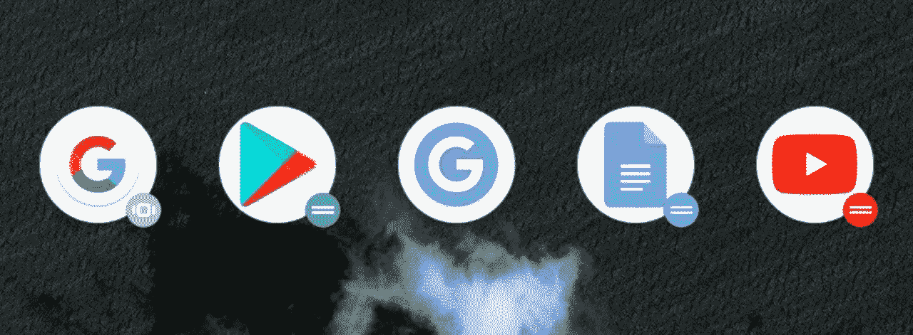

# 亲爱的谷歌:请停止设计可怕的图标

> 原文：<https://medium.com/hackernoon/dear-google-please-stop-designing-horrible-icons-5ea846a1aeff>

## 亲爱的 Google，
您是否会考虑反对在正方形和圆形中放置通用图标？

对于那些阅读这篇文章并想知道为什么的人，我决定写一篇很长很长的长篇大论，看看谷歌提供的“圆形图标”和“自适应图标”的定义。然后，当然是看实现。

在 Android 7.1 发布前后，谷歌宣布了对用户界面的一个小而显著的改变，尤其是图标——“圆形”图标。谷歌表示，引入是必要的，因为一致性是用户界面的关键。重点强调了“一致性”这个关键词。

当谷歌宣布“圆形图标”时，社区期待着一波图标被重新迭代成圆形，同时保留原始图标。人们预计图标会循环变形，如果变形成功实现了，它会大受欢迎，而我会一直抱怨 iPhone X 上没有 Home 键。

当圆形图标出现时，结果令人失望。我们得到的不是符合圆形面具的统一图标，而是这个:

上面显示的图标是图标的单独比萨饼。我们不喜欢的披萨。该死的，谷歌。

# 一致性导致了一个令人困惑的问题

虽然图标看起来不错，但这是一种懒惰的“在图标后面放一个盘子就完事了”的工作，这让它听起来像个笑话。我们谈论的是谷歌，而不是刚刚学会如何使用 Photoshop 图层编辑的人。

虽然这个概念对谷歌的“一致性”理由起作用，但这仍然不能原谅谷歌的懒惰。这几乎就像谷歌刚刚决定剥夺“一致性”的所有美丽，只是做了 5 分钟的捷径，把一切都放在一个白色的盘子上。

但失望不止于此，我的朋友。哦不，当然不是。

这只是故事的一部分。请记住，谷歌推出了这一功能的另一个变种:自适应图标。

# 适应性食堂

有了自适应图标，图标就有望完成一项更具挑战性的任务:塑造自己以适应启动器抛出的各种面具。这意味着图标有可能被剪切或裁剪，这对一些人来说是一场噩梦。

好吧，那么谷歌是如何处理自适应图标的呢？当然，他们已经知道他们以前做的偶像是可怕的。

***没有***

这里的事情实际上是令人失望的**和**同时懒惰。上图是谷歌自己的视频聊天应用 Duo 的图标。如果谷歌 Play 商店图标的比萨饼形状看起来很糟糕，那么这个就更糟糕了。

适应性？并非如此。这不仅仅是懒惰，而是对“适应性”这个词本身的侮辱。如果你能想象一下“适应”是什么意思，你就能理解我的沮丧。

图标没有适应面具，它们只是粘在那里，就像一个抑郁学生的懒惰艺术项目。图标不是自适应的，所以请不要再称它为一，谷歌。

对我来说很明显，谷歌只是在遵循他们自己的设计方针时失去了任何动力。

# 设计师们去哪里了？

公平地说，谷歌也不全是可怕的。举个例子，这些是他们为三个应用程序制作的圆形图标:

它们看起来不像盘子里的比萨饼，也不像懒惰的令人厌恶的东西。他们看起来干净、大胆、专业。如果谷歌自己尝试过，谷歌可以设计图标。

我不会屏住呼吸，等待谷歌解决这个问题。至少近期不会。但是，嘿，希望虚无并没有错。

*原载于 2017 年 9 月 14 日*[*【thecyberfibre.com*](https://thecyberfibre.com/dear-google-please-stop-designing-horrible-icons/)*。*