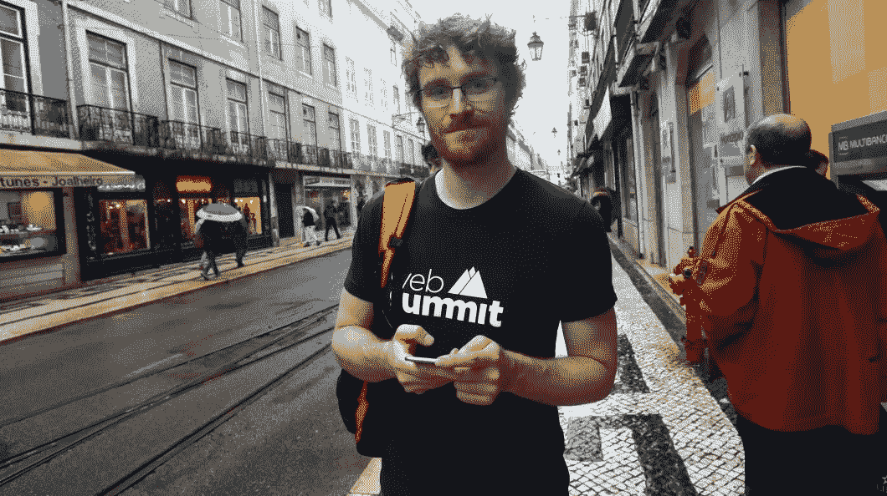

# 亲爱的帕迪·科斯格拉夫，

> 原文：<https://medium.com/hackernoon/dear-paddy-cosgrave-78df101c447>

Source: dinheirovivo.pt

1)我非常喜欢 2016 年网络峰会。这是我第一次参加这种会议，我从中得到了我想要的一切。我想感受挑战，我想结识与我想法不同的数字营销伙伴，我想一瞥未来，被伟大所包围。四重检查。

2)向 16-23 岁的学生提供 6000 张低价票(每张 10€)的想法非常棒。给他们一个不可思议的学习机会，让他们成为生态系统的一部分，否则他们将没有机会。参加的葡萄牙学生肯定会因此变得更好。

3)排队。不可能都很好，对吧？午餐时间很混乱。这些餐车不够 5 万人同时点餐。我不得不每天离开，在大楼周围的[中心找一家隐蔽的咖啡馆，以便能抓紧时间吃点东西，同时不耽误任何会议。我相信你们会在 2017 年解决这个问题。](https://hackernoon.com/tagged/surrounding)

这款应用非常棒。日程安排和与与会者聊天运行良好，但是…您是否注意到该应用程序下载了数量惊人的数据？现在，在会议结束三天后，iPhone 存储显示该应用程序占用了 1gb 的空间！此外，当我没有 wi-fi 时，我在我的 4g 网络上使用它，它使用了近 500mb 的数据！我不得不关闭它对移动数据的使用。有没有可能更轻一点？

5)为 53000 人维持一个持续快速工作的 wi-fi 网络一定非常困难。无线网络基本正常。有时崩溃，但总体来说是好的！干得好！

6)看到你谈论里斯本，真让人感动。你显然爱上了它，对我来说，这让你成为了一个[alfa cinha](https://hackernoon.com/tagged/alfacinha)(lis boners 自称的名字，实际上是“小莴苣”的意思)啊哈。非常感谢您将您的 Summit 宝贝带到里斯本并与我们分享。大多数人不知道这对这个国家和这个城市有多重要。他们会的！

我已经拿到 2017 年的票了！明年见！

你可以在[这里](/@baptista/how-i-conquered-shyness-and-talked-to-hundreds-of-people-at-web-summit-2016-dc17fb1deebf#.uqcwtlyjz)读到我是如何克服害羞并在峰会上与数百人交谈的

你可以在这里阅读我最喜欢的网络峰会演讲

欢迎在 [linkedin](https://pt.linkedin.com/in/francisbaptista) 或 [instagram](http://www.instagram.com/franciscobaptista/) 上给我发消息

> [黑客中午](http://bit.ly/Hackernoon)是黑客如何开始他们的下午。我们是 [@AMI](http://bit.ly/atAMIatAMI) 家庭的一员。我们现在[接受投稿](http://bit.ly/hackernoonsubmission)，并乐意[讨论广告&赞助](mailto:partners@amipublications.com)机会。
> 
> 如果你喜欢这个故事，我们推荐你阅读我们的[最新科技故事](http://bit.ly/hackernoonlatestt)和[趋势科技故事](https://hackernoon.com/trending)。直到下一次，不要把世界的现实想当然！

