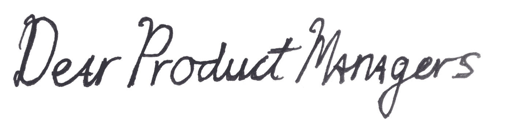

# 亲爱的产品经理们…

> 原文：<https://medium.com/hackernoon/dear-product-managers-c488ba6386ea>

我们知道你的工作很难，但你需要让我们帮助你。我们有能力和创造力，希望帮助您、团队、产品和我们的公司取得成功。

我们有几件事想讨论一下。我们会亲自做这件事，但我们最不需要的就是另一次会议。

我们很好奇。我们的努力工作真的为我们的客户和业务带来了回报吗？是在动针吗？可能看起来不像，但我们在乎。当我们知道我们正在交付成果时，更容易忍受发布平庸的工作，只是运送它，积累债务，并跳到下一个项目。如果没有证据表明我们做出了正确的决定，这些事情就会增加。坦白地说，我们不再信任你，不再关心你。

猜测是可以的(我们都这样做)。不加思考的猜测是不行的。那样我们永远也学不会。我们中的一些人想知道继续迭代和做*更好的*工作是否可能交付甚至*更好的*结果？！或许吧？

我们需要你的帮助。团队每天都被评估(官方的或其他的):正常运行时间，缺陷计数，故事点速度，测试覆盖率，花在编程上的时间，满足的验收标准，以及发布的故事和特性。但是这些都不能说明客户的结果。实际上恰恰相反。功能膨胀增加了复杂性，而复杂性降低了我们的速度。让我们忙起来不是目标。交付成果是目标。

我们知道你有很大的执行压力。你过去可能做过 UX 或发展，但现在没有。你需要我们。因此，如果你把我们当成合作伙伴，而不是施工和组装人员，我们将不胜感激。把我们介绍给真正的顾客。让我们献计献策。让我们监测和衡量进展，并相应地改变方向。给我们背景，我们会做得很好。

当然，你不需要*去做这些——我们可以尽职尽责地给你评估，让你的想法符合规格，并把东西送进深渊——这可以让我们保持几个月或几年的兴趣，但最终我们会转移到其他地方工作(最近市场很好)。公司一点都不会注意到(万岁速度！)但是我们的客户会遭殃，生意也会遭殃。我们不想那样，是吗？*

我们尊重你的能力、直觉、观点和超现实的能力，让你可以耐着性子参加单调的会议。让我们互相帮助，尽我们最大的努力，为我们的客户创造价值，创造我们引以为豪的东西。

谢谢

工程师和 UX

(开始

> [黑客中午](http://bit.ly/Hackernoon)是黑客如何开始他们的下午。我们是 [@AMI](http://bit.ly/atAMIatAMI) 家庭的一员。我们现在[接受投稿](http://bit.ly/hackernoonsubmission)，并乐意[讨论广告&赞助](mailto:partners@amipublications.com)机会。
> 
> 如果你喜欢这个故事，我们推荐你阅读我们的[最新科技故事](http://bit.ly/hackernoonlatestt)和[趋势科技故事](https://hackernoon.com/trending)。直到下一次，不要把世界的现实想当然！

