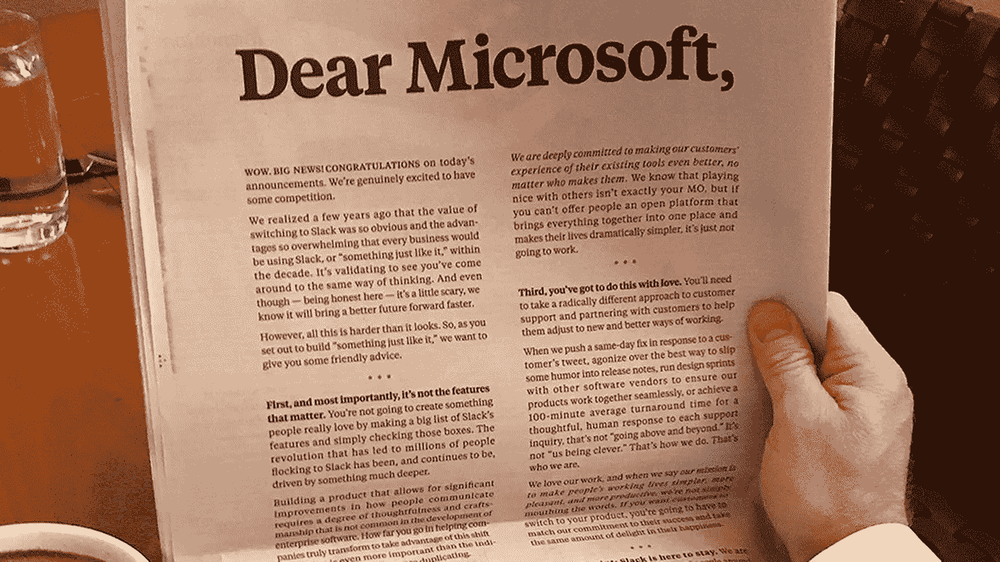
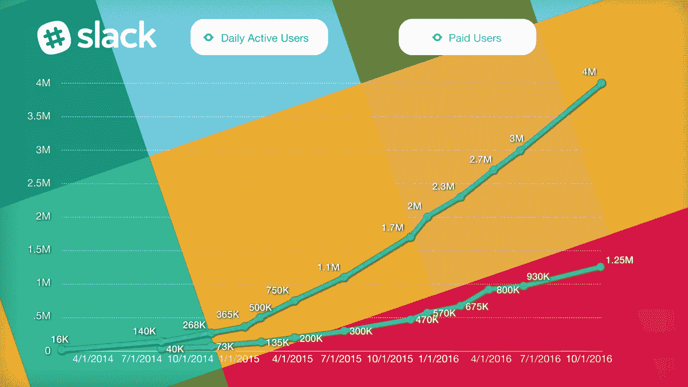
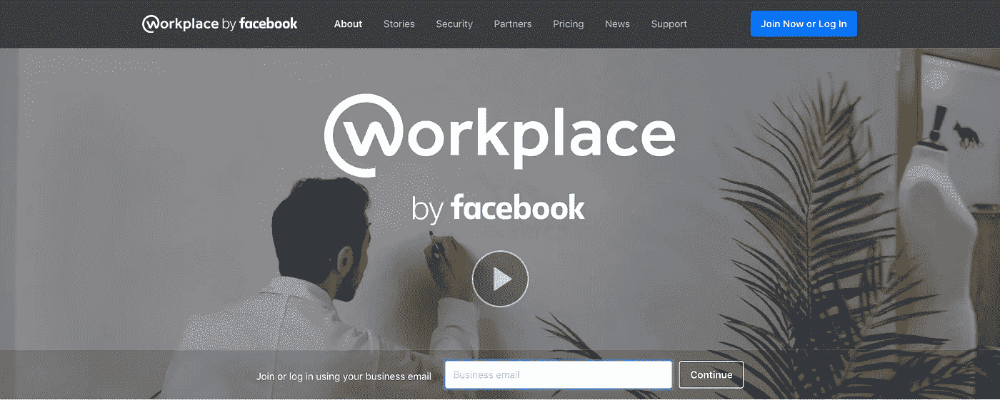
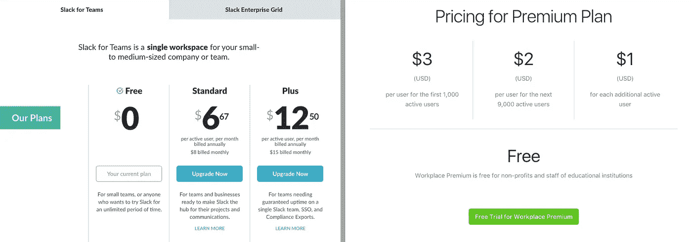

# 亲爱的 Slack，忘掉微软吧。你有更大的问题。

> 原文：<https://medium.com/hackernoon/dear-slack-get-over-microsoft-you-have-a-bigger-problem-7e2e3723c877>

2016 年 11 月 2 日，微软正式推出了 [**微软团队**](https://products.office.com/en-US/microsoft-teams/group-chat-software) (一种基于聊天的工作区软件即服务)，它绑定了其现有的 Office 365 订阅。在发布会上，塞特亚·纳德拉(微软首席执行官)解释说:“微软团队将把聊天、会议、笔记、Office、Planner、PowerBI 以及一系列扩展和应用程序结合在一起，帮助团队完成工作。”

在微软团队发布前几分钟，Slack 在*纽约时报*上以 [**“亲爱的微软”**](https://slackhq.com/dear-microsoft-8d20965d2849) 为标题，发表了一封致微软的公开信，作为全封底广告。这是基于 1981 年的事件，当时苹果公司在《华尔街日报》上刊登了一则整版广告，欢迎它的新竞争对手(IBM)进入个人电脑市场。

The Open Letter Advertisement by Slack in the New York Times

虽然 Slack 给微软的公开信在社交媒体和公共关系上受到了很多关注，但几家顶级技术媒体网络写道，为什么这是 Slack 的一个糟糕举动。The Verge 甚至发表了一篇文章——**[**为什么 Slack 可能会后悔其给微软的谄媚信**](https://www.theverge.com/2016/11/3/13504932/slack-microsoft-teams-letter-wtf) **，**分解了 Slack 信中提到的每一点，以及微软如何打败他们。但 Slack 的问题不在于微软。**

**Slack 的日活跃用户从 2014 年 2 月的 1.6 万增长到 2016 年 10 月的 400 万 DAU，这无疑是一个惊人的增长。但在 2016 年上半年和下半年之间，it DAU 增长率从 50%降至 33%，付费座位增长率从 63%降至 33%。**

****

**Image Source: [Techcrunch](https://techcrunch.com/2016/10/20/slunk/)**

**有人质疑 Slack 是否有能力从一个面向小公司的工作场所聊天应用扩展到一个大型企业可以使用的平台。2016 年 4 月，优步放弃了 Slack，因为该服务无法处理优步 12，000 名员工试图同时通信。Slack 需要找到一种方法来作为大型企业的协作应用程序进行扩展，并找到保持或增加增长的方法。但是 Slack 的道路上有一个更大的问题。**

**2016 年 10 月，经过两年的私下内测，脸书向全球公开了其 [**职场软件**](https://www.facebook.com/workplace) 。一个像普通脸书一样运作的平台，但却是一个员工网络。它不是通过广告来实现盈利，而是每月向企业用户收取用户订阅费。据报道，这款企业社交网络和通信软件自发布以来，仅在 6 个月内就被 14000 家组织使用。**

****

**Slack 面临的最大挑战之一正是职场的最大优势——**学习曲线**。对于新用户来说，Slack 的学习曲线很长，尤其是非技术人员/忙碌的人。脸书(2017 年 3 月)上的 MAU 超过 19.4 亿，Workplace 应用程序与脸书(新闻订阅、群组、活动和 Messenger)没有太大区别，Workplace 能够以接近零的学习曲线获得用户。没有入职流程意味着会有更多人愿意接受它。**

> **Workplace 发布了一个客户故事，讲述了星巴克 如何让超过 80%的商店经理每周使用该平台。这相当于星巴克 20，000 多名门店经理的工作场所。快速采用和大规模处理沟通能力的一个很好的例子。**

**虽然两个平台**都有免费版本**，但 Workplace 在高级版本的**定价上有优势。** Slack 的标准付费版每用户成本约为 6.67 美元，Plus 版为 12.50 美元。Workplace 的费用是每个用户每月 3 美元，对于超过 10，000 人的组，每个用户每月 1 美元。**

****

**Comparison of pricing of Slack vs Workplace by Facebook**

**Workplace 中的 newsfeed 功能对于跨团队交流、公司公告和宣传来说非常方便。任何使用过 Slack 的人都会告诉你，随着几条消息在公共频道上爆发，这变得具有破坏性。与脸书 Live 类似，Workplace 也有一个实时视频功能，这对于远程或大公司的公告或事件非常有用。最棒的是，你的个人脸书账户没有连接到你的工作账户。**

****

**Workplace Free Edition**

****At**[**Freshworks**](https://www.freshworks.com/)**(之前的**[**Freshdesk**](https://medium.com/u/bd06c0f0eb7b?source=post_page-----7e2e3723c877--------------------------------)**)**)我们在 2016 年 10 月从 Google+(是的，Google+)转移到 Workplace，组织一直使用至今。作为一家拥有 1000 多名员工的公司，团队分布在 5 个不同的国家/地区，不同团队之间缺乏可见性和沟通是一个挑战。由于 Google+的普及度很低，从发布公告到寻找放错地方的物品，电子邮件都是最好的沟通方式。现在有了 Workplace，不同的团队可以分组讨论产品更新、想法和客户反馈。我们能够选择加入群组以获取更新，领导者能够更好地了解更新，并在必要时提供帮助。**

**然而，职场面临着两大挑战。他们将不得不与工作中使用的所有业务应用程序建立集成。集成是协作平台的关键，以确保它是工作发生的地方。这真的不应该是一个难题。更大的挑战是让世界相信，工作场所不会让你分心(像脸书一样)，而是实际上有助于促进沟通和能见度。尽管面临挑战，工作场所仍有显著的优势和机会显著阻碍 Slack 的发展。**

****所以，懈怠真的不能是消极怠工。****