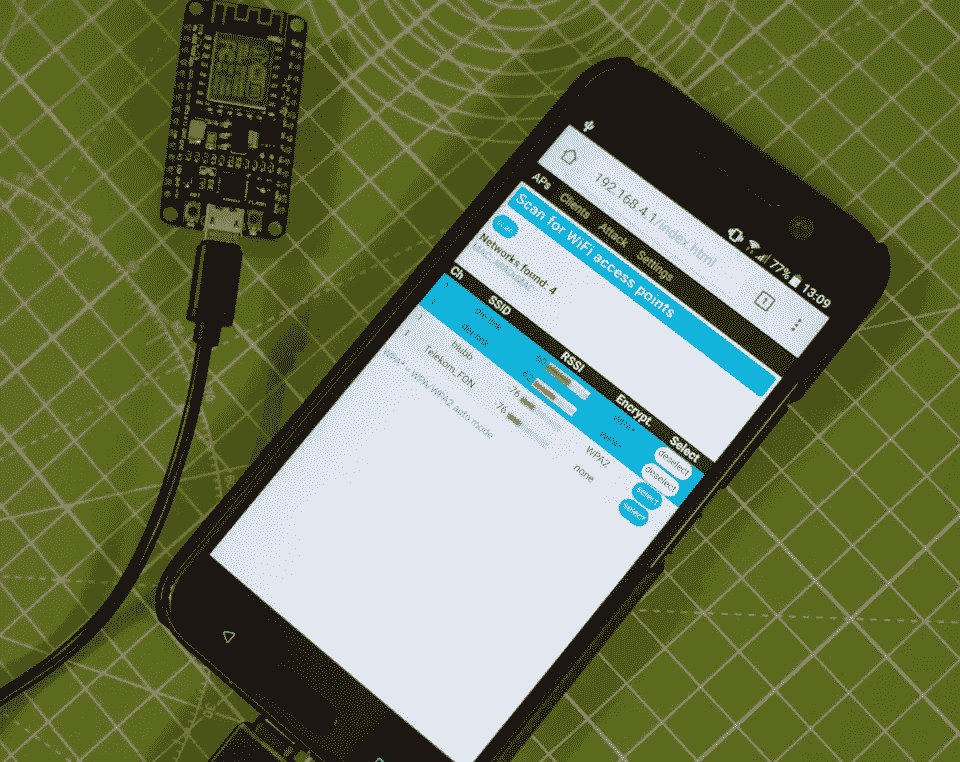
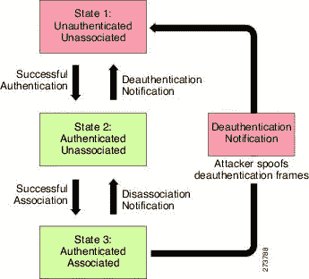
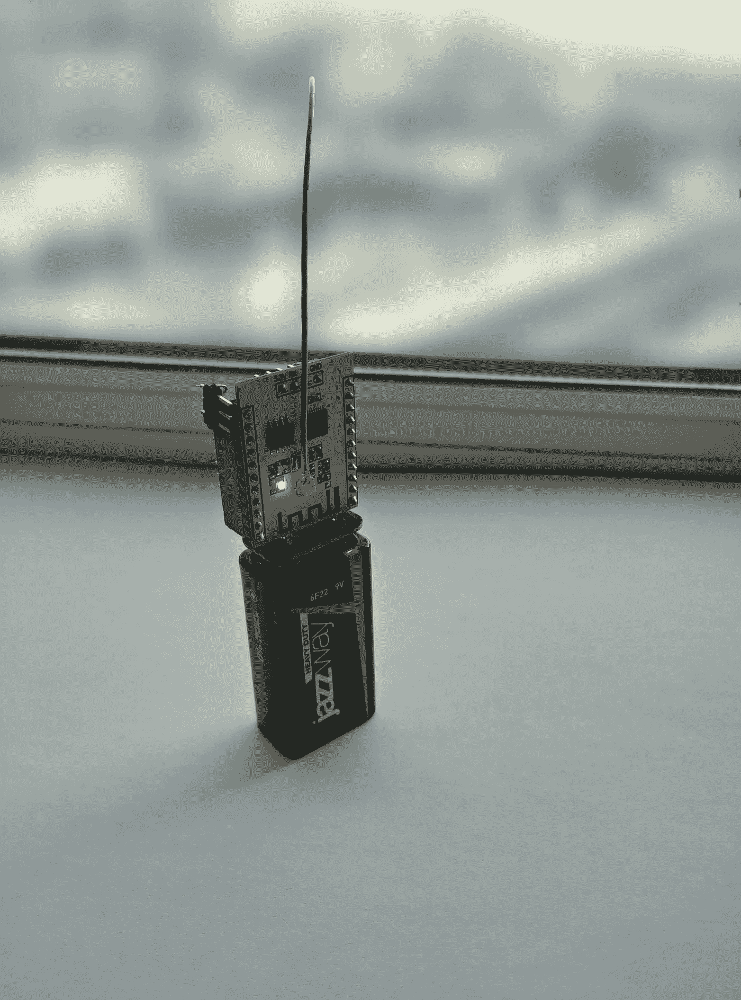

# 使用 ESP8266 模块进行身份验证攻击和其他“wifi 黑客”攻击。

> 原文：<https://medium.com/hackernoon/deauthentication-attack-and-other-wifi-hacks-using-an-esp8266-module-14f9142b063d>

正如著名的 wifi 黑客 Samy Kamkar 最近所说，我们应该转向低成本的黑客/利用工具 T2 T3。NodeMCU 就是这样一个工具，一个基于 LUA 的固件，用于售价不到 5 美元的 [ESP8266 WiFi SOC](https://bit.ly/2TAi8jE) 。

现在多亏了 [Spacehuhn](https://www.patreon.com/spacehuhn) 你可以用 [NodeMCU ESP8266](https://bit.ly/2TAi8jE) 组装自己的 WiFi 干扰器(更准确地说是 wifi deauth 攻击工具)。你选择你需要的 wifi 客户端脱离他们的 wifi 并开始攻击。无论攻击持续多长时间，任何 wifi 都将无法工作。

有了这样的设备，你可以禁用你室友的网飞流、商场的无线安全摄像头或邻居的物联网设备。

802.11 WiFi 协议包含一个身份验证功能。它用于将客户从网络中分离出来。攻击者可以随时向工作站发送取消身份验证帧，其中包含假冒的无线接入点源地址。该协议不要求对该帧进行任何加密，即使会话是用建立的。此漏洞已在 [802.11w-2009](http://www.networkworld.com/article/2312251/network-security/how-802-11w-will-improve-wireless-security.html) 中得到解决，这是对 IEEE 802.11 标准的一项经批准的修订，旨在提高其管理帧的安全性，很少受到支持，默认情况下是禁用的。

Deauthentication Broadcast Attack

十年前，当强大、廉价的磁铁、明亮的发光二极管和小型硬币电池成为黑客攻击的新鲜材料时，有人有了一个好主意:把所有这些东西用胶带粘起来，扔在桥上和立交桥上。LED 投掷器诞生了，虽然我们确信最大的 LED 投掷器装置看起来很酷，但这实际上只是一场小规模的环境灾难。很长一段时间以来，有一些一次性军用无线电干扰器[非常小(比背包小得多)而且相对便宜。这些干扰器可以用来干扰方圆几百米内的无线电通信。通常用手或榴弹炮来安置。从那时起，ESP8266 被创造出来，现在世界上有了一个小小的支持 WiFi 的电脑，只有邮票大小，几乎不花一分钱。](http://www.prc68.com/I/HEXJAM.shtml)

[Rand Druid](https://hackaday.io/RandDruid) battery powered, [Compact ESP8266](http://www.gearbest.com/transmitters-receivers-module/pp_227123.html?lkid=11021403) based multi target De-Auth attack implementation.

虽然不推荐，但它是一个有趣的例子，说明了使一次性黑客工具成为可能的最新和最便宜的技术；10 年前，这么便宜的小 wifi 模块是不可想象的。

支持的设备:您可以将代码闪存到每个 ESP8266。根据模块或开发板的不同，稳定性和性能可能会有所不同。常见的 ESP8266 512kb 版本不会有完整的 MAC 供应商列表和其他功能。 [NodeMCU ESP-12](https://bit.ly/2TAi8jE) 基于 4mb 闪存和内置 USB 端口的主板效果最佳。

安装:上传。bin 文件是启动和运行的最简单的方法。

https://github.com/spacehuhn/esp8266_deauther/releases

总是使用 1mb 版本，将在 4mb，32mb 等上工作。除非你确定你的 ESP8266 只有 512kb 闪存。

使用您选择的 ESP8266 flash 工具上传:
- [nodemcu-flasher](https://github.com/nodemcu/nodemcu-flasher/tree/master/Win64/Release) 【仅适用于 Windows】
-esptool-GUI【Windows、MacOS】
-esptool【Windows、MAC OS、Linux】

电源 ESP8266 来自 OTG 电缆，电源组，2 节 AA 电池。扫描 Wi-Fi 网络并连接到 *pwned* 。密码是“deauther”。
连接后，您可以打开浏览器并转到 192.168.4.1。

[来源:https://github.com/spacehuhn/esp8266_deauther](https://github.com/spacehuhn/esp8266_deauther)(麻省理工学院许可)

还值得看看 spacehuhn 原始作品的其他分支，比如 taner1 的版本，它包含了一个用于社交网站窃取凭证的伪造门户。

https://github.com/taner1/esp8266_deauther(麻省理工学院许可)