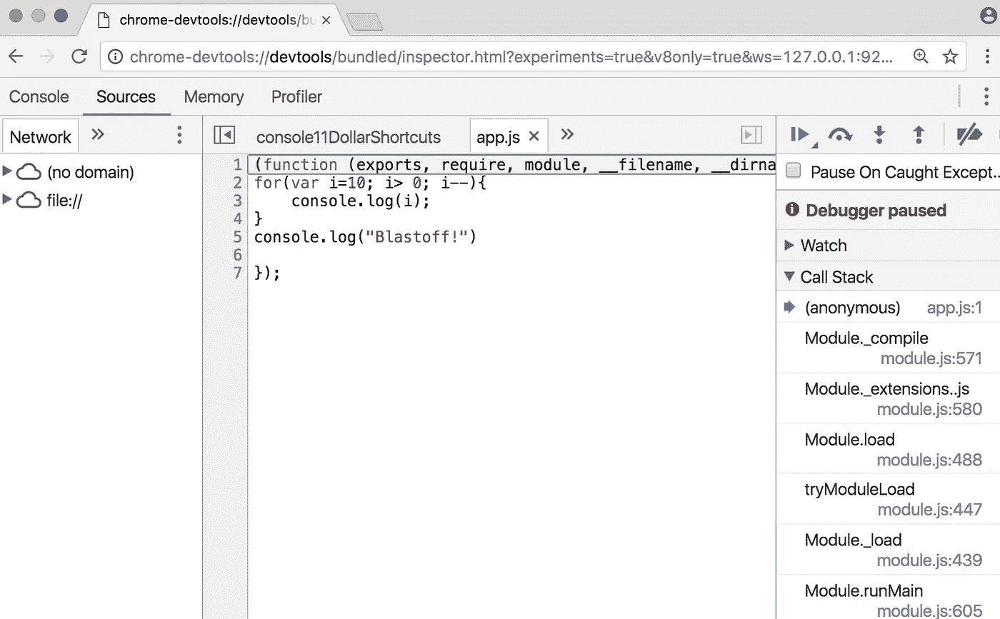
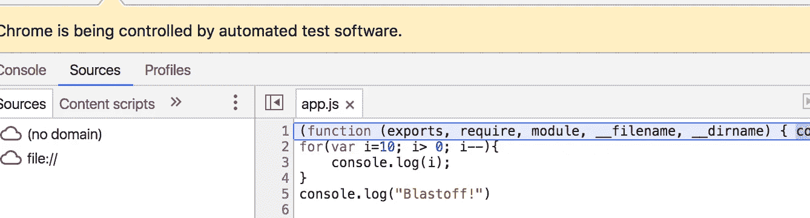

# 使用 real Chrome 开发工具在浏览器中调试 Node.js

> 原文：<https://medium.com/hackernoon/debug-node-js-with-chrome-devtools-aca7cf83af6b>

这些天来，我们被一个出色的 node.js 调试器宠坏了，它利用了 Google Chrome DevTools 的全部功能。

取以下(极难理解；-)) app:

```
//app.js
console.log("Countdown")
for(var i=5; i> 0; i--){
   console.log(i);
}
console.log("Blastoff!")
```

你可以在 Chrome 开发者工具中很容易地调试它！

```
node --inspect --debug-brk app.js
```

这将打印:

```
Warning: This is an experimental feature and could change at any time.To start debugging, open the following URL in Chrome:chrome-devtools://devtools/bundled/inspector.html?experiments=true&v8only=true&ws=127.0.0.1:9229/ef4b0d1d-8268-41bd-aae2-a8e80b47b4e9
```

只需在你的浏览器中打开 chrome-devtools://链接，你就可以开始了！



您现在可以访问断点、控制台、内存和分析器！每当 chrome 进行更新以改进他们的工具时，我们都可以“免费”获得任何更新！

想变得更简单吗？

```
npm install -g inspect-process 
inspect --debug-brk app.js
```

[inspect-process](https://github.com/jaridmargolin/inspect-process) 自动启动调试器(我想是通过 selenium)，你可以跳过在浏览器中复制粘贴的步骤。



使用 inspect-process 方法的一个缺点是，在会话之间不保留断点。有人能解决这个问题吗？如果有，给我发一条[推特](https://twitter.com/theroccob?lang=en)！

june07.com/nim**更新 05/08/17:阿德里安·沃德尔和@june07t(在推特上)都让我知道我应该用* [*。我还没试过，但假设有效的话。*](http://june07.com/nim)*

下面是这个过程的视频:

喜欢这个提示吗？查看我的课程[掌握 Chrome 开发工具](https://www.udemy.com/master-google-chrome-developer-tools/?couponCode=MEDIUMDISCOUNT)。使用上面的链接，我的中等关注者可以享受 85%的折扣！

[](http://bit.ly/HackernoonFB)[](https://goo.gl/k7XYbx)[](https://goo.gl/4ofytp)

> [黑客中午](http://bit.ly/Hackernoon)是黑客如何开始他们的下午。我们是阿妹家庭的一员。我们现在[接受投稿](http://bit.ly/hackernoonsubmission)并乐意[讨论广告&赞助](mailto:partners@amipublications.com)的机会。
> 
> 如果你喜欢这个故事，我们推荐你阅读我们的[最新科技故事](http://bit.ly/hackernoonlatestt)和[趋势科技故事](https://hackernoon.com/trending)。直到下一次，不要把世界的现实想当然！

