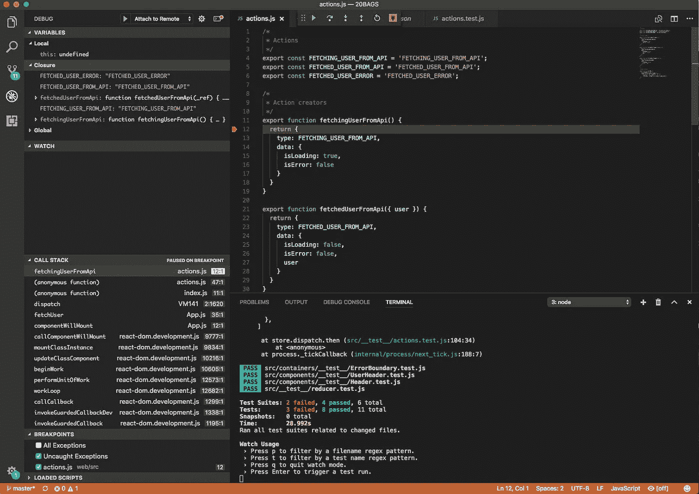
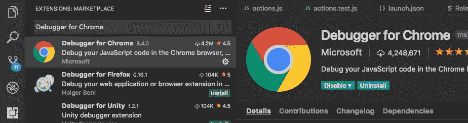
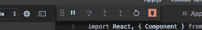
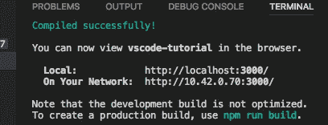
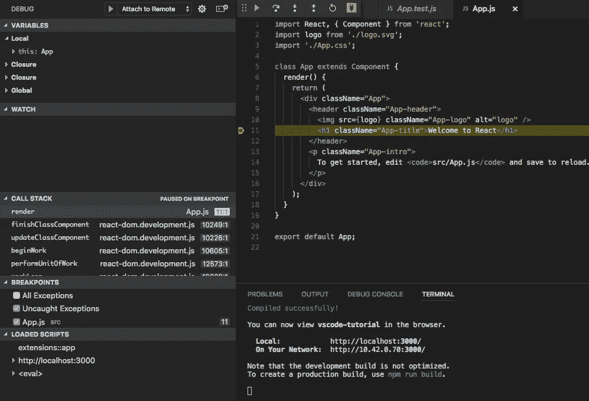
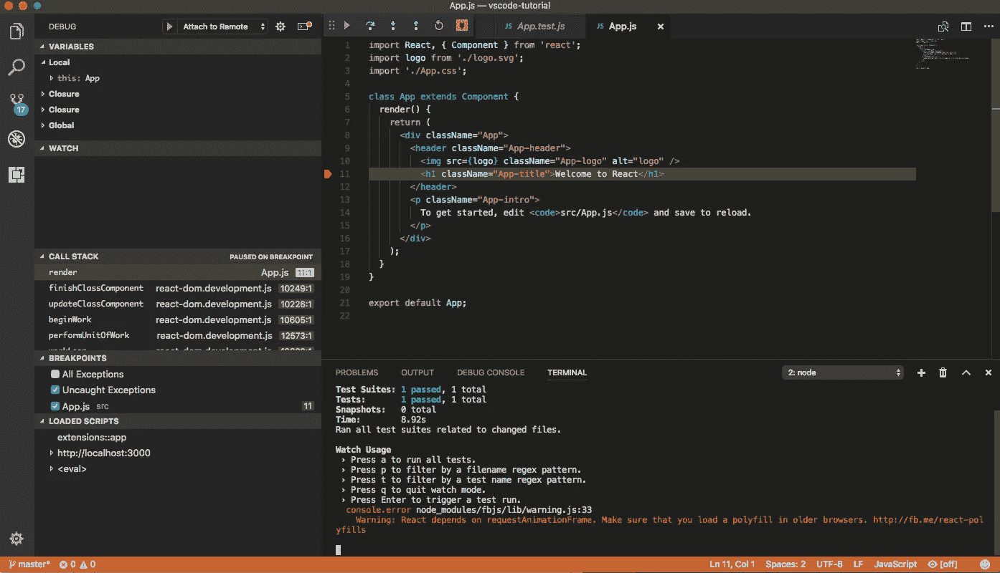

# 使用 VSCode，调试反应像冠军一样

> 原文：<https://medium.com/hackernoon/debugging-react-like-a-champ-with-vscode-66281760037>

VSCode debugging tools and Facebook’s Jest

我在终端、浏览器和编辑器之间来回切换的日子已经一去不复返了。没人有时间做那个！

在本指南中，我将向您展示如何使用 Visual Studio 代码的调试功能来增强 React 工作流。您将学习如何连接 VSCode 和 Chrome，以便直接从 VSCode 调试浏览器代码😎

# 设置测试项目

在开始本教程之前，我们需要创建一个测试应用程序，我们将在本文的后面使用它。我经常使用 [create-react-app](https://github.com/facebookincubator/create-react-app) ，因为我讨厌写样板文件。我们也将在本教程中使用它。或者，如果您有一个现有的应用程序，您可以使用它。

首先创建测试项目:

1.  通过运行`npm i -g create-react-app`全局安装`create-react-app`
2.  安装完成后，运行`create-react-app vscode-tutorial`创建一个新项目

这将创建一个包含新 React 应用程序的新目录。

# 设置 VSCode

接下来，我们需要安装 VSCode 扩展，以便它知道如何与 Chrome 对话。VSCode 通过 Chrome 的[调试器协议](https://developer.chrome.com/devtools/docs/debugger-protocol)连接 Chrome。这与 Chrome 的开发工具使用的调试器协议相同。你可以使用 VSCode 来调试浏览器代码，而不是使用 Chrome 的开发工具。

## 为 Chrome 扩展安装调试器

为了让 VSCode 和 Chrome 相互通信，我们需要为 Chrome 安装一个名为*调试器的扩展。通过导航到扩展窗格并搜索: *debugger for chrome* 来安装它。它应该类似于下图:*

Debugger for Chrome VSCode Extension

# 配置 VSCode 以连接到 Chrome

接下来我们需要配置 VSCode 来使用 connect to Chrome。

1.  单击调试图标
2.  点击下拉菜单(播放按钮旁边)并按“添加配置…”
3.  从“选择环境”下拉菜单中选择“Chrome”。

迷茫？这里有一个 gif …

一个新的`.vscode`目录将自动添加到您的项目根目录中。该目录将包含一个`launch.json`文件，用于为当前项目配置 VSCode 的调试器。每次创建新项目时，您都必须遵循相同的步骤来设置远程调试(或者将`.vscode`目录从一个项目复制到下一个项目)。

修改`url`属性以指向开发服务器的 URL。对`create-react-app`来说是`[http://localhost:3000](http://localhost:3000)`。您的`launch.json`应该看起来像这样(感谢 VSCode 的 [Kenneth Auchenberg](/@auchenberg) 提供的发布建议)…

配置选项的完整列表可以在找到[。](https://github.com/Microsoft/vscode-chrome-debug#other-optional-launch-config-fields)

# 运行调试器

别担心，我们快完成了。接下来，我们需要使用我们的测试项目来测试调试器是否正常工作。

## 启动调试器

您可以通过执行下列操作之一来启动调试器:

*   按 F5 键
*   按下调试面板中的绿色播放按钮
*   从菜单中选择`Debug > Start Debugger`

如果调试器成功启动，您将看到一个小工具栏出现在 VSCode 的顶部，类似于下图…

## 设置断点

断点用于告诉调试器在代码中的特定点暂停代码的执行。这允许您在应用程序运行时检查变量、调用堆栈并修改代码。

让我们在测试应用中设置一个断点。打开`src/App.js`，在第 11 行旁边的空白处点击鼠标。应该会出现一个红点，表示已经添加了一个断点。如果你有点困惑，请看下面的 gif 图…

## 启动开发服务器

最后，为了看到一切工作协调一致，在终端中启动开发服务器 buy running `npm start`。这将启动一个新的服务器，可以在地址 [http://localhost:3000/](http://localhost:3000/) 访问该服务器

导航到 [http://localhost:3000/](http://localhost:3000/) ，您应该会看到“冻结”页面。这是因为应用程序遇到了断点。如果切换回 VSCode，您会注意到第 11 行被突出显示，并且调试窗格被更新以反映调用堆栈。

如果一切顺利，恭喜你！您刚刚学习了如何在 VSCode 中设置远程调试。如果你想了解更多关于在 VSCode [中调试的信息，请阅读这个](https://code.visualstudio.com/docs/editor/debugging)。

# 用 Jest 进行连续测试

让我的单元测试和调试器一起运行对我很有帮助。我喜欢在每次修改实现时运行我的测试。幸好`create-react-app`是自动设置来做这件事的。只需在终端键入`npm test`开始 jest。它会自动监视您的文件，并在保存时运行。看起来是这样的…

很酷吧？

在以后的文章中，我将更详细地介绍如何调试 JavaScript。如果你觉得这篇文章很有帮助，并且想了解 JavaScript 和 web 开发世界中的最新动态 [**请在 Twitter 上关注我**](https://twitter.com/JamesJefferyUK?lang=en) 。

调试愉快！

## 进一步阅读

*   [https://code.visualstudio.com/docs/editor/debugging](https://code.visualstudio.com/docs/editor/debugging#_launch-configurations)
*   [https://code . visual studio . com/blogs/2016/02/23/introducing-chrome-debugger-for-vs-code](https://code.visualstudio.com/blogs/2016/02/23/introducing-chrome-debugger-for-vs-code)
*   [https://github.com/Microsoft/vscode-chrome-debug](https://github.com/Microsoft/vscode-chrome-debug)
*   [https://facebook.github.io/jest/](https://facebook.github.io/jest/)