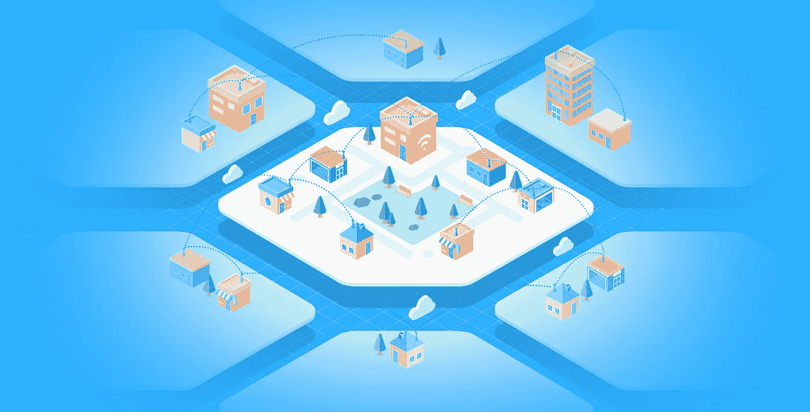
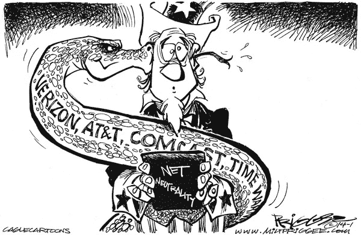
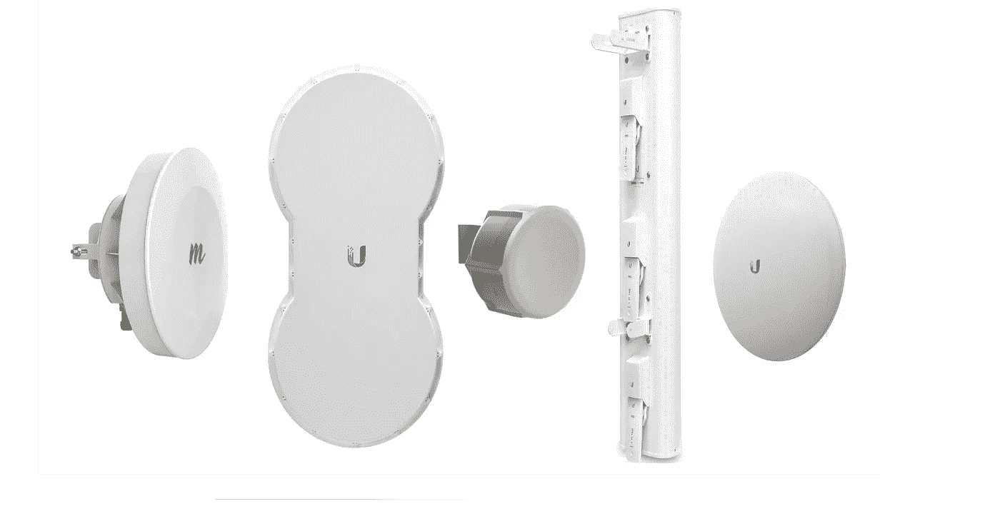
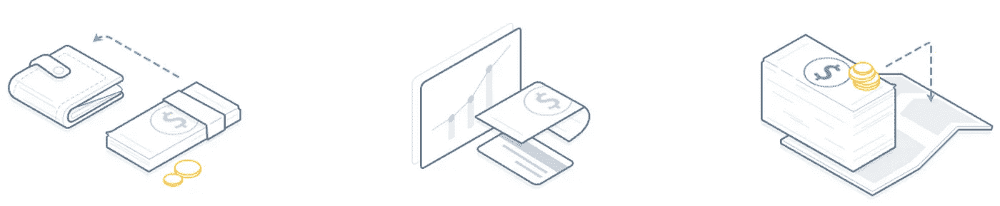
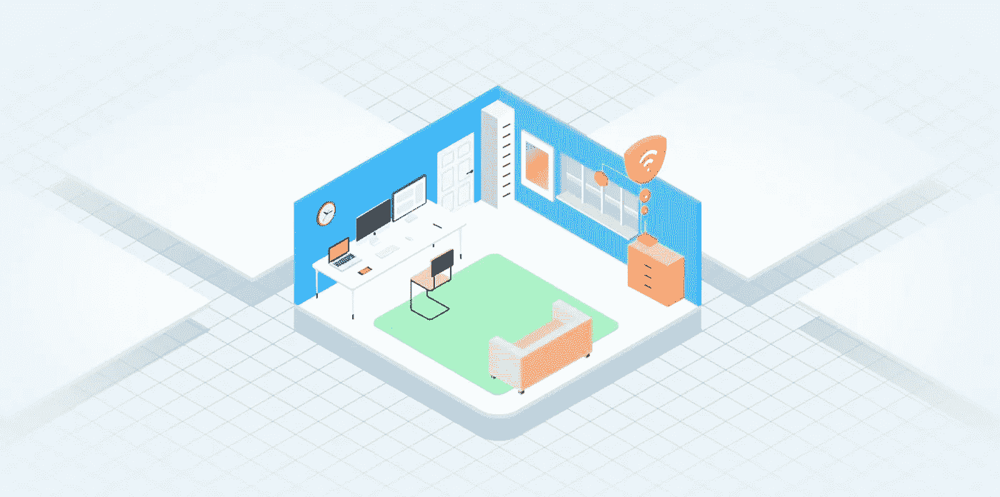
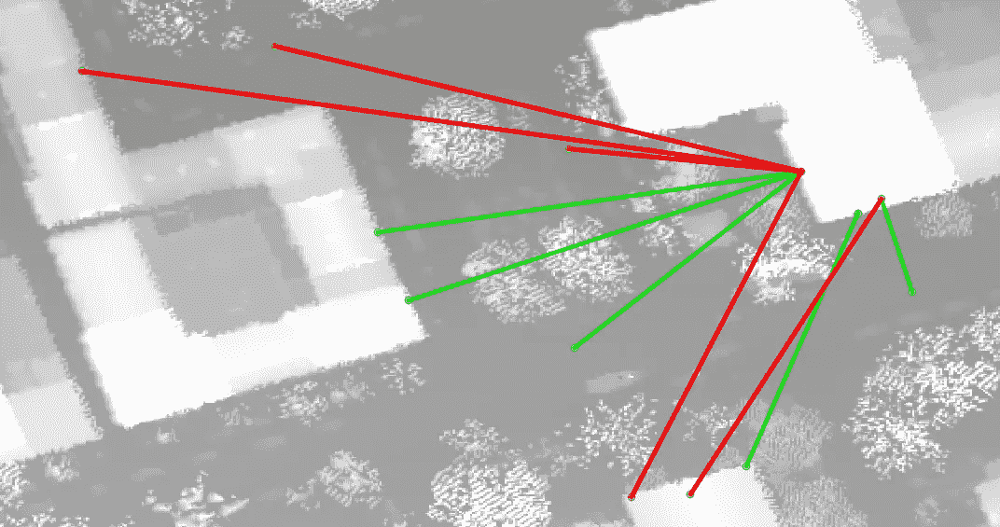

# 区块链上的去中心化互联网

> 原文：<https://medium.com/hackernoon/decentralized-internet-on-blockchain-6b78684358a>

*区块链如何动员社区为彼此提供互联网，创造新的共享经济*

Community powered Internet, coordinated by Andrena’s blockchain

我过去几年的目标和梦想是通过社区的力量取代互联网服务提供商(ISP)。因此，我开始了个人和职业的旅程，开始了**【OISP】**，它代表着**开放互联网社会化项目。**

我以为我用这样的缩写很聪明，但后来我开始在谈话中大声说出来。即便如此，我也想不出更简洁的词语来描述我和我的团队正在努力做的事情。

核心原则很简单:社区成员拥有相互提供互联网的手段。他们也从交货中获利。

这就是我所说的社会化。分担成本，也分享利润。我们，社区，一起分担成为我们自己的 ISP 的成本和努力。我们也分享公用事业的利润。

这看起来像什么？你不是向 ISP 付费，而是向邻居付费，让他们为你提供互联网接入。钱留在社区，互联网最终会便宜得多。

在我们深入细节之前，让我们问一个重要的问题。我们真的需要改变上网的方式吗？

# 通信的未来

Comic by [Milt Priggee](http://miltpriggee.com/)

在过去的 25 年里，美国纳税人已经支付了 4000 亿美元(每户 5000 美元)来确保我们得到互联网。我们为 ISP 使用的基础设施付费，但我们仍然发现自己的网络速度是发达国家中最慢的。最重要的是，我们甚至没有为它支付合理的价格。

这最终成为成本社会化和利润私有化的一个例子。互联网服务提供商拥有我们纳税人支付的基础设施，然而他们却获得了过高的回报。现在他们拥有了基础设施，并且是数十亿美元的公司，他们游说削弱网络中立性，尽管绝大多数人都支持自由开放的互联网。同样，所有这些都是以纳税人为代价将利润私有化。

我认为提醒我们自己这是我们谈论的互联网的未来是很重要的。在人类文明的 0.5%中，我们拥有了在几毫秒内与地球上任何人交流的能力。现在我们正处于十字路口，人类如何学习、联系、感受和创造生活的未来将被决定。如果任何方面违背了互联网服务提供商的底线呢？当他们有责任实现利润最大化时，我们能指望他们保护我们的数字自由吗？这是对任何公司的极大信任。

假设 ISP 走的是利润最大化的道路。如果用户不喜欢 ISP 限制他们的连接，或者出售他们的浏览器历史，那么他们当然可以通过把钱带到其他地方来塑造这个行业，对吗？这是自由市场的标志，也是消费者如何用他们的钱包让行业负起责任。互联网接入被认为是一项人权，因此没有它是不合理的。那就剩下把你的钱给竞争对手了。但是如果竞争是有限的呢？如果我们不能把钱带到别处，我们应该拥有的累积钱包的力量就毫无价值。

如果顾客不能把他们的钱带到别处，那么这种责任就不复存在了。当通信的未来岌岌可危时，问责不应该是一个荒谬的要求。

除非我们做一些不同的事情，否则可以说我们的力量是有限的。毕竟，互联网服务提供商有很多钱，竞争有限，而且他们拥有基础设施。

这一切听起来令人难以置信的黯淡，但有一个奇怪的挑战路线，植根于一个简单的问题:*谁说互联网服务提供商必须拥有基础设施？*

我们能不能用我们今天拥有的技术来互相提供互联网，这样我们就不需要它们了？这些是 OISP 想要解决的问题，我们从社区开始。

# 什么和如何

OISP 的团队正在开发一个网络，我们称之为**安德瑞娜**。这个网络由城镇或城市中的人组成，他们充当无线网格中的节点，帮助彼此传递数据。

## 安德烈娜可以总结为四点:

*   **用户拥有组建大型网络所需的所有无线硬件**
*   **整个系统的管理在公共区块链上进行**
*   **所有用户直接在区块链上无缝地相互交易，这意味着网络可以在没有我们公司的情况下运行**
*   **网上批发价格带给消费者。任何利润都在为网络做出贡献的社区成员之间进行分配。**

让我们详细阐述这几点，看看共享基础架构是什么样子的。

## 作为基础设施的无线硬件

当想到 Andrena 和基础设施/硬件时，你可以想象像你的无线家用路由器一样的东西。它仍然在家里提供一个热点，但它也被设计成与其他拥有自己硬件的用户互联。这就是我们所说的*互相传递互联网*。如果你连接到你的邻居，而他比你离 Google.com 更近一步，他会把数据传送到你的设备上。

在社区中设置 Andrena 的过程中，最大限度地减少所需的硬件数量是有意义的。如果这个网络能够为每个人服务，同时将人们需要花费在额外硬件上的钱减到最少，那就太理想了。如果你的笔记本电脑或手机在邻居的覆盖范围内，那么你家里就不需要额外的东西了。

需要多少新的基础设施/硬件完全取决于人口密度和地理位置。如果一个公寓房东是 Andrena 网络的一部分，那么一个热点就可以覆盖她的所有租户，他们不需要任何额外的东西。值得注意的是，她的租户并没有为基础设施做出贡献，而是使用了基础设施。

从现在开始，我们将关注对基础设施做出贡献的人:贡献者。

网络中的任何两个贡献者(想想你和街道尽头的一个邻居的房子，或者附近的两个公寓业主)，只要他们有可以说话的成对硬件，就可以连接。无论是 airMAX，airFiber，MikroTik，Mimosa 等。安德烈娜对这些设备一无所知。在选择时，我们的组织会根据贡献者的积极程度来帮助推动这一过程。

如果你是一名积极为他人提供互联网接入的贡献者，那么为此获得奖励是有意义的。

以前面的例子为例，一个想要为其租户提供互联网的房东可以预先花 1000 美元购买硬件。她的租户可以加入她的无线网络(无需任何额外的硬件)，并直接向她支付他们消费的数据。这种方法为房东提供了剩余收入，并能为她的房客节省数千英镑的家庭互联网费用。

与此同时，拥有一套位置优越的角落公寓的人可以投资 100 美元购买硬件，但最终每月支付 0 美元的互联网账单，因为这抵消了向他人提供互联网的费用。

**这些例子展示了某人如何用自己的硬件为网络做出贡献，并因此获得回报**。我们还可以看到，基础设施是分散的。它不属于一家公司，而是属于用户。

## 更多是为了当地经济

在刚才提到的例子中，我们为共享互联网而互相付费。这就是共享经济模式，也叫协同消费。想想优步，Airbnb 等等。，适用于互联网使用。

在这种共享经济中，基础设施归用户所有。在拼车服务中，用户拥有汽车。在我们的模型中，向邻居提供互联网的基础设施归社区所有。

我们与 Andrena 和这个用户拥有的网络的目标是创建一个新的地方经济部门。食品、交通等。都是当地经济的一部分，那么为什么不把互联网融入其中呢？这带来了一层复杂性，因为不是每个人都知道或有时间配置网络。

我们的重点是消除这种复杂性，以便资金能够在共享经济中流动。任何普通消费者都应该能够无缝集成，而无需了解技术细节，并因做出贡献而获得回报。

**通过让每个人都能轻松投稿，我们旨在创造一个理想的环境，让竞争提高质量，降低价格**。

如果当地的一家出租车公司每次都走很长的路线，并向你收取很高的价格，你可以选择另一家。同样，如果网络中的一个节点要求过高的速率，或者没有通过*超额预订*来交付他的数据份额，那么另一个节点应该很容易以更低的价格和专用数据进行竞争。

这种方法将竞争重新带入组合中，并将权力交还给你的钱包。

这种共享经济最大的好处是**它把互联网服务提供商从当地经济中吸走的利润再重新注入。**我们谈论的是给当地居民、业主和小企业更多的钱，他们都更有可能将这些钱用于当地经济。我们花在 ISP 网络账单上的所有钱，有没有被用来在当地商店买咖啡，或者在当地杂货店买杂货？

我在这一部分描述的一切都是围绕着*公平*展开的。你贡献越多，得到的回报就越多。如果你想敲诈你的邻居，小心行事，因为他很容易取代你。我们必须记住，我们面对的是任何行业中一些最大的巨头。如果社区要击败互联网服务提供商，我们必须公平对待彼此。

## 核心的区块链

公平是有代价的，那就是信任。如果你不能相信你得到的服务质量，或者你被收取的价格，那么它就不是一个真正公平的系统。如果你完全不必信任你的邻居，仍然能够和他一起组织形成这个网络，那将是最理想的。Andrena 网络的核心技术需要能够在没有信任的情况下运行。

Andrena 使用区块链(与推动比特币和以太坊的技术相同)作为其核心，以确保没有信任的公平。它允许安德烈娜网络形成和组织，没有一个中央权威(如互联网服务提供商)，这是我们的一个重要观点。

> “分布式分类帐是这样一种系统，它使不完全信任彼此的各方能够就一组共享事实的存在、状态和演变形成并维护共识。”——Richard Gendal Brown

[区块链](https://hackernoon.com/tagged/blockchain)是一种分布式账本，它非常适合在社区中创建网络。这个网络要协调很多信息(人脉、财务等。)，并且每个人都需要对网络的当前状态达成一致。如上所述，用户不应该互相信任才能组织起来，区块链解决了这个问题。

此外，OISP 希望 Andrena 网络能够持久。如果我们的公司摇摇欲坠，全世界的社区还怎么互相提供互联网？如果一个社区想要在没有我们的情况下组织他们自己的网络并丰富他们的经济呢？如果我们是所有这些网络的中央权威，我们无法给出一个充分的答案。

作为一家公司，我们必须放弃权力。我们不能只是互联网服务提供商的替代品。在一个非常基本的层面上，我们必须把权力还给我们的用户，这样我们才能以不同的方式做事。T2 的技术 T3 需要去中心化，就像基础设施一样，这也是区块链的闪光点

我们未来的许多文章将致力于区块链如何对安德烈娜进行研究的细节，因为有许多细节需要探索。最大的领域之一是它作为金融支持的协作消费的实用媒介的使用。

OISP 承诺开源运行这个网络所需的代码，以及维护共享经济所需的代码。开源承诺结合区块链给了我们的用户一个非常有趣的承诺:**如果我们变得和你今天讨厌的互联网服务提供商一样糟糕，你将能够联合起来取代我们，并且你将拥有这样做的技术。**

# 关于节点和用户的更多信息

以上一切都是 Andrena 的要点:用户拥有无线硬件来相互提供互联网，它得到了区块链共享经济的支持。尽管如此，仍有许多细节被遗漏，这里是一些快速点击。

## 方法

网络中的一些节点将成为通向更大的互联网的网关。这些用户(或我们)与互联网批发提供商保持联系。这个级别的互联网价格比我们今天通过互联网服务提供商支付的价格要便宜得多。

一些互联网共享模式依赖于使用现有的消费互联网服务提供商作为网关。这在这里行不通，因为出售这些数据是违反服务条款的。

## 装置

无线设备可以安装在屋顶、窗户或完全看不见的地方。较小的设备安装在窗户和墙壁上，而较大的设备(最大的大约 4 英尺)最好安装在非穿透式屋顶支架上。

## 吞吐量验证

为了验证节点正在提供它们同意的带宽量，仍然需要分散的技术。我们将在接下来的文章中更详细地探讨这一点。

## 安全性

因为我们假设节点不完全信任彼此，所以我们必须考虑窥探。虽然 HTTPS 解决了这个问题，但用户可以选择在他们的设备和网关节点(甚至更上游)之间创建一个加密隧道，确保中间的任何人都无法看到任何明文流量。

# 关于安德瑞纳公司

如果你只是对 Andrena 作为一个无线网络的细节感到好奇，请不要继续阅读了。

## 贝塔

我和我的团队正在新泽西州普林斯顿部署 Andrena beta。我知道，这不是一个真正需要低成本互联网的领域。尽管如此，我们在第一轮部署中将所有低收入地区作为目标。

我们希望一轮成功的部署将允许我们扩展到其他地区，包括特伦顿、新不伦瑞克、霍博肯和布鲁克林。

## 没有撇清的承诺

消费者支付的费用和网关支付的批发互联网费用之间的差额在系统中的用户之间严格划分。安德烈娜的商业模式不包括从每笔交易中获利。

## 地理空间洞察

A simple example of LoS(Line of Sight) calculations in action

我们公司也注重战略部署。举一个具体的例子，我们使用卫星数据来确定新用户的位置和网络中其他节点之间的服务质量。这在部署时节省了大量时间，因为你不需要有人出现在你家测试信号。它还允许我们对新社区进行模拟，以确定哪些区域最适合。

# 有权势的人

在安德瑞纳所处的领域中，有许多拥有出色解决方案的巨头。我们以不同的身份从他们那里获得灵感，并想提及他们。

*   [guifi.net](http://guifi.net)—西班牙一个拥有 33，000 个节点的大型社区供电网络，表明类似的事情也可以在美国实现
*   [屋顶网](https://pdos.csail.mit.edu/~rtm/roofnet-b.pdf)——在剑桥实施的第一个城市范围的网格之一。不表达对他们的敬意，这篇文章就不完整。
*   [Open Garde](https://www.opengarden.com/)n——推动实现由每个人的移动设备驱动的互联网的真实愿景。正在形成的最终解决方案。
*   [开放网格](http://www.open-mesh.com/) —一个使用 B.A.T.M.A.N 协议的优秀网格解决方案，展示了使用 [OpenWrt](https://en.wikipedia.org/wiki/OpenWrt) 可以做什么。
*   Ubiquiti —提供一些最好的无线硬件。我们的很多网络使用无处不在的设备。随着拥挤成为 ism 频段的一个问题，他们的空中棱镜技术改变了游戏规则。
*   [MikroTik](https://www.mikrotik.com/) —无线硬件，具有丰富的低级和 CLI 文档。他们的产品使我们的解决方案非常可定制。