# 分散的客观共识，无需工作证明

> 原文：<https://medium.com/hackernoon/decentralized-objective-consensus-without-proof-of-work-a983a0489f0a>

去中心化和客观共识是当今加密货币面临的两个主要挑战。虽然缺乏客观性通常归因于利害关系证明区块链，但在任何现有的基于财务利害关系或计算资源的共识算法中，分散化的实际程度是值得怀疑的。我们将分析这两个困难，并提出一个新的区块链模式，提供客观的共识，以及一个强大的权力下放的趋势。

# 共识小组的分散化

尽管比特币旨在分散对基础货币的控制权，但人们对作为其核心机制的工作证明(PoW)能否实现这一目标表示严重关切。几个因素确实损害了比特币的主要设计目标:

1.  采矿的利润很大程度上取决于电力成本，因此也取决于采矿设备的位置。
2.  资源的不平等分配和规模经济影响了共识，并通过采矿奖励得到加强。
3.  当前的块散列困难使得私人用户进行挖掘是不可行的，除非他们参与挖掘池(这再次导致集中化)。

不幸的是，PoW 的主要竞争对手 Proof-of-stage(PoS)也面临着类似的、甚至更糟糕的问题。它向利益相关者支付利息，并按照股权(硬币所有权)的比例集中控制权，这是一种分配不均的有限资源。因此，许多漏洞损害了 PoS 硬币的安全性。攻击货币是一次性的赌注成本，永远持续，而对于 PoW，攻击者必须继续花费资源在采矿上以维持攻击。一个人甚至可以通过做空硬币来获利，而不需要卖掉你的股份。用少于 50%的股份进行攻击似乎是可能的。

# 客观共识

如果加入网络的新节点能够仅基于协议规则(例如，起源块的定义)和跨系统传播的消息(例如，所有块的集合)独立地到达与网络其余部分相同的状态，则一致协议被称为[目标](https://blog.ethereum.org/2014/11/25/proof-stake-learned-love-weak-subjectivity/)。比特币中使用功率共识是客观协议的一个例子；只要一个新节点连接到至少一个“诚实”用户，它将总是把计算难度最高的区块链视为有效链。叉子对新来者不构成威胁。

另一方面，传统的 PoS 缺乏这种重要的属性。任何能够构建比实际链更长的分叉的人都会混淆新节点，这些新节点不能识别这样的 canocial 链。似乎 PoS 历史没有可验证的最长链。虽然远程分叉可以被跟踪链历史的系统的现有用户拒绝(例如，通过限制可能分叉的长度)，但是新来者必须依赖关于区块链的最近状态的附加信息。这种共识协议被称为“弱主观的”，因为加入的用户需要从可信的、可靠的来源访问当前块。这损害了区块链的不信任。

# 一个实体，一票

## 西比尔发作

在一次 [Sybil 攻击](https://en.wikipedia.org/wiki/Sybil_attack)中，攻击者正在创建大量假名身份，以在对等网络上获得不成比例的巨大影响力。例如，如果决策是基于一个 IP 一票制，那么任何能够为其节点分配多个 IP 地址的人都有可能颠覆这种决策。系统对 Sybil 攻击的脆弱性最终取决于身份生成和积累的成本。在现有的加密货币中，创建一个账户(或比特币中的地址)是一个相当简单的过程，只需要生成一个私人/公共密钥对。因此，理论上任何用户都可以创建任意数量的帐户。PoW 和 PoS 通过不将投票权建立在用户拥有的帐户或 IP 地址的数量上来解决这个问题。

## 付费和免费账户

问题是加密货币是否可以建立在*一个账户一票*的理念上。这样的方案将要求实体不使用多个账户，实现*一实体一票*的原则。如前所述，如果生成身份的成本很低，Sybil 攻击就可能发生。相反，我们必须确保创建帐户是昂贵的。然而，我们必须假设，不是每个用户都能够并且愿意为一个账户付费。这就是为什么我们的建议基于两种类型的账户，这两种账户都可以用于向任何类型的账户进行交易:

1.  没有造币权的免费账户
2.  谁建造了区块链

## 明特账户是一个有利率限制的，不可转让的第二令牌

由于人们需要一种为 minter 账户付费的激励，后者必须拥有自己的价值。为此，我们必须为他们提供优于免费账户的优势，让他们成为有限的资源。在这种情况下，铸币账户将作为基础货币的第二个标志。然而，这种系统本身不能解决中央集权的问题；一个富有的实体仍然可以购买所有 minter 账户的很大一部分，甚至大部分，以获得对共识的控制。显然，付费账户不足以实现去中心化。此外，我们还必须确保一个经济实体不会从使用多个账户中获得任何好处。因此，我们不会向 minter 账户支付固定报酬，而是向他们支付往来账户余额的利息。因此，无论一个实体如何在其账户中分割其股份，总利益将是相同的。当然，如果我们只是向当前区块的创建者支付利息，这个想法就行不通了，因为股东可以通过使用几个帐户进行铸造来增加获得奖励的机会。因此，每当任何人创建一个新的区块时，我们将按照其在货币中的份额比例向每个 minter 账户支付利息。

这就给我们留下了一个问题:如果利益相关者无论如何都能得到他们的利益，他们为什么还要建造积木？此外，强大的攻击者可能会试图获得大多数帐户，目的是发起双重消费攻击。因此，我们必须减少账户交易，使其难以获得对硬币的多数控制权。幸运的是，如果我们把 minter 账户变成一个*不可转让的有限资源*，这两个问题都可以解决。

## 父帐户和子帐户

与其“无中生有”地创建 minter 帐户，不如让当前区块的构建者有权创建一个新帐户，他可以在之后出售和转让该帐户。我们将后面的帐户称为“子”帐户，创建者的帐户称为“父”帐户。因此，minter 帐户将形成如下图所示的树形结构。

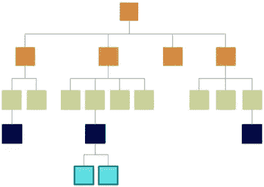

Diagram 1: Account tree structure

现在，很明显，minter 帐户将构成一个*速率受限的资源*，因为它们的创建速度不能比 blocks 快。寻求获得 50%铸币权的攻击者(作为唯一购买者)将不得不在一段时间内继续购买子账户，这段时间(至少)对应于他开始其阴谋时存在的区块数。

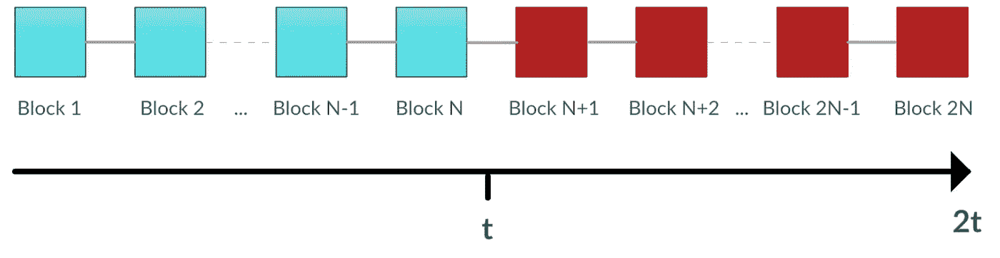

Diagram 2: Required time to take control over 50% of the minter accounts

区块链存在的时间越长，攻击者就需要越长的时间来建立对共识的多数影响。随着时间的推移，区块链的安全将不断增加。由于绝对意义上的时间是不可协商的，并且由于生命的有限性而自然受到限制，因此它可以保护区块链免受攻击者的攻击，而不管攻击者的财富如何。

还有一个问题有待解决。如果现有帐户可以自由转移给新的所有者，攻击者可能会通过累积现有帐户而不是子帐户来轻松绕过此安全层。然而，很容易看出，即使没有任何特殊安排，购买现有账户也需要转移账户的私钥，这使得交易对买方来说风险很大。仍然知道密钥的卖家可以在事后用它来“窃取”账户的余额。如果我们要求一个 minter 帐户必须拥有一定的最低帐户余额来构建一个块，我们可以利用这种风险来达到我们的目的。我们假设这样的需求可以有效地防止基于累积现有账户的攻击场景。

一个幸运的副作用是，拥有 minter 账户的股东将有动力去构建积木，因为他们可以通过出售子账户获利。虽然现有账户仍然不可替代，但市场最终将决定儿童账户的价格。

## 分散的 minters 组

如上所示，一个(理性的)实体拥有一个以上的账户是没有意义的，因为它的实际利益并不取决于账户的数量，而是取决于股权。虽然铸币商可能会决定保留孩子账户，以便以后出售“孙子”账户，但考虑到在获得铸币机会之前持有账户的资金锁定成本，这样做是不合理的。由于每个帐户创建下一个块的概率降低，平均持有时间将随着 minter 帐户池的增长而增加。因此，minter 帐户的市场价格将倾向于首先由利率决定，而不是由创建和出售子帐户的前景决定。换句话说，持有一个子账户意味着你不能将你的收益再投资到货币中，并且你将在很长一段时间内收不到这笔钱的利息。

即使我们假设一些铸币者将为自己保留他们的子账户，他们也不能在不购买新账户的情况下增加他们的总铸币能力，因为铸币池也在增长。他们所能做到的只是保持他们对共识的相对影响力。最终，随着越来越多的利益相关者出售他们的子账户，造币权将变得越来越分散。

总之，我们的区块链设计是基于具有交互 PoS 关系的双令牌方案。Minter 帐户充当第二个令牌，您需要它来构建区块链并“铸造”子帐户，还有一个相反的 PoS 关系，因为您需要硬币(第一个令牌)来“填充”minter 帐户，以便他们可以生产更多的硬币(利息)。

# 建造区块链

Sybil 证明账户是一个安全、分散的区块链的重要基石，但它们还不够。我们还需要一种以随机方式选择 minters 的方法，这种方法不会受到操纵和 DDoS 攻击。此外，节点必须有适当的规则来决定某个区块链是否有效，以及几个区块链候选中的哪一个是规范的。

## 选择下一分钟

在 PoW 区块链中，块 *B* 的散列不能超过某个阈值，因此挖掘器必须重复遍历块头中的可能变量以找到有效块:

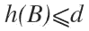

通过设置难度阈值 *d* ，可以调节预期的积木创建速率(“积木时间”)。在大多数区块链设计中，协议会自动调整难度，以确保平均阻塞时间保持不变。为了简单起见，我们将在设计中省略这一方面。

在像 NXT 这样的经典 PoS 算法中，不等式取决于用户在货币中的股份或账户余额 *bal(A)* 。为了确保块最终可以在任何情况下构建，每个块中都包含一个时间戳，并且将自前一个块创建以来经过的时间添加到公式中:

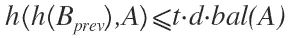

在新数据块通过网络传播后，任何给定用户满足条件的机会最初很低，并随着时间的推移而增加。此外，该公式允许以合理的精度预测下一个块的 minter。不幸的是，可预测性为针对下一个 minter 的 DDoS 攻击提供了便利。此外，我们必须避免节点通过操纵变量来增加它们的机会。这就是为什么我们不使用这个不等式，而是使用一个更复杂的方案。

## 哈希链是随机性的来源

为了保证随机选择下一个块的创建者，我们将求助于一种叫做散列链的技术。散列链是通过取一个随机值(或“nonce”)并使用 SHA256:

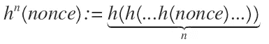

假设验证者已经知道了 *n* 的链结果，链的创建者可以通过给验证者*n–1*的散列链进行认证，验证者随后将散列它并检查它是否等于链结果。这个过程可以重复进行，从链中剥离多个层，并重新散列几次以进行验证。

对于从给定散列值 *x* 中移除 *k* 层的函数，我们将使用以下符号:

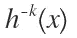

由于加密散列函数是不可逆的单向函数,显然“剥离”函数不能直接应用于散列链。相反，它只能通过散列原始随机数 *n-k* 次来确定，这只有在您知道随机数的情况下才有可能:

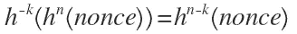

哈希链可以扩展为私有的随机生成方案，在该方案中，一个人首先公开承诺某个链结果，然后随后揭示其内层，这些内层将充当可验证的随机填充。在区块链的情况下，可以通过在最新的块中记录散列链的结果的特殊事务来完成提交。一旦一个人投入到这样的链条中，她将无法篡改它的层次。另一方面，她可能通过相应地选择随机数来预先影响结果，这使得该方案易于被*初步*操纵。幸运的是，可以使用多个实体的散列链的组合来防止任何个人操纵最终结果。为了将这个想法应用到我们的区块链，我们首先要仔细看看 minter 帐户是如何创建的。

## 创建 minter 帐户

如上所述，新的 minter 帐户是从现有的父帐户派生的。每当构建一个块时，父帐户就获得产生子帐户的权利。为此，铸币商必须发布包含子账户公钥 *pk* 的*生成交易*。当向其他人出售子账户时，创建者必须使用购买者提供的公钥，以便通过购买者的密钥 *sk* 访问该账户。在第一次使用之前，子账户必须由其新所有人通过*激活交易*激活，该交易包含对使用 *sk* 签名的散列链的承诺，该散列链可以使用来自起源交易的 *pk* 进行验证。一旦账户的激活在一定数量的区块内得到确认，账户将被认为是活跃的，我们称之为*激活期 k* 。

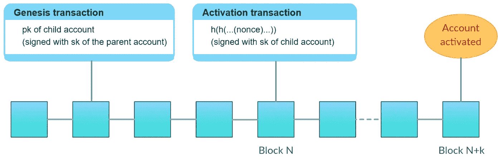

Diagram 3: Account creation

我们现在已经准备好解决我们模型中实际的铸造不平等。

## 铸造不等式

在我们的设计中，每个块必须包含 1。一个时间戳 *ts，* 2。前一个块的散列和 3。minter 的当前哈希链值，即账户 *A:* 创建的第 *i* 个块的链位置

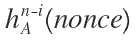

为了方便起见，让我们使用下面的简化符号来表示记录在区块链的第 *j* 个块中的散列链值:

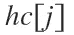

这允许我们将下一个块 *m+1* 的基本造币不等式写成如下:

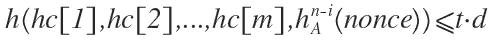

因此，我们在长度为 *m* 的区块链中结合当前 minter 的散列值构建所有散列链值的散列，并检查结果是否低于某个难度 *d* 乘以自前一个块以来经过的时间 *t* 。经过的时间定义为两个连续时间戳之间的差值:

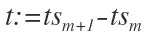

如果该不等式对一个块成立，则认为*形式上*有效，前提是其造币者拥有造币的最小账户余额。这种形式上的检查仅基于块中包含的信息来完成，而不求助于外部时间源。如果整个区块链的所有块都是形式有效的，那么它就被认为是有效的，这可以由任何节点在任何时间对每个块进行检查。

当一个*新的*块到达时，如果它的时间戳 *ts* 满足以下约束，则只有*被其他节点接受*:

1.  *ts* 不低于当前 UTC 时间——o 的时差
2.  **ts* 不大于当前 UTC 时间*

*因此，在网络上提前或广播太晚的时间戳将不会被接受。由于网络传播的不规则性，可能出现块到达某些节点太晚而被认为是有效的情况。然而，只要大多数造币节点(帐户)及时接收到该块，它们将开始在它上面造币，因此最终可能会有一个新的块附加到它。一旦发生这种情况，前一个块也将被后一个节点接受，因为时间约束只应用于链中最近的块。*

## *链选择规则*

*有效性检查和时间限制不允许在多个有效的链叉之间进行选择。我们需要额外的链选择规则来确定规范链。假设恒定的区块难度 *d，*我们可以将简化版的[比特币最长链规则](http://bitcoin.stackexchange.com/questions/5540/what-does-the-term-longest-chain-mean) (LCR)应用于我们的区块链，并将区块数最多的链视为标准链。如果两个分叉具有相同的长度，则具有最小时间戳的最后一个验证时间约束的块赢得比赛。如果最后两个块具有相同的时间戳，则具有较高公钥的帐户被接受为当前 minter。(在“实现客观性的心跳交易”一章中将介绍一个额外的链选择规则。)*

## *防篡改秘密铸造*

*与利用透明伪造的 PoS 区块链相反，我们的算法基于散列链，因此增强了谁成为下一个硬币制造者的不可预测性。所有的伪造都是“秘密”进行的，这对于 DDoS 恢复能力来说是一个很大的优势，因为攻击者无法集中精力破坏当前正在伪造的节点。此外，没有人能够通过为他的散列链选择特定的随机数来增加他的造币机会，即使他控制多个账户。所有过去的造币者的散列链值的组合阻止了任何影响选择过程的企图，因为每个造币者对未来的造币顺序都有不可预测的影响。对于由现有帐户创建的子帐户也是如此，因为在强制激活期间构建的块中包含的散列值也将有助于随机性。*

# *攻击场景和保护措施*

## *无关紧要的问题*

*与 PoS 相关的一个众所周知的问题是所谓的无利害关系(NaS)问题。由于铸币不涉及大量的计算工作，一个理性的用户可以使用一个偏离协议规则(例如 LCR)的修改过的客户机，并在多个分支上铸币，以便增加创建下一个块的机会。换句话说，链选择规则并不构成一个[纳什均衡](https://en.wikipedia.org/wiki/Nash_equilibrium)，即如果其他参与者的策略保持不变，那么没有一个参与者可以通过单方面改变策略而获益。应该注意的是，NaS 本身并不是一个攻击媒介，而是一个游戏理论设计弱点，它可以强化自然分叉并为某些攻击场景提供便利。*

*已经有人提出了惩罚方案来解决 NaS 问题。这些方案在“应受惩罚的罪行”和施加的惩罚方面有所不同。一种可能性是惩罚双重铸造本身。虽然在相同长度的冲突链上铸造块显然是违反规则的，但是如果块是在不同的链位置上创建的，那么重复铸造是否也应该受到惩罚是值得怀疑的。因为可能会发生这样的情况，一个诚实的节点在一个变成孤儿的链上铸造了一个块，并且同一个节点随后有机会在一个冲突的链上铸造。此外，一个节点可以简单地*尝试*在每个分叉上挖掘并广播一个单独的块，而不是实际创建多个块，即使在这种罕见的情况下，它在两个分叉上都成功了。因此，一个理性的矿工会计算许多不同链的挑战，如果其中一个击中目标，将他的块添加到相应的链中，不管这是不是他迄今为止见过的最好的链。这种行为会破坏网络的稳定，必须避免。实现这一点的一种方法是确保在 fork 发生之前确定铸造节点。通过预先选择 minters *k* 块，如果链分叉的时间不长于 *k* 块之前，则两个链的目标将是相同的。*

*或者，你可以惩罚在*错误*链上创建块的账户。这本身就带来了一个问题:有时，铸造者不确定在给定位置的两个候选块中的哪一个将最终获胜，因此他们可能完全出于害怕被处罚而放弃制造块。然而，这个问题可以通过选择适当的惩罚来解决，这种惩罚既不太弱也不太严厉。因此，我们将选择不太严厉的惩罚，而不是破坏帐户及其余额:如果帐户被发现在错误的链上铸造(即，它将它的块附加到没有成为规范链的一部分的块 N)，它将失去铸造和繁殖的能力，同时它继续从其股份中赚取利息。在我们的区块链设计中，单个账户很少有机会创造一个区块，随着越来越多的账户被创建，这个概率会降低。因此，即使在存在多个链叉的情况下，考虑到在可预见的将来再次成为铸币者的低概率，有资格创建下一个块的用户似乎也不太可能放弃他的机会。*

*与其他惩罚方案相比，我们的机制不依赖于持续时间有限的安全保证金，而是利用账户作为系统的永久令牌。这样做的好处是，不在错误的岔道上造币的激励将永远持续，而不会永久锁定资金。在错误的链上铸造的惩罚应该有效地防止攻击者试图分叉最近的块的短程攻击。为了建立一个比目前公认的更长的区块链，攻击者必须拥有或控制> 50%的当前活跃的 minter 账户。如上所示，攻击者将不得不在比现有区块链更长的时间内继续购买新的子账户。随着时间的推移，这种情况变得越来越不现实。*

## *远程攻击*

*让我们考虑一个攻击者试图重写历史，而不是现在接管区块链。对于现有的 PoS 区块链来说，这就是问题变得严重的地方，至少在理论上是如此。一个原因是，如果有人在过去持有该货币的股份，那么原则上，这种先前拥有的股份可以用于创建从该较早时间开始的区块链分叉。攻击者甚至可以购买旧的未使用的密钥来实施攻击。这就是为什么许多 PoS 加密货币通过防止长时间重组来避免这种远程攻击。例如，在 NXT 中，如果替代区块链与现有区块链的差异超过最后 720 个块，则用户可能不接受该替代。然而，这种限制不能解决新用户的问题。当新来者连接到网络时，他会看到多个区块链，而事先并不知道它们的真实性。知道哪个是正确的区块链的一个方法是从可靠的来源下载；然而，这使得系统是半集中式的，并且不是完全不可信的。与比特币使用的“客观”标准相比，维塔利克·布特林称之为“弱主观的 T2”。*

*在实践中，远程攻击并不像理论上看起来那么容易执行，因为攻击者必须超越由其他节点挖掘的规范链(也就是说，出售了他们的旧密钥并继续为主链做出贡献的节点)。*

## *股份和账户研磨*

*不幸的是，如果攻击者可以通过创建多个帐户、来回转移资金或通过其他方式来影响其伪造链中的块创建顺序，则远程历史攻击就变得容易了。在我们的设计中，例如，攻击者可以选择他的子帐户的随机数，以便他的一个现有帐户有权为一个小时间戳创建下一个块。通过将间隔很小的积木串在一起，他最终可以追上正确的链条，同时满足时间限制。如上所述的不可预测性和防篡改性因此只能保证未来，而不能保证过去的块。*

*另一方面，强制帐户激活期使得很难从分支点开始构建第一系列块，因为子帐户在被激活之前不能用于铸造。如果激活周期足够长，并且攻击者只控制少数旧帐户，他的伪造链将在分支点之后显示不自然的减速(块之间更大的间隔),这可能是统计检测到的。然而，人们不应该依赖这一点作为防御，特别是如果我们假设攻击者可能获得超过 50%的旧帐户的攻击场景。*

## *心跳交易达成客观共识*

*为了有效地防止远程攻击，我们引入了一种新的防御机制，我们称之为*心跳事务*。我们要求每一个 minter 账户以一定的规则进行交易，以保持活力。如果最后一笔交易的时间超过 *k* 块(*心跳周期*)，该账户将被降级为“自由”账户，不再能够铸造块和接收利息。与 [TaPoS](http://bravenewcoin.com/assets/Uploads/TransactionsAsProofOfStake10.pdf) 类似，heartbeat 事务必须包含对链中最近一个块的引用，否则它们不会被其他节点接受。除此之外，每笔交易都可以算作心跳交易，所以一个账户可能只是把钱寄回给自己。像所有其他事务一样，心跳也必须包含少量费用，以避免事务垃圾。因此，“双心跳”，即向多个链添加交易变得成本高昂。*

*由于所有者最初不得不为他的 minter 账户付费，因此可以有把握地假设，只要他在基础货币中有股份，他就会努力保持它的活力。一般来说，他进行心跳交易的动机将持续比*心跳周期*长得多的时间，只要后者被适当地设置(使用与新账户的*激活周期*相同的长度是有意义的)。*

*这一切是为了什么？好吧，我们随机取一个块 *B* 。通过查看从 genesis 块开始的链的历史，我们可以看到在块 *B* 中哪些 minter 帐户仍然存在，而哪些已经被降级为免费帐户。接下来的 *k* 模块允许我们确定在等于心跳周期的额外间隔结束时，有多少活动账户仍然存在。可以预计，这将是一个很高的百分比，或在最好的情况下，所有的帐户。现在让我们假设是后者，并且考虑一个攻击者控制了在块 *B* 之前生成的> 50%的(活动)账户，想要从这个块开始创建一个分支。很明显，他只能包括源自他所控制的账户的伪造心跳交易(如果激活期短于心跳期，则源自他们的子账户)。相比之下，如果不知道相应的私钥，攻击者就无法从 block *B* 之前创建的所有其他帐户中复制心跳交易。因此，即使没有先验知识的新手也可以通过以下事实将 fork 与权威的区块链区分开:它具有更少的*唯一心跳事务*(如果同一帐户的心跳包含在多个冲突的链中，则不计算它们)。在这种最好的情况下，一个诚实的帐户不出售它的旧密钥就足够了，因为它能够确定正确的链，该链将简单地包含一个唯一的心跳。*

*现在假设总数为 *n* 的账户出现在块 *B* 处，并且子集 *m* 没有在 *B* 和 *B+k* 之间进行心跳(或者因为它们简单地失败了，或者因为它们太新，还没有被激活)。我们称这个账户子集为 *pivotal 账户。**

*原来，如果攻击者控制了*m*枢纽账户中的 *c* ，那么他还必须控制>中的*n–m–c*n–m 非枢纽账户才能使他的链条看起来规范。假设 *m* 比 *n* 小得多，攻击者因此需要拥有给定时间几乎所有历史账号的密钥(不考虑*c*)*，这是一个非常强的属性(见下图)。**

**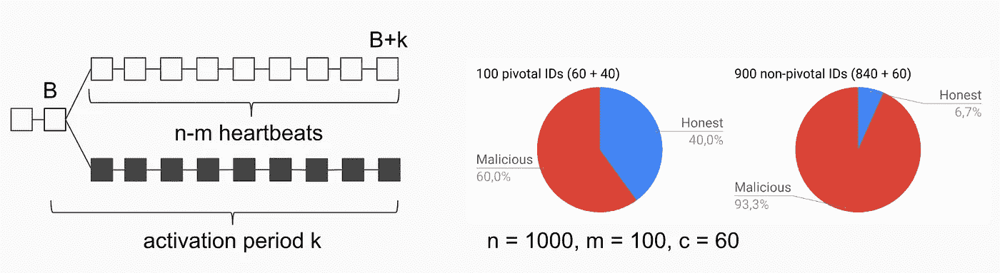**

**利用所提出的机制，新节点不需要从可信来源获得 canocial 区块链，因为它们可以自己识别它。因此，我们的区块链模型在至少“一些”账户是诚实的假设下提供了共识的客观性，其中诚实账户的所需百分比取决于其预期寿命和心跳周期之间的关系。由于心跳周期在理论上可以被设置为任意低的值，所以即使存在非常强大的攻击者，该协议也可以达到客观性。**

************

> **[黑客中午](http://bit.ly/Hackernoon)是黑客如何开始他们的下午。我们是 [@AMI](http://bit.ly/atAMIatAMI) 家庭的一员。我们现在[接受投稿](http://bit.ly/hackernoonsubmission)，并乐意[讨论广告&赞助](mailto:partners@amipublications.com)机会。**
> 
> **如果你喜欢这个故事，我们推荐你阅读我们的[最新科技故事](http://bit.ly/hackernoonlatestt)和[趋势科技故事](https://hackernoon.com/trending)。直到下一次，不要把世界的现实想当然！**

****