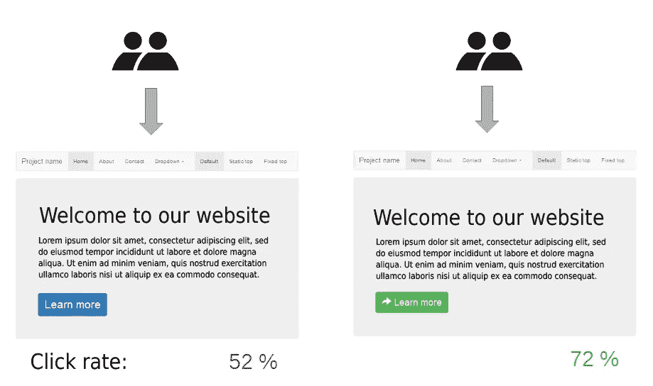
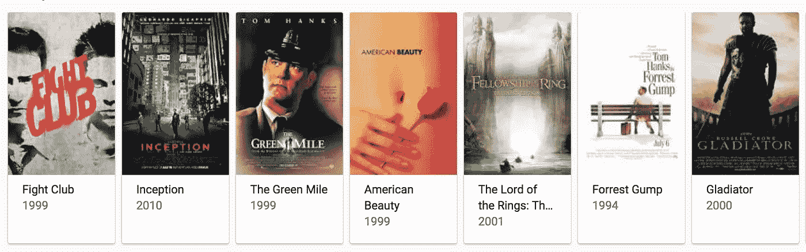
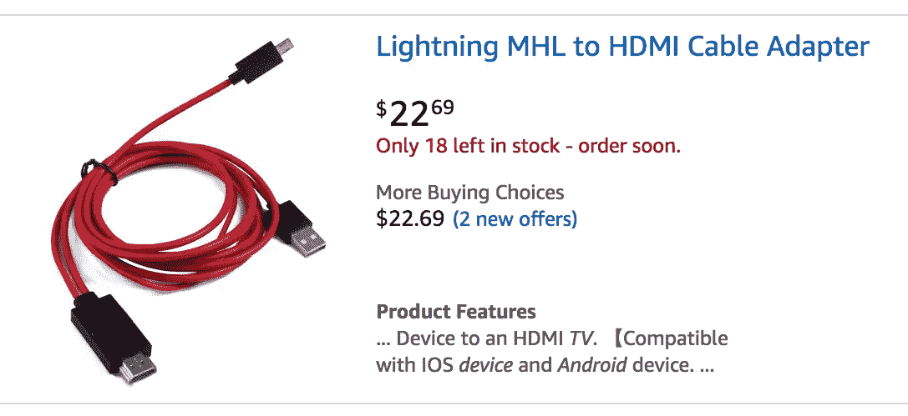
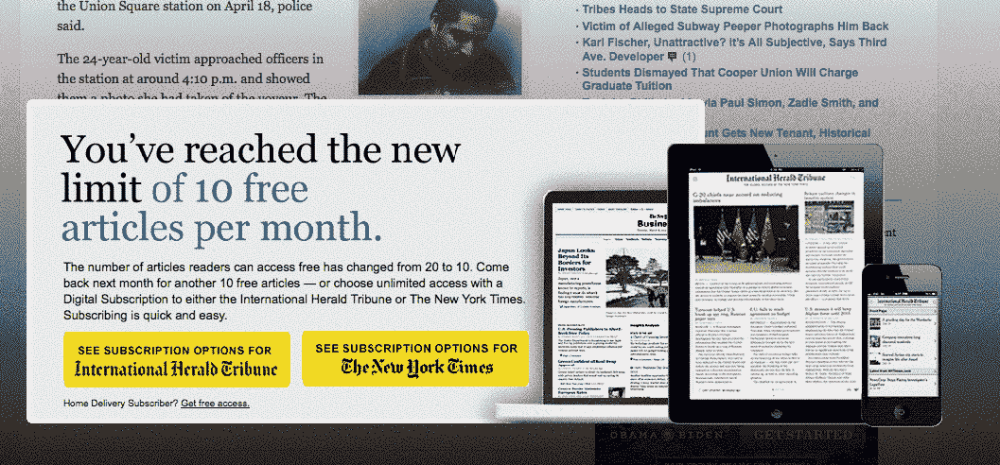
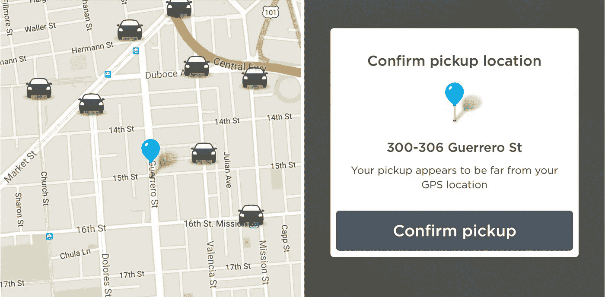
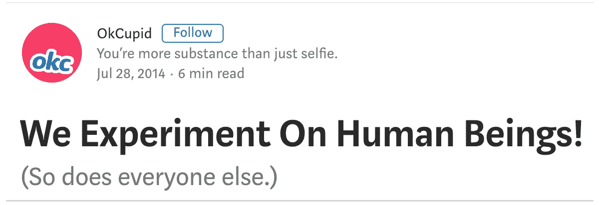
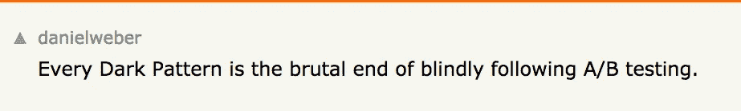

# 欺骗:退化的 A/B 测试

> 原文：<https://medium.com/hackernoon/deception-degenerate-a-b-testing-ecce6635000e>

## 使用深色图案的可疑 A/B 测试

在你的脑海中想象一个普通的三角形。现在想象一个没有面积的三角形。可以吗？在数学中，**退化三角形**定义如下:

> 三个共线的点形成一个退化的三角形。看起来不像三角形，像是线段。

A triangle approaching degeneracy.

就好像三角形的三个角被展平了一样。理论上，三角形是存在的，但剩下的只是重叠的直线。

虽然这篇文章不是关于数学，但它试图将某些 A/B 测试方法归类为*退化*，使用接近用户欺骗线的模式，也称为*黑暗模式*。然后，我们将回顾科技行业中有问题的大规模测试。最后，我们将通过向我们的用户做出清晰的陈述来给出避免这种欺骗的建议。

在我们开始之前，让我们讨论一下什么是 A/B 测试。

# 什么是 A/B 测试？

A/B 测试松散地基于统计数学和理论心理学实验。有一个控制“A”和一个变化“b”。一个测试的作者发送这两种类型给一个控制百分比的用户，在测试产品的一个变化时间内。用户的百分比和分组可以通过*定位来控制。*

一旦 A/B 测试完成，就会收集和分析数据。分析允许团队根据结果[将产品导向](https://dev.to/solidi/what-is-a-product-manager-anyway-3pc4)方向。这些数据点由团队进行推断，推动业绩指标，如*客户保持率*和*增长、行动号召、收入、转化率、*或寻找新的指标。

传统上，A/B 测试作用于用户体验、视觉设计或目标系统的其他修改途径，以减少用户*摩擦*并最大化*参与度。*大多数测试都是在*表面*进行的，这里的颜色、布局或导航流程/行为都被改变了。

A basic A/B test example. Note the difference in button color.

[A/B 测试](https://hbr.org/2017/06/a-refresher-on-ab-testing)获得了特定的*感知*。咨询公司围绕这一学科形成了业务，就像他们围绕搜索引擎优化(SEO)一样。SEO 在 2000 年代很流行。A/B 测试现在在 2010 年代很流行。虽然 SEO 受制于秘密算法，这些算法可以从谷歌等公司的直接控制中立即改变，但 A/B 测试逻辑完全由作者所有，他们执行这些逻辑以满足他们的产品和利益相关者的目标。

在过去的几年中，数据收集和工具的使用显著增加。A/B 测试的作者可能有权力在道德准则上走钢丝。接下来让我们通过定义高级黑暗模式来探索这一点，第一个分类利用紧急平台工具。

# 模式 1:行动平台工具紧迫性

那些使用过 Android 或 iOS 应用程序的人很清楚通知徽章是什么。通知徽章是应用程序图标上的视觉指示器，提示用户重要事件。这通常是一个颜色鲜艳的圆圈，带有一个与等待通知相关的数字。

A typical, highly visible notification badge.

## 例子

想象一下，如果我们推出一个带有欺骗性计数的徽章来表示主观或模糊的通知活动。即使用户已注销，他们也可能在没有用户活动的情况下收到徽章。徽章是订婚知识。

发生在一群用户身上。用户反复参与应用程序，以了解应用程序中发生了什么。由于通知与指标的联系不紧密，他们参与了更多次。

## 座右铭:“紧急通知”

在移动平台上，通知徽章是执行有趣的 A/B 测试的许多途径之一。平台工具会有所不同，但每个平台都有用户熟悉的高级参与指标。用户被连线来响应和参与。

接下来，我们将伪造的东西。

# 模式 2:假平台，直到我们建立它

当然，一个数字产品的许多部分还没有被智能地制造出来。然而，我们希望以某种方式提高参与度。

## 例子

最近，一群用户浏览了一个网站，想看一部特定类型的电影。当用户输入搜索结果时，他们被引导到部分匹配。

用户进一步参与到类似的内容中。

## 座右铭:“预设搜索结果”

开发最终的抛光产品是我们可以在许多方面伪造的事情，包括搜索结果。我们没有在“完美功能法案”上投入大量资金，而是根据之前的研究将结果简单分类。

Results when the user searches on a subjective statement that is not quantifiable.

现在，让我们用稀缺性来测试。

# 模式三:**让平台东西稀缺**

对于消费者营销来说，操纵诸如项目库存、内容数量和评级的关键数字是众所周知的。虽然这些伎俩可能暂时奏效，但也可能适得其反。然而，我们确实有能力调整数字来暂时隔离，并了解进一步的接触动态。

## 例子

最近，一群用户在一个网站上购物——这些用户看到了很多不同的商业网站设置。

假设用户绝对需要的商品中有一件在库存中，但是只剩下“一件”当然，用户行动迅速，购买及时。

第二天，该用户返回该网站研究另一项类似的购买——有 16 件商品可供选择。

## **座右铭:**一切都是最后一项

**它不必停留在项目的数量上，可以扩展到产品需要的任何数量。使用产品优势的平台限制细节。低空间，股票，评级，很多东西都是可调的。如果你的团队拥有一个视频平台，“过期”内容是主观的。最后，任何数字都可以四舍五入。**

****

**A great layout with many numbers encapsulated.**

**接下来，让我们通过赠送来测试。**

# **模式四:出乎意料地给予平台**

**有时，如果我们给予或拿走平台的主要项目，它可能会操纵参与。**

## **例子**

**一群用户最近在一个付费墙后提供付费内容的应用程序上。这款应用本质上是免费增值。**

**访问变得“解锁”，一群用户可以在没有付费订阅的情况下免费观看更多内容。然后时间过去了，就没了。**

**一些用户想要更多，因为他们看到了他们可以拥有的东西。他们订婚了。**

## **座右铭:“震惊中的奇妙接触”**

**在 A/B 测试中打开大门可能是吸引用户的潜在机会。这里的过程是选择已知的身份来进一步吸引他们。**

****

**A paywall can have many testable options.**

**此外，出乎意料地移动或关闭物品可能会导致更多的参与和增加回报。如果所依赖的服务丢失，这些用户将更频繁地返回，直到它重新建立。**

**最后，我们可以隐藏事情。**

# **模式 5:平台信息隐藏**

**最后一个例子是创造性地使用信息。这里，我们进行了一个 A/B 测试，在适当的时间和上下文中操作与用户相关的信息。我们要么将信息向上游转移，要么操纵它，使它被稀释。我们减少信息的*摩擦*来获得一个结果。有时候缺乏信息就是摩擦。**

## **例子**

**一个例子是，一项服务依赖于该地区可用车辆的实时位置，可能是那些停放或休息的车辆，增加用户的信息可能会带来更多的参与。**

****

**Plenty of levels of information to reduce friction.**

## **组:“转换、调整和过滤信息”**

**我们将通过在测量点给出或取走信息来尝试调整信息或指导用户进行一些期望的动作。在测试中更进一步，信息操作可以针对特定的用户群。**

**这就结束了模式示例。**急迫**、**作伪**、**匮乏**、**给予**、**隐瞒**都是主观上的分裂。他们不道德吗？**

# **退化测试可能是不道德的测试**

**在数学中，简并三角形存在于*简并情况*的支配项中:**

> ****退化**情况是一种极限情况，其中一类对象的元素在性质上不同于该类的其余部分，因此属于另一个通常更简单的类。**退化**是成为**退化**情况的条件。**

**退化三角形是欺骗性的，也许上面定义的模式也是如此。所有的测试都是可行的，不需要用户理解它已经发生，也不需要平台当场抓住作者。这些 A/B 测试可能属于典型的电子商务标准技巧的退化类别，例如*紧迫性*、*稀缺性*和*人为谬误*。在大多数情况下，这些技术是无害的，但对欺骗起作用。这里提出的问题是，当人类不知不觉地参与时，进行这些测试是否道德？**

**这个问题可能已经有了答案，因为大型科技公司已经公布了他们的结果。**

# **A/B/ *代码/欺骗*测试**

**几年前，脸书和 OkCupid 都通过围绕内容参与和伴侣匹配进行有争议的 A/B 测试欺骗了他们的用户。然后，他们将结果公布于众。许多反对者认为，操纵情绪和错误地匹配不相容的约会对象是错误的。这引发了来自[社区](https://techcrunch.com/2014/06/29/ethics-in-a-data-driven-world/)的一长串回应。**

****

**The increasing data and tooling power will be the deciding factor. [Post here](https://www.gwern.net/docs/psychology/okcupid/weexperimentonhumanbeings.html).**

**一篇优秀的研究论文关注了这次测试的后果。这里可以看[。Raquel Benbunan-Fitch 将这些称为 A/B/C/D 测试，她说:](https://journals.sagepub.com/doi/pdf/10.1177/1747016116680664)**

> **这是一种深层的测试形式，我建议称之为**代码/欺骗**或 **C/D** 实验，以区别于与 A/B 测试相关的表层测试。**

**这些测试合乎道德吗？随着辩论的激烈进行，尚无定论。然而，让我建议我们可以陈述我们的测试行为准则的方式。**

# **伦理学可能从说我们是开始**

**虽然大多数行业都试图找出如何推广和扩展 A/B 测试对他们有利，但我想定义我们如何才能避免这些类型的 C/D 测试。这里有几个想法是围绕着交流实时用户测试的使用。**

1.  ****在服务条款中明确规定 A/B 测试部分。****
2.  ****发布 A/B 测试的道德声明和指导原则。****
3.  ****直观指示正在执行 A/B 测试，并选择退出。****

**消息将由团队或公司决定，但必须对用户简单。测试的界限必须清晰。**

**对于第三项，许多测试传道者会同意这种行为会极大地扰乱结果，并且测试是无效的。测试作者不期望用户感觉他们处于测试“A”或“B”模式。作者希望用户像正常人一样正确测量。**

**虽然这可能是真的，但我们仍然希望在更合适的时候给出选项，也许是在用户首选项或注册时。我们希望满足用户的关注，同时进行测量和取样，以帮助提高*产品的价值*。**

**这是因为我们打算这样做。**

**将来，随着公众知识的增加和有问题的测试被发现，州和政府机构可能会通过定义 C/D 测试的限制来介入。公司可能会被发现进行我们都无法理解的高度退化的测试。**

**许多人可能会问，骗人的*后果*会是什么？这时候，有**没有**越线的例子。我们有权询问是否在专业上*将*与创作团队联系起来，即*明知*部署这些越来越有问题的测试或*选择退出*购买，作为客户，意识到这些欺骗性的做法。**

****

**Impactful wisdom by [Daniel Weber](https://news.ycombinator.com/item?id=8230442).**

**一如既往，时间会告诉我们这是如何解决的。数据、工具及其对准将继续增加测试能力。公众意识将通过提出尖锐的问题来参与。如果有一个持久的建议，试着不要欺骗…太多。**

***如果你对关于黑暗图案的更多信息感兴趣，请查看*[*https://darkpatterns.org/*](https://darkpatterns.org/)*。***