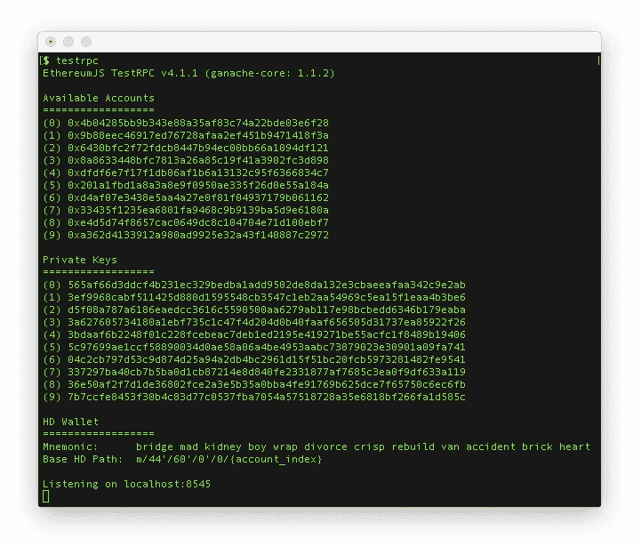

# 用以太坊仲裁合同决定晚餐

> 原文：<https://medium.com/hackernoon/decide-on-dinner-with-an-ethereum-arbitration-contract-c59c13a28d5>


杰克和吉尔决定不了晚餐，所以他们请了一位仲裁人来审理他们的争执。问题是他们不相信对方能独立选择仲裁人。

让我们写一份以太坊契约来处理他们的纠纷吧！

> 本文假设您对以太坊有基本的了解。如果你还不确定，就从 Preethi Kasireddy 的这篇[精彩文章](/@preethikasireddy/how-does-ethereum-work-anyway-22d1df506369)开始吧。

## 我们的合同将如何运作

**1。**第一个人创建一个新的仲裁实例，并对其进行描述。🌟

**2。**第一个人和第二个人提交了他们的不同意见。😠

**3。**人物一和人物二也选择一个仲裁者。直到双方同意相同的帐户地址，该过程才会继续。👍

**4。仲裁人审查两个观点并决定获胜者。🤔 ➡ 🏆**

# 设置

> F 如果你以前运行过松露项目，你可以随意移动到下一部分

我们将使用一个名为 [Truffle](http://truffleframework.com/) 的框架来开发我们的智能合约。这是一个处理编译、测试、部署、迁移等等的一站式商店。在这篇文章中，我们将只使用某些功能，但我鼓励你深入挖掘。

在我们开始之前，全局安装 truffle 和 testrpc。

```
npm install -g truffle ethereumjs-testrpc
```

然后，在新目录中运行:

```
truffle init
```

你应该看到 truffle 的文件夹结构随着一些简单的例子在`contracts/`文件夹中膨胀。

## 把你的脚弄湿

让我们感受一下工作流程。

**1。**用`testrpc`启动我们的测试客户端。您将看到一些用于模拟互动的账户:



**2。**中的*分开*标签中的*运行`truffle compile`。这将从契约中生成一个相应的 JSON 工件，并将它们放到一个构建文件夹中。*

**3。**现在运行`truffle migrate`来生成文件，以便将合同部署到区块链。*重要的是，当您迁移时，testrpc 必须正在运行，否则您的契约不会被部署到那个测试实例。*

**4。运行`truffle console`，它将连接到我们正在运行的以太坊客户端，并允许我们与合同进行交互。**

## 闲逛

我们将修改一个现有的契约(技术上来说是一个[库](http://solidity.readthedocs.io/en/develop/contracts.html#libraries) …尽管对我们的目的有用)`[ConvertLib.sol](https://github.com/ConsenSys/truffle-webpack-demo/blob/master/contracts/ConvertLib.sol)`。它提供了一种将两个数相乘的方法。

> 改变链上状态的方法是一个**事务**(消耗 gas)，而任何只返回数据的方法是一个**调用**(免费)。

松露的控制台已经 [web3](https://github.com/ethereum/wiki/wiki/JavaScript-API) 和我们的合同准备就绪，放手一搏:

```
*// get the deployed contract by its class name, returns a promise* **> const contract = ConvertLib.deployed()***// invoke the 'convert' method with 'call', also returns a promise***> const response = contract.then(c => c.convert.call(5, 20))***// print out our result!!* **> response.then(res => res.toNumber())***100*
```

太好了，我们已经与一个*部署合同*互动，让两个数字相乘！

# 让我们写一些可靠性

以太坊合同是用一种叫做[可靠性](https://solidity.readthedocs.io/en/develop/)的高级语言编写的。如果你熟悉 Javascript 或面向对象编程，你会发现很多相似之处。

使用 Solidity，我们将定义状态变量并建立我们的仲裁规则。之后，我们将使用 Truffle 来编译合同，并将其部署到我们的测试环境中。我们在合同中定义的状态和代码将存在于以太坊区块链的一个特定地址。

让我们从打扫房间开始。移除`contracts/ConvertLib.sol`和`contracts/MetaCoin.sol`，但**保留**和`contracts/Migrations.sol`，以便我们可以执行迁移。

然后，在`contracts/`文件夹中创建一个名为`Arbitration.sol`的文件。现在进入你的`migrations/`文件夹，修改`2_deploy_contracts.js`:

```
var Arbitration = artifacts.require('./Arbitration.sol');module.exports = function(deployer) {
  deployer.deploy(Arbitration);
};
```

打开`contracts/Arbitration.sol`，开始定义实体版本和合同名称。

您将添加公共变量`description`和`winningOpinion`以及事务方法`setDescription`来设置描述。

```
pragma solidity ^0.4.11;contract Arbitration {
  string public description;
  string public winningOpinion; function setDescription(string _description) {
    description = _description;
  }
}
```

接下来使用`[struct](http://solidity.readthedocs.io/en/develop/types.html#structs)`类型来定义我们的索赔人的数据应该是什么样子。然后，我们将使用我们创建的`Claimant`类型来声明一个名为`claimants`的数组。最后，创建一个添加新索赔者的方法。

```
contract Arbitration {
  string public description; **struct Claimant {
    string opinion;
    address addr;
    address arbiter;
  }** **Claimant[] public claimants;**  
  function setDescription(string _description) {
    description = _description;
  } **function addClaimant(string opinion, address arbiter) {
    if (claimants.length < 2) {
      claimants.push(Claimant(opinion, msg.sender, arbiter));  
    }**
 **}**
}
```

需要注意的一点是，`msg.sender`会给我们发送`addClaimant`交易的账户地址。`msg`也有其他[有价值的信息](http://solidity.readthedocs.io/en/develop/units-and-global-variables.html#block-and-transaction-properties)传递。

在申请人添加了他们的提议之后，仲裁人将能够通过调用`getProposals`来审查异议。

```
contract Arbitration { ... **function getProposals()
    returns (
      string _description,
      string _proposalOne,
      string _proposalTwo
    )
  {
    require(claimants.length == 2);
    return (
      description,
      claimants[0].opinion,
      claimants[1].opinion
    );
  }**}
```

在函数声明中，你会看到我们定义了用`returns`关键字返回的内容。我们使用`require`来允许代码仅在两个索赔者提交时继续。

接下来，我们将创建一个方法，只允许*这个仲裁者*选择获胜者。首先我们将创建一个`selectWinner`将使用的助手方法`verifyArbiter`。`verifyArbiter`循环遍历索赔人，确保发件人地址与每个索赔人选择的地址相匹配。如果 require 没有抛出错误，那么它将设置契约的状态变量`winningOpinion`。

```
contract Arbitration { ... **function verifyArbiter() returns (bool isArbiter) {
    for (uint i = 0; i < claimants.length; i++) {
      if (msg.sender != claimants[i].arbiter) {
        return false;
      }
    }** **return true;
  }** **function selectWinner(uint proposalNumber) {
    require(verifyArbiter());** **winningOpinion = claimants[proposalNumber].opinion;
  }**}
```

# 与合同互动

打开终端并运行`testrpc`。然后，在新的选项卡中运行`truffle compile`、`truffle migrate`和`truffle console`，就像我们在上一节中所做的那样。让我们首先获取对我们的合同的引用，并为其添加描述:

```
> **const contract = Arbitration.deployed()**> **contract.then(c => c.description())**
*''* > **contract.then(c => c.setDescription('What to eat for dinner'))**> **contract.then(c => c.description())** *'What to eat for dinner'*
```

可以看到，我们可以像调用函数一样调用变量名来访问状态:`description()`。

现在，回到 testrpc 输出，查看它给出的十个地址。将`*ARBITER_ADDRESS*`设置为列表中除第一个以外的任何地址，因为 truffle 默认使用第一个帐户作为发送者。

```
> **contract.then(c => c.addClaimant('burgers', '*ARBITER_ADDRESS*'))**> **contract.then(c => c.claimants(0))** *[ 'burgers',
'FIRST_ADDRESS_LISTED',
'ARBITER_ADDRESS' ]*
```

为了添加第二个索赔者，我们将修改调用 addClaimant 方法的方式。最后一个参数将从 testrpc 帐户列表中获取另一个地址，并从那里模拟发送一个调用。

```
> **contract.then(c => c.addClaimant('pizza', '*ARBITER_ADDRESS*', {from: '*SECOND_CLAIMANT_ADDRESS*'}))**> **contract.then(c => c.claimants(1))** *[ 'pizza',
'SECOND_CLAIMANT_ADDRESS',
'ARBITER_ADDRESS' ]*
```

现在假设仲裁人希望看到提案的当前状态。假设两个声明者都投票了(否则会抛出一个错误),他们将得到如下响应:

```
> **contract.then(c => c.getProposals.call())** *[ 'What to eat for dinner', 'burgers', 'pizza' ]*
```

使用仲裁人的地址，让我们选择一个赢家，用 0 代表汉堡，用 1 代表披萨。

```
> **contract.then(c => c.selectWinner(1, {from: '*ARBITER_ADDRESS*'}))**
```

仲裁人选出获胜者后，任何人都可以查阅获胜者的合同。

```
> **contract.then(c => c.winningOpinion())** *'pizza'*
```

我们知道披萨会赢，但写这份合同仍然是理解以太坊的一次富有成效的练习。点击查看代码[！](https://github.com/captDaylight/arbitration-tutorial)