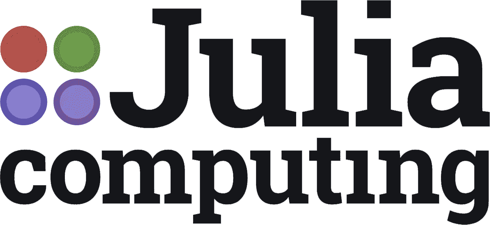
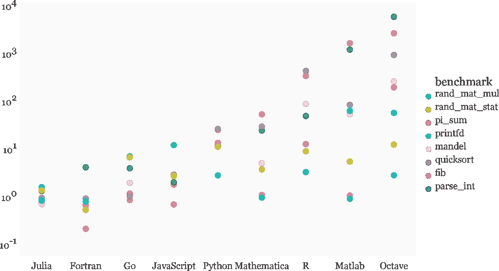
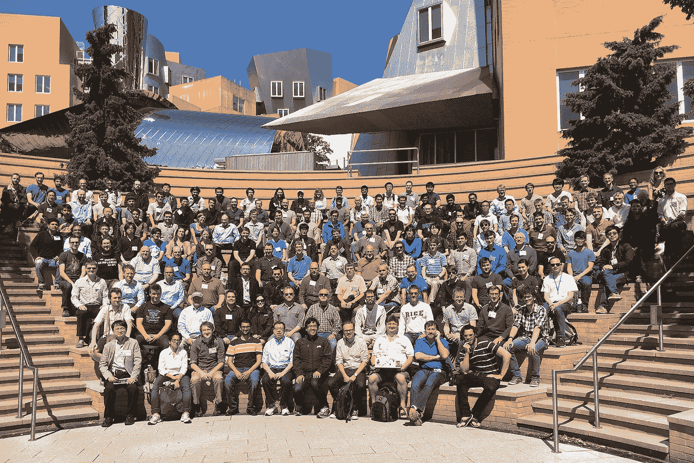
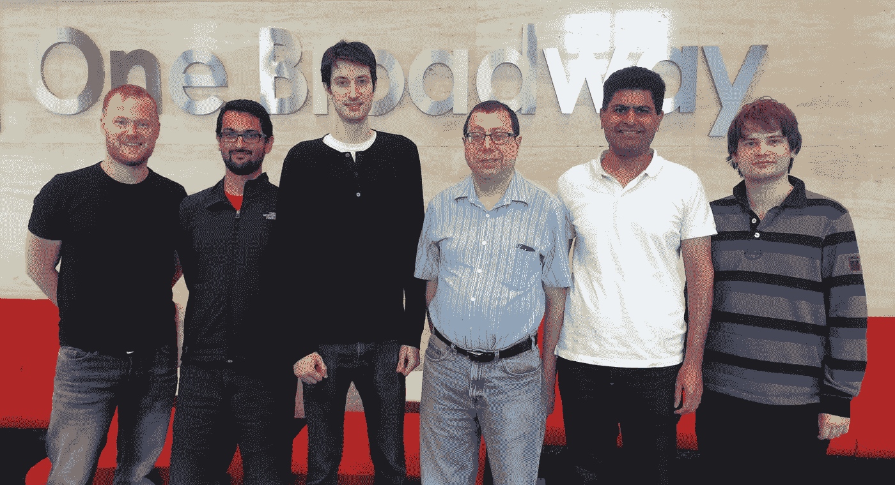

# 解构“近乎”完美的交易——我们对 Julia Computing 的投资

> 原文：<https://medium.com/hackernoon/deconstructing-the-near-perfect-deal-our-investment-in-julia-computing-dca81bb1d779>

Examples of visualizations that can be produced, rapidly, using the Julia programming language.

*由***，搭档**

*这些年来，我很幸运地接触了一些了不起的企业家和初创公司，但当我投资时，这些交易都有一些缺陷。这些显然不是取消资格；事实上，高风险的种子期风险投资是基于……风险之上的。这就是为什么我既兴奋又有点担心，我最近有机会投资一笔交易，这是我可能看到的最接近柏拉图式理想的交易。*

**

*朱莉娅计算有机会重新定义数学和科学的实践方式。你可以在他们的[公告](https://juliacomputing.com/press/2017/06/19/funding.html)中读到更多关于朱莉娅的无数应用，从金融工程到探索太阳系，再到发现癌症的治疗方法。简而言之，Red Hat 让 Linux 对企业来说变得平易近人，Julia Computing 为 Julia 编程语言做了同样的事情。*

*这笔交易也恰好勾选了我作为投资者可以合理预期的几乎所有选项:*

# ***它解决了一个真正的技术难题……***

*保罗·格拉厄姆说，他很少看到一种工具能让员工的工作效率提高 10 倍，却没有被迅速采用。如果你给高薪专业人士超能力，你通常不会为创业而挣扎。*

**

*Comparing Julia and other quant focused programming tools. Julia wins. [*Source*](http://istc-bigdata.org/index.php/open-big-data-computing-with-julia/)*

*开源的 Julia 编程语言为 quants 做了这些。对冲基金的数据科学家或分析师的现有工作流程通常包括在用 c 编写生产代码之前，先在 Matlab 等工具中构建一个想法的原型。Julia 的设计允许在一次无缝体验中构建原型和编写生产代码。这是真正的 10 倍优势。*

*该产品在极客中广受欢迎，Github 上有 33K+的提交量，500+的贡献者和 40+的发布量。这些数字中有许多比得上广泛使用的工具，如 [Node.js](https://github.com/nodejs/node) ，但是考虑到 Julia 的技术密集程度，这些数字更加令人印象深刻。*

# ***对于愿意付费的观众……***

*朱莉娅是多才多艺的，强大到足以应用于许多市场。从表面上看，这似乎是一种优势，但是能够做任何事情的产品经常因为没有把任何一件事情做得非常好而失败。专注是你打入市场的必要条件。*

*战略通常被认为是对你能做的所有事情的考虑，但它实际上是关于你选择忽略的有利可图的选项。Julia Computing 开始时，laser 并不专注于某个特定的市场，而是非常专注于某个特定市场中利润丰厚的专业领域的用例，在这个市场中，客户获得了丰厚的报酬，并迫切地寻求解决方案。*

*创始团队的关注点不仅仅是选择垂直市场。Viral Shah 和 Alan Edelman 在分享他们的“会议室和教室”营销策略时说服了我他们避免炫耀的贸易展览和昂贵的销售代表，而喜欢向潜在用户宣传产品的机会。*

# *由一个已经把“免费”放在“免费增值”中的团队领导*

*投资者通常会让免费增值产品中“免费”部分的开发浮出水面，但 Julia Computing 的情况并非如此。*

*该团队基于近十年的研究和开发，于四年前推出了 Julia，并在此后的受欢迎程度方面取得了出色的增长。一年一度的[茱莉亚大会](http://juliacon.org/)、[成千上万关于 Stack Exchange 上的语言的问题](http://stackoverflow.com/tags/julia-lang/info)，以及许多其他标志表明茱莉亚已经找到了产品市场契合点。*

**

*Julia is advanced, but will never forget ASCII. [Photo.](http://www.oceanographerschoice.com/2016/03/the-julia-language-is-the-way-of-the-future/)*

*Julia 符合我们在这种模式下看到的许多最佳公司的模式——Github、Unity 等。-这推动了早期产品开发，只有在需要提供优质产品时才会求助于投资者。Julia 团队确定了“免费”，我们很高兴尝试帮助他们营销“增值”*

*除了“免费”的财务方面，该团队还展示了对最好的创业公司所采用的开源的“像演讲一样免费”方面的非凡贡献。朱莉娅商标将由一个独立的信托机构持有，以确保该语言不会被垄断。他们专注于这种语言的单一特定应用，为其他企业家建立自己的企业留下了空间。如果有什么不同的话，风险资本对*公司*的增加可能只会通过提高提交的频率和质量而使*语言*受益！*

# ***这笔交易得到了一位明星的支持……***

*Donald Fischer 帮助推出了 Red Hat 的企业业务，并担任副总裁，同时该公司建立了一个[130 亿美元的专营权](https://www.google.com/finance?cid=663462)生产 Linux 的部分。唐纳德目前是 General Catalyst 的投资者，他专注于为“开发者群体”建造东西的初创公司。*

*唐纳德对一个想法有着坚如磐石的信念，并凭借这种洞察力建立了令人印象深刻的投资组合。他把我介绍给了创始团队，我非常感谢有机会再次和他一起工作。*

***它与有准备的头脑产生共鸣……***

*我在工程学位期间的第一份工作是帮助设计一个国家海军 GPS 应用程序。MATLAB 中的初始模拟工作帮助了我。当我的大学不再免费提供 MATLAB 时，我更加敏锐地意识到它的高昂成本。所以我知道它是一个多么强大的工具，对几乎所有其他人来说它是多么遥不可及。同样清楚的是，开源工具开始比许多传统工具表现更好，创新更快。这些年来，许多工具都试图取代 MATLAB，但没有一个能与它的能力水平相匹敌——Julia 就是这样做的。*

*风险投资有点像在树下做一头精力有限的狮子。你需要做好准备，但要有耐心，这样才能达成你最适合的交易。*

# ***利用不公平的优势……***

*波士顿有三个 M，这给了朱莉娅不公平的优势。Mathematica，Mathworks 和麻省理工学院。这并不是说在特拉维夫和帕洛阿尔托没有杰出的数学家在这个行业工作，而是马萨诸塞州有最好的应用数学头脑，关于定量分析师和特别相关的商业开发人才，你可以在任何地方找到他们。*

**

*A small group of engineers at a recent JuliaCon event at MIT. [Photo: MIT](http://news.mit.edu/sites/mit.edu.newsoffice/files/images/2016/juliacon-mit-csail_0.jpeg)*

*杰出的数学家和程序员无处不在。Julia 创始团队从第一天起就分布在波士顿、纽约和班加罗尔，这是一次真正的全球合作。[吉多·范·罗苏姆从荷兰推出了 Python](https://en.wikipedia.org/wiki/Python_(programming_language)) ，R 从新西兰脱颖而出，但说到商业化，可能没有比波士顿红线更大的量化人才库了。*

# ***他们不需要钱……***

*如果你想从风投那里融资，最好的办法就是不需要。当我被介绍到这个团队时，他们已经拥有了他们所需要的所有资本。他们已经和唐纳德谈了好几年，他们觉得从方正集体拿走资金就像“速配”。*

*这个筹款策略不是一个姿势。朱莉娅计算机公司的创始人并没有欲擒故纵。他们不了解我，也不想冒险在他们的资本表中增加一个未知量。创始人非常关心他们的公司，但更重要的是，他们对语言和开发语言的社区有着深深的忠诚。这位创始人的融资方式发出了很多信号；他们不是盲目追逐资本，而是谨慎的决策者；他们对自己的精益运营能力充满信心。*

*我必须在我们的投资组合中招募一些最好的首席执行官；SeatGeek 的杰克·格罗青格(Jack Groetzinger)、PillPack 的 TJ·帕克(TJ Parker)、Olo 的诺亚·格拉斯(Noah Glass)和 Kuvee 的维杰·曼瓦尼(Vijay Manwani)帮助我为 Founder Collective 辩护。*

# *我撒谎了，没有完美的交易*

*既然我对这家公司大唱赞歌，彻底扫了它的兴，我还必须指出，那些看似十拿九稳的交易已经告吹，而对一些古怪公司的小额投资却能让资金翻好几倍。*

**

*The Julia Computing Founding Team.*

*根本不可能知道一家公司一开始会做得怎么样。*

*衡量成功的真正标准只有多年后才能知晓，但能与 Viral、Alan、Deepak、Keno、Jeff、Stefan、Donald 以及 Julia 计算团队的其他成员一起工作，我再兴奋不过了。*

******

> *[黑客中午](http://bit.ly/Hackernoon)是黑客如何开始他们的下午。我们是 [@AMI](http://bit.ly/atAMIatAMI) 家庭的一员。我们现在[接受投稿](http://bit.ly/hackernoonsubmission)，并乐意[讨论广告&赞助](mailto:partners@amipublications.com)机会。*
> 
> *如果你喜欢这个故事，我们推荐你阅读我们的[最新科技故事](http://bit.ly/hackernoonlatestt)和[趋势科技故事](https://hackernoon.com/trending)。直到下一次，不要把世界的现实想当然！*

**