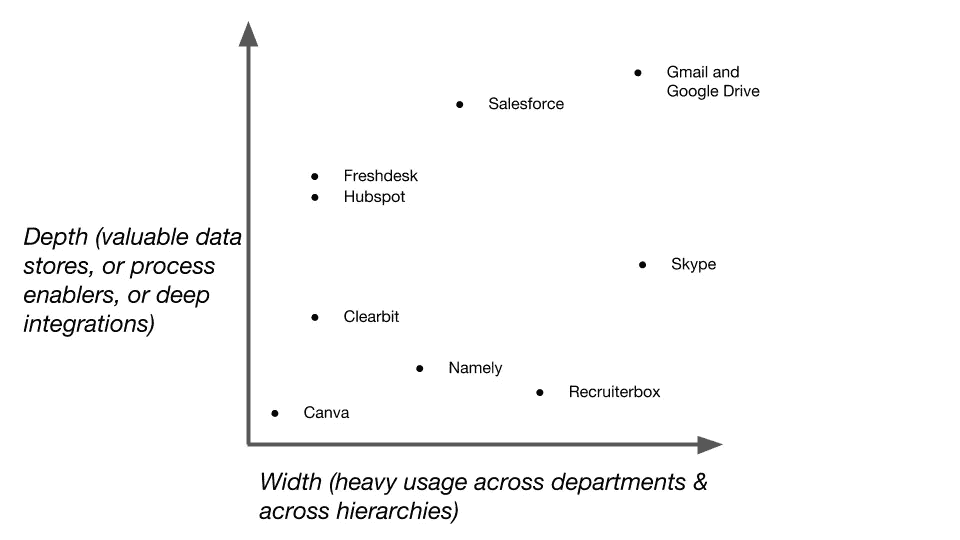

# 深度和广泛的产品采用是减少 SaaS 流失的关键

> 原文：<https://medium.com/hackernoon/deep-and-wide-product-adoption-are-key-to-reducing-saas-churn-aa607e7fbfa7>

我在为谁写作？ SaaS 产品经理和创始人。

我们最近从 [Wingify](https://wingify.com/) (拥有 [VWO](https://vwo.com/) 和[push screw](https://pushcrew.com/)的公司)换了个人。他们走后，管理员正在审查我们的软件费用，发现[爆米花指标](https://www.popcornmetrics.com/)的一个行项目没有明确的所有者。离开的那个人是唯一使用它的人，没有人知道为什么，也没有人知道它是用来做什么的。

删除爆米花就像删除代码片段一样简单，所以我联系他们要求取消。

这就是你的产品没有被广泛采用的问题。你可能在顾客付钱的情况下卖出了产品，但是在他们广泛使用之前，你并没有真正卖出产品。

# 宽度

就宽度而言，我的意思是一个公司中跨部门的多个层次都在使用该产品。最好的例子是:

*   沟通平台(Skype、Gmail)
*   人力资源和绩效管理软件
*   文档编辑和管理(谷歌文档，Office 365)

如果一个产品解决了任何劳动力的基本需求，它就有可能被广泛采用。一个产品被使用的越广泛，它提供的价值就越多，因此很难被移除。

# 深度

所谓深度，我指的是对一个产品的依赖程度。对我来说，深度采用的定义特征是:

*   该产品支持关键流程，例如，公司的销售流程在 CRM 上运行，绩效和工资管理在人力资源软件上完成，或者通过支持软件提供技术支持
*   该产品拥有公司不想丢失的重要数据
*   该产品支持或连接多个其他数据孤岛，以形成 1 + 1 = 3
*   产品是可塑的，以支持公司的工作流程

将我们在 [VWO](https://vwo.com/) 使用的产品放在深度/宽度图上，这是我得出的结论:

解释上图:

*   Recruiterbox 居中，因为它主要由招聘经理和 HR 使用。它在所有部门使用，但在足够多的层级中使用。而且它包含的数据也没有那么有价值…大部分是不合适的候选人的简历/简介。
*   Canva 是为非设计师设计的简单图形设计软件，我用它来展示一个最小宽度或深度的产品。它通常出现在设计师不在的时候。根据 Canva 的最初定位，如果他们能够利用社交媒体营销团队，他们可能会得到稍微更深入的采用。
*   [Clearbit](https://clearbit.com/) ，连接到 Salesforce，用于铅富集。我们几乎从来没有登录过这个产品，但是我怀疑我们会一直使用它，直到合同更新日期过去，他们提高价格。那时我们可能会考虑建造类似的东西。我已经包含了 Clearbit 来展示一个产品，它负责业务流程中一个很小但很重要的部分，只要它完成了它的工作并且业务流程保持不变，它就会一直被使用。
*   我将[即](https://namely.com/)放在中间，因为尽管它是人力资源和绩效管理软件，但在 Wingify 我们还没有完全采用它。我注意到每个人都在使用它，但是每个季度只有几天是在评估期间。如果我们有类似大公司的人力资源流程，它可能会被更深入地采用，但既然我们没有，也许它适合有更复杂的人力资源政策和管理的大公司？
*   Salesforce 可能是产品完全拥有流程、拥有数据、深度集成并被高管广泛使用的最好例子。我为此钦佩他们，尽管我不会向任何人推荐他们，因为这是与公司和产品打交道的痛苦经历。

# 更多想法

不是所有的产品都能被广泛深入的采用，但这并不意味着所有的希望都破灭了。如果一个产品能够捕捉到团队的一个重要过程，流失的可能性就会大大降低。例如，如果 Canva 的目标团队需要快速、好看的图像，而不依赖于图形设计师，它就可以做到这一点。我首先想到的是 B2C 企业中一直在开展活动的社交媒体团队。或者以上面的 Recruiterbox 为例，它在组织中没有被广泛或深入地采用，但在简化招聘流程方面做得非常好。

如果产品具有以下一些特性，它们的寿命往往会更长:

*   是组织中重要流程/数据的“真实来源”
*   在财务、人力资源、销售、制造/生产/产品和 R&D 等核心部门
*   被从业者和管理者用于不同的目的
*   团队 KPI 的部分或全部由产品报告
*   被高级管理层大量使用
*   它们接近于公司提供和实现的价值，如产品、R&D 或收入/利润

销售人员接受培训，通过尽快接触最高决策者来破解销售流程。毫无疑问，这仍然有效，但是在一个等级扁平化的世界里，实际使用产品的从业者正在成为购买过程中的重要因素。在没有客户成功经理充分跟进支持的情况下进行快速销售，会让你面临合同期满后被颠覆的风险。

如果客户明白他们在最初几个月的目标是增加产品采用的广度和深度，并且他们受到这些目标的激励，那么客户成功功能可以对增加终身价值产生巨大影响。

基于我的 Canva 观点，我意识到当你在创造一个产品时，重要的是考虑你将拥有的过程和数据，以及你将拥有的团队和层次结构。而这需要产品+人的努力。

我很惊讶为什么产品没有和邮件更深入的融合。现在(2017 年初)有关于人工智能和聊天机器人的整个喧嚣。相反，我会把精力放在与 Gmail 和 Outlook 更深层次的同步上。毕竟，这是大多数决策者花费时间的地方。

*本帖原载于*[*http://deswal . org/SaaS/to-reduce-churn-your-SaaS-needs-to-order-to-order-during-to-be-adopted-wide-and-deep/*/](http://deswal.org/saas/to-reduce-churn-your-saas-needs-to-be-adopted-widely-and-deeply/)

> [黑客中午](http://bit.ly/Hackernoon)是黑客如何开始他们的下午。我们是 [@AMI](http://bit.ly/atAMIatAMI) 家庭的一员。我们现在[接受投稿](http://bit.ly/hackernoonsubmission)并乐意[讨论广告&赞助](mailto:partners@amipublications.com)机会。
> 
> 如果你喜欢这个故事，我们推荐你阅读我们的[最新科技故事](http://bit.ly/hackernoonlatestt)和[趋势科技故事](https://hackernoon.com/trending)。直到下一次，不要把世界的现实想当然！

