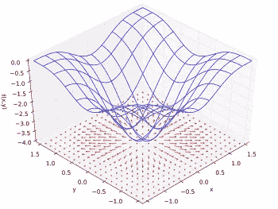
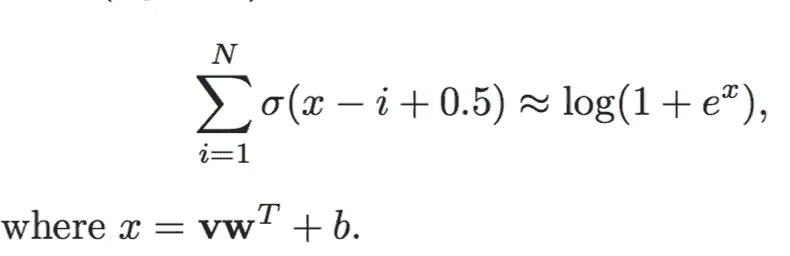
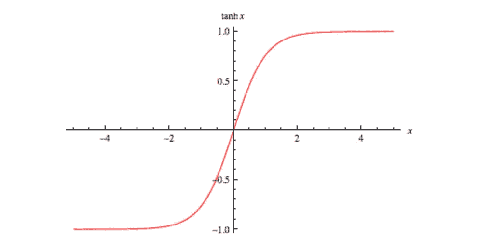
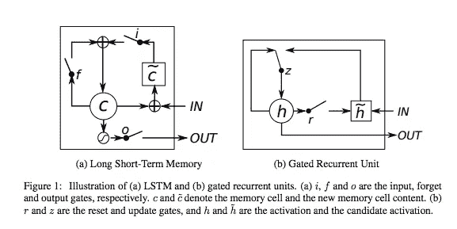
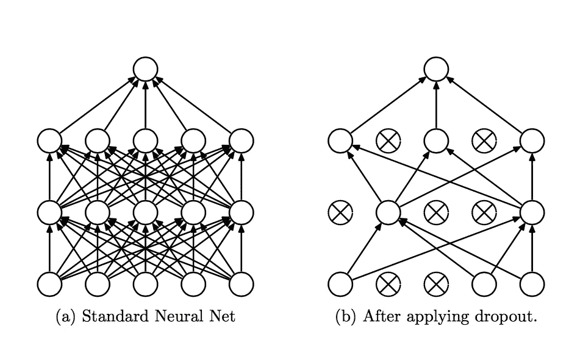
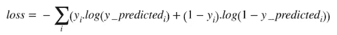

# 深度学习备忘单

> 原文：<https://medium.com/hackernoon/deep-learning-cheat-sheet-25421411e460>


对一门新学科来说，深入的学习会让人不知所措。这里有一些帮助你度过难关的秘籍和技巧。

## 那些是什么？！？！

在本文中，我们将回顾在深度学习中发现的常见概念，以帮助开始这个令人惊叹的主题。



Visualization of gradient. The red arrows are the gradient of the blue plotted function.

## 梯度∇

梯度是接受多个向量并输出单个值的函数的偏导数(即我们在神经网络中的成本函数)。梯度告诉我们，如果我们增加我们的可变输入，在图上哪个方向会增加我们的输出。我们使用梯度，并在相反的方向，因为我们想减少我们的损失。

## 反向传播

也称为反向传播(back prop ),这是通过网络前向传播输入后，通过[网络](https://hackernoon.com/tagged/network)的权重反向跟踪误差的过程。这是通过应用微积分中的链式法则来使用的。

## s 形σ

用于在[0，1]的区间内激活我们的网络中的权重的函数。这个函数看起来像一个 S，这就是这个函数的名字，S 在希腊语中是 sigma。也称为逻辑功能



Formula for ReLU from Geoffrey Hinton

## 校正线性单位或 ReLU

sigmoid 函数的区间为[0，1]，而 ReLU 的范围为[0，无穷大]。这意味着 sigmoid 更适合逻辑回归，而 ReLU 更适合表示正数。ReLU 没有消失梯度问题。



Tanh function

## 双曲正切

Tanh 是一个函数，用于初始化[-1，1]网络的权重。假设你的数据是标准化的，我们将有更强的梯度:因为数据以 0 为中心，导数更高。要看到这一点，计算双曲正切函数的导数，注意输入值在范围[0，1]内。双曲正切函数的范围是[-1，1]，sigmoid 函数的范围是[0，1]。这也避免了梯度中的偏差。



## LSTM/GRU

通常在递归神经网络中发现，但正在扩展到在其他网络中使用。这些是小的“记忆单元”,用于保持训练输入之间的状态，并帮助解决消失梯度问题，其中在大约 7 个时间步长之后，RNN 失去了先前输入的上下文。

## Softmax

Softmax 是通常用在神经网络末端用于分类的函数。此函数进行多项式逻辑回归，通常用于多类分类。通常与交叉熵配对作为损失函数。

## L1 和 L2 正规化

这些正则化方法通过对系数施加惩罚来防止过拟合。L1 能产生稀疏模型，而 L2 不能。正则化用于指定模型复杂性。这一点很重要，因为它允许您的模型更好地概括，而不会过度适应训练数据。



## 退出

[1]“它防止了过度拟合，并提供了一种有效地近似指数组合许多不同神经网络架构的方法”(Hinton)。这种方法随机选择可见和隐藏的单位从网络中删除。这通常是通过选择一个层百分比下降来确定的。

## 批量标准化

[1]当网络有许多深层时，就出现了内部协变量转移的问题。这种转变是“由于训练期间网络参数的变化而导致的网络激活分布的变化。”(赛格迪)。如果我们能减少内部协变量的变化，我们就能训练得更快更好。批次归一化通过均值和方差将每个批次归一化到网络中来解决这个问题。

## 目标函数

又称**损失函数、成本函数**或**优化得分函数**。网络的目标是最小化损耗以最大化网络的准确性。

一个更技术性的解释[3]:

损失/成本/优化/目标函数是根据网络预测计算的函数。您的网络将输出一个预测值 y_hat，我们将把它与 y 的期望输出值进行比较。然后，在反向传播中使用该函数，为我们提供梯度，从而优化我们的网络。这些函数的例子有 f1/f 得分、分类交叉熵、均方误差、平均绝对误差、铰链损耗等。

## F1/F 分数

通过使用精确度和召回率来衡量模型的精确程度，公式如下:

```
F1 = 2 * (Precision * Recall) / (Precision + Recall)
```

精确的:在每一个预测中，哪些预测实际上是积极的？

```
Precision = True Positives / (True Positives + False Positives)
```

回忆:在所有实际上有正面预测的人中，有多少是正面的？

```
Recall = True Positives / (True Positives + False Negatives)
```

## 交叉熵

用来计算你的标签预测有多远。有时用 CE 表示。



交叉熵是一个损失函数，是与熵有关的热力学熵概念。这用于多类分类中，以发现预测中的错误。

**学习速度【2】**

学习率是反向传播后优化过程中调整网络权重的幅度。学习率是一个超参数，对于各种问题都是不同的。这应该在上进行交叉验证。

```
# ---- Vanilla Gradient Descent ----
# W is your matrix of weights
# dW is the gradient of W# Adjust the weights of our layer by multiplying our gradient times our learning_rate (Which is a scalar value)W -= learning_rate * dW
```

> 这是一个活的文档，如果你认为有什么需要补充的，请告诉我，我会补充并感谢你。

[1] *建议者:[tensor flow—第三部分:所有模型](https://medium.com/u/7cca9fed98b6#.ad4t6k2l9)。

一如既往地检查我的其他文章在 [camron.xyz](http://camron.xyz)

[](http://bit.ly/HackernoonFB)[](https://goo.gl/k7XYbx)[](https://goo.gl/4ofytp)

> [黑客中午](http://bit.ly/Hackernoon)是黑客如何开始他们的下午。我们是 [@AMI](http://bit.ly/atAMIatAMI) 家庭的一员。我们现在[接受投稿](http://bit.ly/hackernoonsubmission)并乐意[讨论广告&赞助](mailto:partners@amipublications.com)机会。
> 
> 如果你喜欢这个故事，我们推荐你阅读我们的[最新科技故事](http://bit.ly/hackernoonlatestt)和[趋势科技故事](https://hackernoon.com/trending)。直到下一次，不要把世界的现实想当然！

