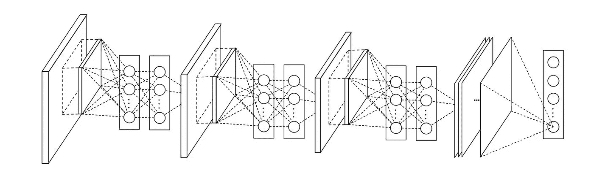
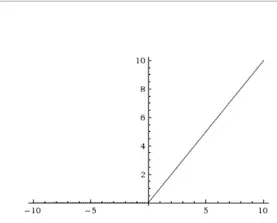
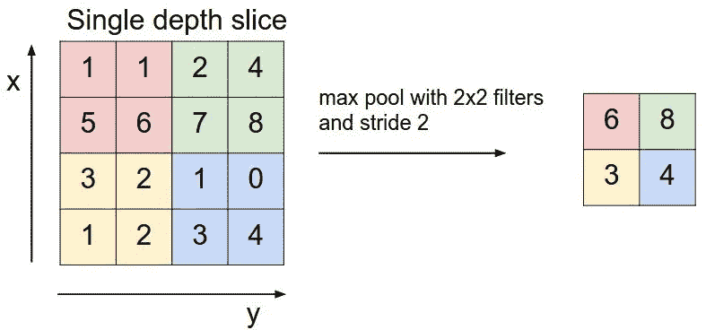
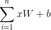
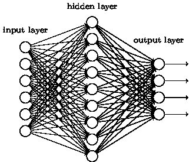
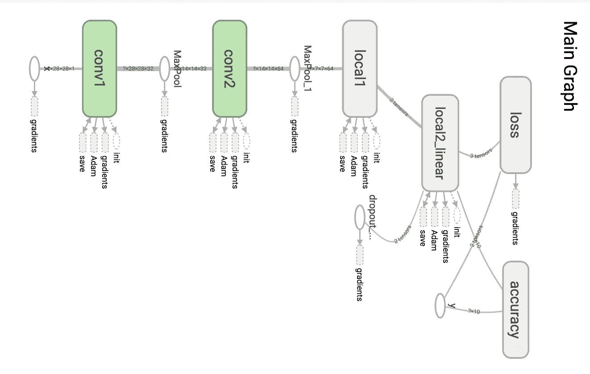
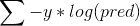
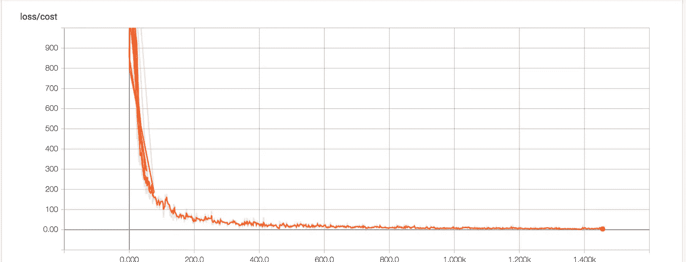
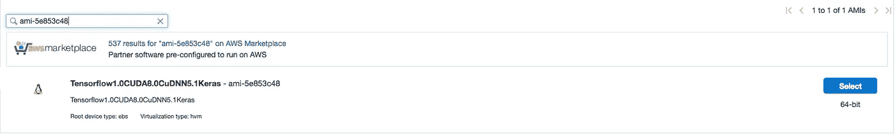
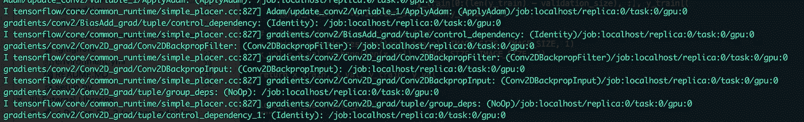

# 深度学习 CNN 的 Tensorflow 与 GPU

> 原文：<https://medium.com/hackernoon/deep-learning-cnns-in-tensorflow-with-gpus-cba6efe0acc2>



在我的上一篇教程中，你从一个预先训练的 inception v3 模型中创建了一个复杂的卷积神经[网络](https://hackernoon.com/tagged/network)。

在本教程中，您将学习卷积神经网络(CNN)的架构，如何在 Tensorflow 中创建 CNN，并在图像标签上提供预测。最后，您将学习如何在 GPU 上运行模型，以便您可以花时间创建更好的模型，而不是等待它们收敛。


# **概述**

*   CNN 简介
*   创建您的第一个 CNN 和 CPU 培训
*   在 GPU 上训练

# 先决条件

*   基本的机器学习理解
*   基本张量流理解
*   AWS 帐户(用于 gpu)

# 卷积神经网络

卷积神经网络是当前用于图像分类的最新架构。今天，它们在实践中被用于面部识别、自动驾驶汽车和检测一个物体是否是热狗。

## 基础建筑

CNN 架构的基础包括 3 个部分。卷积、汇集和完全连接层。这些组件协同工作来学习输入的密集特征表示。

**卷积**


Image from [https://github.com/vdumoulin/conv_arithmetic](https://github.com/vdumoulin/conv_arithmetic)

卷积由一个**内核** *(上面的绿色方块)*组成，也称为滤波器，它以滑动窗口的方式从输入中提取特征。每次操作后，该滤波器在输入端移动一个称为**步长的量。**在每个操作中，计算输入的内核和当前区域的矩阵乘法。可以堆叠过滤器来创建输入的高维表示。

> 如果过滤器没有均匀地映射到输入的大小，会发生什么？

有两种方式处理不同的过滤器尺寸和输入尺寸，称为**相同的**填充和**有效的**填充**。**相同的填充会用零填充输入边界(如上所示),以确保输入宽度和高度被保留。有效填充不填充。

通常，您会希望使用相同的填充，或者您会迅速减少输入的维数。

最后，应用一个激活函数(通常是一个 [ReLU](https://en.wikipedia.org/wiki/Rectifier_(neural_networks)) )来给出卷积非线性。ReLU 与其他激活函数有点不同，如 sigmoid 或 tanh，因为 ReLU 是单侧的。这种单侧属性允许网络创建稀疏表示(隐藏单元的零值)，从而提高计算效率。



ReLU

**联营**

池化是一种降维操作。它应用了一个总结相邻信息的函数。两个常见的函数是最大池和平均池。通过计算输入区域的最大值，输出汇总了周围值的强度。

池层也有一个内核，填充，并在大步移动。要计算池化操作的输出大小，可以使用以下公式

```
 (Input Width - kernel width + 2 * padding) / strides + 1\. 
```



**全连接层**

你可能从神经网络中熟悉的完全连接的层。输入中的每个神经元都连接到输出中的每个神经元；完全连接。由于这种连接性，输出中的每个神经元将最多被使用一次。



Fully connected neural network

在 CNN 中，输入从汇集层馈入全连接层。根据任务，可以应用回归或分类算法来创建所需的输出。

**回顾**

您现在已经了解了卷积神经网络的构成。通过卷积传递输入，可以提取高维特征。汇集汇总了空间信息并降低了维度。最后，该特征表示通过完全连接的层传递到分类器或回归器。


Full CNN Architecture ([source](https://www.mathworks.com/content/mathworks/www/en/discovery/convolutional-neural-network/jcr:content/mainParsys/image_copy.adapt.full.high.jpg/1492406018870.jpg))

# 在 Tensorflow 中创建 CNN

现在您已经有了卷积神经网络背后的想法，您将在 Tensorflow 中编写一个。

你将创建一个 CNN 来训练 [MNIST(手写数字的图像)数据集](https://pjreddie.com/projects/mnist-in-csv/)。训练后，你将在 10k 次迭代中达到大约 98.0%的准确率。

**设置环境**

首先您需要设置您的环境。此外，您将创建一个 setup.py 文件。下面列出了 python3.5 和 python2.7 的 Anaconda 环境文件。

如果不使用 anaconda，可以通过 pip 安装 tensorflow:

```
$ pip install tensorflow
```

运行:

```
python3 setup.py develop
```

# 数据


Mnist Data

在这里，您将创建 3 个独立的输入；训练集、验证集和测试集。通过提供额外的数据来调整超参数，验证集允许您更好地训练模型。

**下载数据**

可以使用以下命令检索数据:

```
$ curl [https://pjreddie.com/media/files/mnist_train.csv](https://pjreddie.com/media/files/mnist_train.csv) -o data/mnist_train.csv # 104 MB$ curl [https://pjreddie.com/media/files/mnist_test.csv](https://pjreddie.com/media/files/mnist_test.csv) -o data/mnist_test.csv # 17.4 MB
```

mnist.py

## 体系结构

在这里，您将创建一些用于创建网络的辅助函数。这些函数用于创建前面讨论过的单个组件。

**辅助功能/模型定义:**

Helper Functions and Model Definition

**型号**



Tensorflow Graph of Model

下面是训练模型的代码。三个公共函数解释如下:

> 代码在这里:[https://github . com/cole Murray/tensor flow-CNN-tutorial/tree/add _ model _ functions](https://github.com/ColeMurray/tensorflow-cnn-tutorial/tree/add_model_functions)

**推论。** 这个函数负责创建一个它认为输入代表的预测。这里，它将为每个输入返回一个 1x10 张量。包含在该张量中的值将被传递给损失函数，以确定该预测与真实情况有多远。

如 batch_size 超级参数所示，您一次处理 128 个图像。这种技术被称为小批量。通过以较小的批次处理输入，而不是整个数据集，输入可以适合内存。此外，由于在每一批之后而不是在处理完所有的例子之后更新权重，该模型将更快地收敛。

***失落。*** 这里，您将使用 softmax 交叉熵函数来执行 N 路分类。softmax 函数用于对推理函数产生的输入进行归一化(将张量相加为一)。

利用这个归一化张量，针对一个热编码标签计算交叉熵。交叉熵给出了预测离真实情况有多远的度量。每次迭代，应用一个优化器来最小化这个交叉熵。



cross entropy



Loss after training

## 培训和评估

下面，您将为 10k 迭代训练模型。每 1000 次迭代，您将根据验证集测试模型，以了解准确性。最后，您将根据测试数据集评估训练好的模型，以获得样本外准确性的度量。在 10k 次迭代时，您应该看到大约 98.0%的准确性。

要执行此代码，请运行以下命令:

```
$ python3 mnist_conv2d_medium_tutorial/train.py*(Building the computational graph can take a few seconds depending on hardware)*
```

有了训练好的模型，您现在将在来自上一个检查点的测试集上对它进行评估。

```
$ python3 mnist_conv2d_medium_tutorial/evaluate.py
```

> 到目前为止的代码:[https://github . com/cole Murray/tensor flow-CNN-tutorial/tree/train _ and _ evaluate](https://github.com/ColeMurray/tensorflow-cnn-tutorial/tree/train_and_evaluate)

您可以通过运行以下命令来可视化您的结果:

```
$ tensorboard --logdir=graphs/ --port=6006navigate in browser: localhost:6006
```

# 在 GPU 上训练

正如你所注意到的，由于每次迭代所需的计算量，训练 CNN 可能非常慢。现在，您将使用 GPU 来加速计算。

默认情况下，如果 CPU 和 GPU 都可用于给定的操作，Tensorflow 在放置操作时会给予 GPU 更高的优先级。为了简化教程，您不会显式定义操作位置。你可以在这里阅读更多关于如何做这件事的[。](https://www.tensorflow.org/tutorials/using_gpu)

## 创建一个 GPU 盒子

对于本教程，您将使用一个社区 AMI。转到 AWS 控制台，启动一个新的 EC2 实例。在 AMI 屏幕上，选择 community 并输入 AMI id: **ami-5e853c48。**这款 AMI 自带 Tensorflow 和 Nvidia 驱动，预装 CUDA。



Ami id: **ami-5e853c48**

对于实例类型，选择 G2.2xlarge。选择实例类型后，请确保创建一个密钥对。这个密匙对将允许您 [ssh](https://en.wikipedia.org/wiki/Secure_Shell) 进入实例并复制/执行您的代码。


G2.2xlarge

**同步你的代码**

既然已经创建了实例，您需要将代码和数据集复制到其上。最简单的方法是使用 rsync。 [Rsync](https://linux.die.net/man/1/rsync) 是构建在 ssh 之上的 unix 命令，允许高效的文件传输。它非常灵活，提供了多种选项来直接改变行为。下面，该命令会将您的项目目录复制到您的 gpu 实例用户的主目录。

```
rsync -trucv mnist_conv2d_medium_tutorial **ip-address-of-your-gpu-box:/home/ubuntu/**
```

**运行代码**

下面，您将 ssh 到实例并安装软件包。安装后，运行 train 命令。运行 train 命令后，您将看到输出，指示操作的位置。如下所示，操作按预期被放置到 gpu 上。

```
$ ssh ubuntu@ip-address-of-your-gpu-box
$ cd mnist-conv2d-medium-tutorial
$ pip3 install .
$ python3 mnist_conv2d_medium_tutorial/train.py
```



Operations being placed on GPU

大约 20 分钟后，培训将完成，您可以运行 evaluate 命令根据测试集进行测试。

```
$ python3 mnist_conv2d_medium_tutorial/evaluate.py
```

**结论**

在本教程中，您学习了卷积神经网络背后的概念。此外，您还学习了基本 CNN 的 Tensorflow 实现，实现了大约 98.0%的准确率。最后，您学习了如何在 GPU 上运行代码以提高性能。

此处为完整代码:

[](https://github.com/ColeMurray/tensorflow-cnn-tutorial) [## cole Murray/tensor flow-CNN-教程

### 关于卷积神经网络的教程。

github.com](https://github.com/ColeMurray/tensorflow-cnn-tutorial) 

**下一步:**

*   使用超参数(批量大小、[学习](https://hackernoon.com/tagged/learning)速率、内核大小、迭代次数)来查看它如何影响模型性能
*   根据其他数据集训练和评估您的模型( [CIFAR-10](https://www.cs.toronto.edu/~kriz/cifar.html) )
*   深入一点

# **行动号召:**

> 如果你喜欢这个教程，请关注并推荐！
> 
> 有兴趣了解更多关于深度学习/机器学习的知识吗？查看我的其他教程:
> 
> [-在谷歌计算引擎上使用 Keras 进行深度学习](/google-cloud/keras-inception-v3-on-google-compute-engine-a54918b0058)
> 
> [-谷歌计算引擎上的 Apache Spark 推荐系统](/google-cloud/recommendation-systems-with-spark-on-google-dataproc-bbb276c0dafd)
> 
> 你可以在其他地方找到我:
> 
> ——推特:[https://twitter.com/_ColeMurray](https://twitter.com/_ColeMurray)

[](http://bit.ly/HackernoonFB)[](https://goo.gl/k7XYbx)[](https://goo.gl/4ofytp)

> [黑客中午](http://bit.ly/Hackernoon)是黑客如何开始他们的下午。我们是 [@AMI](http://bit.ly/atAMIatAMI) 家庭的一员。我们现在[接受投稿](http://bit.ly/hackernoonsubmission)，并乐意[讨论广告&赞助](mailto:partners@amipublications.com)机会。
> 
> 如果你喜欢这个故事，我们推荐你阅读我们的[最新科技故事](http://bit.ly/hackernoonlatestt)和[趋势科技故事](https://hackernoon.com/trending)。直到下一次，不要把世界的现实想当然！

