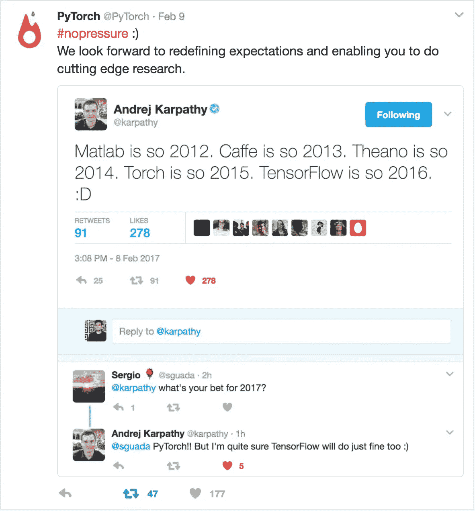

# 面向新手的深度学习[第二部分]

> 原文：<https://medium.com/hackernoon/deep-learning-for-noobs-part-2-43d5098e61f6>


如何建立自己的卷积神经网络？让我们在这篇文章中尝试解决这个问题。我们将研究一个图像分割问题，我在这个系列的第一部分中讨论过这个问题。

有很多库可用于创建卷积神经网络。我们将选择 [Keras](https://keras.io/) 和 [Tensorflow](https://www.tensorflow.org/) 。我想到的第一个问题是:

> 为什么是这两个？为什么不只是 Tensorflow？

在机器学习库领域，有很多库。Tensorflow、Theano、PyTorch、Caffe 和 Torch 是其中比较著名的几个。由 Soumith Chintala 和团队向 PyTorch 大声喊出来。你们创造了一个很棒的图书馆。希望你们能接管这个世界。



PyTorch planning to take over the world :P ssh ec2-user@ec2–52–24–183–62.us-west-2.compute.amazonaws.com -i ~/deepkey.pem**# The AMI might be a bit backdated, so it's always better to update**
sudo yum update**# Install pip to get Keras**
sudo yum install python-pip**# Upgrade the pip master that got installed** sudo /usr/local/bin/pip install — upgrade pip**# Install Keras**
sudo /usr/local/bin/pip install keras

默认情况下，Keras 安装时将 Theano 作为基本配置。我们将使用张量流。所以让我们改变这一点。打开 **~/。keras/keras.conf** 并更新如下图所示。该文件应该类似于下面的部分。

```
**{
“image_dim_ordering”: “tf”,
“epsilon”: 1e-07,
“floatx”: “float32”,
“backend”: “tensorflow”
}**
```

我希望你已经正确无误地完成了所有的步骤。让我们测试我们的安装。打开 python，然后导入 keras 进行测试。输出应该如下所示。


Test Keras installation

所以现在你已经安装了 Python，Tensorflow 和 Keras。AMI 还预装了 ano 和其他东西，但我们不会使用它们。不要费心卸载，因为他们不会干扰。安装够了，让我们深入研究代码。

> 不要浪费时间安装，花时间学习和实施。

我们将训练一个网络，用于对 Kaggle 的猫狗进行分类。在此之前，我们将开始编写一个简单的模型。这将有助于您了解 Keras 的工作原理。我从代码开始。如果你注意到，在代码的每一行之前都有注释。这些注释在某种程度上解释了那一行代码中发生了什么。要运行这段代码，您可以使用自己的一套猫和狗，也可以从 Kaggle 下载示例数据。您必须注册并加入 Kaggle 竞赛才能下载样本数据。这里是 [Kaggle 链接](https://www.kaggle.com/c/dogs-vs-cats/data)。

```
from keras.preprocessing.image import ImageDataGenerator
from keras.models import Sequential
from keras.layers import Convolution2D, MaxPooling2D
from keras.layers import Activation, Dropout, Flatten, Dense

# expected image size
img_width, img_height = 150, 150# folder containing the images on which
# the network will train. The train folder 
# has two sub folders, dogs and cats.
train_data_dir = 'data/train'# folder containing the validation samples
# folder structure is same as the training folder
validation_data_dir = 'data/validation'# how many images to be considered for training
train_samples = 2000# how many images to be used for validation
validation_samples = 800# how many runs will the network make
# over the training set before starting on
# validation
epoch = 50# ** Model Begins **
model = Sequential()
model.add(Convolution2D(32, 3, 3, input_shape=(3, img_width, img_height)))
model.add(Activation('relu'))
model.add(MaxPooling2D(pool_size=(2, 2)))

model.add(Convolution2D(32, 3, 3))
model.add(Activation('relu'))
model.add(MaxPooling2D(pool_size=(2, 2)))

model.add(Convolution2D(64, 3, 3))
model.add(Activation('relu'))
model.add(MaxPooling2D(pool_size=(2, 2)))

model.add(Flatten())
model.add(Dense(64))
model.add(Activation('relu'))
model.add(Dropout(0.5))
model.add(Dense(1))
model.add(Activation('sigmoid'))
# ** Model Ends **model.compile(loss='binary_crossentropy',
              optimizer='rmsprop',
              metrics=['accuracy'])

# this is the augmentation configuration we will use for training
# we are generating a lot of transformed images so that the model
# can handle variety in the real world scenario
train_datagen = ImageDataGenerator(
        rescale=1./255,
        shear_range=0.2,
        zoom_range=0.2,
        horizontal_flip=True)

# this is the augmentation configuration we will use for testing:
# only rescaling
test_datagen = ImageDataGenerator(rescale=1./255)# this section is actually taking images from the folder
# and passing on to the ImageGenerator which then
# creates a lot of transformed versions
train_generator = train_datagen.flow_from_directory(
        train_data_dir,
        target_size=(img_width, img_height),
        batch_size=32,
        class_mode='binary')

validation_generator = test_datagen.flow_from_directory(
        validation_data_dir,
        target_size=(img_width, img_height),
        batch_size=32,
        class_mode='binary')# this is where the actual processing happens
# it will take some time to run this step.
model.fit_generator(
        train_generator,
        samples_per_epoch=train_samples,
        nb_epoch=epoch,
        validation_data=validation_generator,
        nb_val_samples=validation_samples)

model.save_weights('trial.h5')
```

代码非常简单明了。替换“模型存在”和“模型结束”之间的部分，以使用其他模型。您将拥有自己的分类器代码。我会给你们讲解代码。首先，导入一些 Keras 依赖项。然后，您定义将传递到网络的图像尺寸。之后，您告诉代码图像集在哪里。训练数据集和验证数据集。然后，从模型开始的地方开始构建模型，直到模型结束。我不打算深入研究这个模型，因为这是一个标准的 VGGNet 实现。有关网络架构的详细信息可在以下 arXiv 文章中找到:

```
Very Deep Convolutional Networks for Large-Scale Image Recognition
K. Simonyan, A. Zisserman
arXiv:1409.1556
```

代码的下一步是生成一些数据转换。在这里，您可以剪切、拉伸、倾斜数据集，以便网络不会过度训练。您创建生成器，以便代码可以从指定的文件夹中读取图像。之后，处理开始。系统对提到的纪元次数进行训练和验证。最后，我们保存这些权重，以便我们可以在将来使用它们，而不必再次训练网络。如果你还有疑问，请突出显示并提问。我将尽力回答这些问题。

上面的模型是一个简单的模型，只是为了更简单的解释。根据我们现有的数据量，猫和狗的分类可能不会那么成功。所以我们不得不进行迁移学习。在迁移学习中，我们研究模型，我们训练这些模型来解决类似的陈述。我们采用经过训练的权重，并重新使用它们来解决完全不同的语句。我们训练模型，这些模型是我们在图像上预先训练的，用来对不同的事物进行分类。为什么会这样？这是因为我们将要使用的模型也是被训练来进行图像分类的。深入内部的层将总是能够进行一般分类。这些将在检测边缘和曲线的水平上工作。因此，术语迁移学习。你把从一个问题陈述中学到的知识转移到另一个问题陈述中。这对我们可能有好处。但是我们可以让它变得更好。接下来，我们训练顶层。这些层实际上担心实际的元素被分类。我们在我们的训练数据集上训练他们。我们可以称这个数据集为特定领域数据集。这给了网络一个理解，正是我们想要分类的。因此代码如下所示:

```
import os
import h5py
import numpy as np
from keras.preprocessing.image import ImageDataGenerator
from keras import optimizers
from keras.models import Sequential
from keras.layers import Convolution2D, MaxPooling2D, ZeroPadding2D
from keras.layers import Activation, Dropout, Flatten, Dense

# path to the model weights files.
weights_path = 'vgg16_weights.h5'
top_model_weights_path = 'fc_model.h5'
# dimensions of our images.
img_width, img_height = 150, 150

train_data_dir = 'data/train'
validation_data_dir = 'data/validation'
nb_train_samples = 2000
nb_validation_samples = 800
nb_epoch = 50

# build the VGG16 network
model = Sequential()
model.add(ZeroPadding2D((1, 1), input_shape=(3, img_width, img_height)))

model.add(Convolution2D(64, 3, 3, activation='relu', name='conv1_1'))
model.add(ZeroPadding2D((1, 1)))
model.add(Convolution2D(64, 3, 3, activation='relu', name='conv1_2'))
model.add(MaxPooling2D((2, 2), strides=(2, 2)))

model.add(ZeroPadding2D((1, 1)))
model.add(Convolution2D(128, 3, 3, activation='relu', name='conv2_1'))
model.add(ZeroPadding2D((1, 1)))
model.add(Convolution2D(128, 3, 3, activation='relu', name='conv2_2'))
model.add(MaxPooling2D((2, 2), strides=(2, 2)))

model.add(ZeroPadding2D((1, 1)))
model.add(Convolution2D(256, 3, 3, activation='relu', name='conv3_1'))
model.add(ZeroPadding2D((1, 1)))
model.add(Convolution2D(256, 3, 3, activation='relu', name='conv3_2'))
model.add(ZeroPadding2D((1, 1)))
model.add(Convolution2D(256, 3, 3, activation='relu', name='conv3_3'))
model.add(MaxPooling2D((2, 2), strides=(2, 2)))

model.add(ZeroPadding2D((1, 1)))
model.add(Convolution2D(512, 3, 3, activation='relu', name='conv4_1'))
model.add(ZeroPadding2D((1, 1)))
model.add(Convolution2D(512, 3, 3, activation='relu', name='conv4_2'))
model.add(ZeroPadding2D((1, 1)))
model.add(Convolution2D(512, 3, 3, activation='relu', name='conv4_3'))
model.add(MaxPooling2D((2, 2), strides=(2, 2)))

model.add(ZeroPadding2D((1, 1)))
model.add(Convolution2D(512, 3, 3, activation='relu', name='conv5_1'))
model.add(ZeroPadding2D((1, 1)))
model.add(Convolution2D(512, 3, 3, activation='relu', name='conv5_2'))
model.add(ZeroPadding2D((1, 1)))
model.add(Convolution2D(512, 3, 3, activation='relu', name='conv5_3'))
model.add(MaxPooling2D((2, 2), strides=(2, 2)))

# load the weights of the VGG16 networks
# (trained on ImageNet, won the ILSVRC competition in 2014)
# note: when there is a complete match between your model definition
# and your weight savefile, you can simply call model.load_weights(filename)
assert os.path.exists(weights_path), 'Model weights not found (see "weights_path" variable in script).'
f = h5py.File(weights_path)
for k in range(f.attrs['nb_layers']):
    if k >= len(model.layers):
        # we don't look at the last (fully-connected) layers in the savefile
        break
    g = f['layer_{}'.format(k)]
    weights = [g['param_{}'.format(p)] for p in range(g.attrs['nb_params'])]
    model.layers[k].set_weights(weights)
f.close()
print('Model loaded.')

# build a classifier model to put on top of the convolutional model
top_model = Sequential()
top_model.add(Flatten(input_shape=model.output_shape[1:]))
top_model.add(Dense(256, activation='relu'))
top_model.add(Dropout(0.5))
top_model.add(Dense(1, activation='sigmoid'))

# note that it is necessary to start with a fully-trained
# classifier, including the top classifier,
# in order to successfully do fine-tuning
top_model.load_weights(top_model_weights_path)

# add the model on top of the convolutional base
model.add(top_model)

# set the first 25 layers (up to the last conv block)
# to non-trainable (weights will not be updated)
for layer in model.layers[:25]:
    layer.trainable = False

# compile the model with a SGD/momentum optimizer
# and a very slow learning rate.
model.compile(loss='binary_crossentropy',
              optimizer=optimizers.SGD(lr=1e-4, momentum=0.9),
              metrics=['accuracy'])

# prepare data augmentation configuration
train_datagen = ImageDataGenerator(
        rescale=1./255,
        shear_range=0.2,
        zoom_range=0.2,
        horizontal_flip=True)

test_datagen = ImageDataGenerator(rescale=1./255)

train_generator = train_datagen.flow_from_directory(
        train_data_dir,
        target_size=(img_height, img_width),
        batch_size=32,
        class_mode='binary')

validation_generator = test_datagen.flow_from_directory(
        validation_data_dir,
        target_size=(img_height, img_width),
        batch_size=32,
        class_mode='binary')

# fine-tune the model
model.fit_generator(
        train_generator,
        samples_per_epoch=nb_train_samples,
        nb_epoch=nb_epoch,
        validation_data=validation_generator,
        nb_val_samples=nb_validation_samples)
```

VGG16 的权重可以从我的 [Github](https://gist.github.com/debarko/6b1983ec3dd0403321082d07ddfea17c#file-readme-md) gist 中获得。您还可以通过在数据集上运行这段[代码](https://gist.github.com/fchollet/f35fbc80e066a49d65f1688a7e99f069)来获得 fc_model 权重文件。您可以使用 VGG16 链接共享的同一组权重。你可以调整[纪元](http://stackoverflow.com/a/31157729)的数量来获得更好的学习，但不要走极端，因为这可能会导致[过拟合](http://machinelearningmastery.com/overfitting-and-underfitting-with-machine-learning-algorithms/)。我已经在我的[工作场所](http://www.practo.com/)的许多实际用例中使用了这种技术。一个用例是区分处方和非处方。我们使用在猫和狗的 ImageNet 数据上训练的完全相同的模型来分类处方。我希望你们能在现实世界的实际案例中使用它。一定要回答你用这种方法解决的任何有趣的案例。

这篇文章大量引用了 Keras 的博客文章。请在 twitter 上关注我，你也可以注册一个由我维护的小而不常见的邮件列表。如果你喜欢这篇文章，请点击❤按钮推荐它。这将有助于其他媒体用户找到它。

[](http://bit.ly/HackernoonFB)[](https://goo.gl/k7XYbx)[](https://goo.gl/4ofytp)

> [黑客中午](http://bit.ly/Hackernoon)是黑客如何开始他们的下午。我们是 AMI 家庭的一员。我们现在[接受投稿](http://bit.ly/hackernoonsubmission)并乐意[讨论广告&赞助](mailto:partners@amipublications.com)机会。
> 
> 如果你喜欢这个故事，我们推荐你阅读我们的[最新科技故事](http://bit.ly/hackernoonlatestt)和[趋势科技故事](https://hackernoon.com/trending)。直到下一次，不要把世界的现实想当然！

