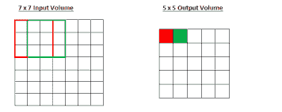
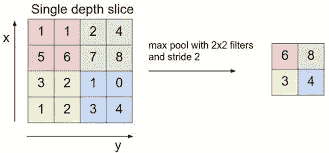
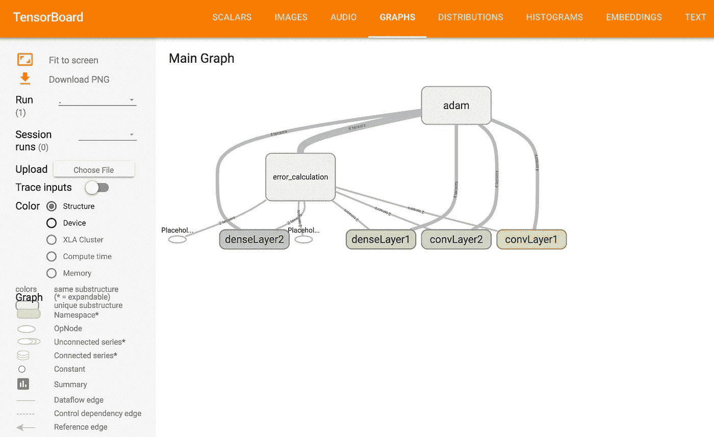

# 更深层次:卷积神经网络

> 原文：<https://medium.com/hackernoon/deeper-still-convolutional-neural-networks-495efdbba435>

两周前，我们通过构建一个完整的神经网络开始了我们的机器研究。但按照深度学习的标准，这个网络仍然非常简单。在这篇文章中，我们将解决一个更加困难的问题:图像识别。当然，我们仍将使用众所周知的数据集和众所周知的结果，所以这只是冰山一角。我们将使用 [MNIST 数据集](http://yann.lecun.com/exdb/mnist/)。该集合将手写数字图像分类为数字 0-9。这个问题是如此众所周知，以至于张量流的人们将其称为机器学习的“你好世界”。

我们将使用与 Iris 数据集非常相似的方法来解决这个问题。我们将制作一个具有两层的全连接神经网络，然后使用“Adam”优化器。按照我们初学者的标准，这会给我们一些不错的结果。但是 MNIST 是一个众所周知的问题，有着非常大的数据集。所以这一次我们要保持更高的精确度。这将迫使我们使用一些更先进的技术。但是首先，让我们检查一下我们需要改变什么来使我们的 Iris 模型适用于 MNIST 问题。和过去几周一样，如果你想继续学习，这一切的代码都在 Github 上。

# 重复使用和回收！

一般来说，我们可以重用 Iris 的大部分代码，这是个好消息！尽管如此，我们仍然需要在一些地方做一些调整。首先，我们将使用一些不同的常数。我们将用`mnistFeatures`代替`irisFeatures`，用`mnistLabels`代替`irisLabels`。我们还将增加隐藏层的大小和每次迭代中要绘制的样本数:

```
mnistFeatures :: Int64
mnistFeatures = 784mnistLabels :: Int64
mnistLabels = 10numHiddenUnits :: Int64
numHiddenUnits = 1024sampleSize :: Int
sampleSize = 1000
```

我们还将改变我们的模型，使用`Word8`作为结果类型，而不是`Int64`。

```
data Model = Model
 { train :: TensorData Float
         -> TensorData Word8 -- Used to be Int64
         -> Session ()
 , errorRate :: TensorData Float
             -> TensorData Word8 -- Used to be Int64
             -> SummaryTensor
             -> Session (Float, ByteString)
 }
```

现在，我们必须改变获取输入数据的方式。这次我们的数据不是 CSV 格式的。我们将使用张量流库中的辅助函数来提取图像和标签:

```
import TensorFlow.Examples.MNIST.Parse (readMNISTSamples, readMNISTLabels)
…
runDigits :: FilePath -> FilePath -> FilePath -> FilePath -> IO ()
runDigits trainImageFile trainLabelFile testImageFile testLabelFile = 
 withEventWriter eventsDir $ \eventWriter -> runSession $ do -- trainingImages, testImages :: [Vector Word8]
   trainingImages <- liftIO $ readMNISTSamples trainImageFile
   testImages <- liftIO $ readMNISTSamples testImageFile -- traininglabels, testLabels :: [Word8]
   trainingLabels <- liftIO $ readMNISTLabels trainLabelFile
   testLabels <- liftIO $ readMNISTLabels testLabelFile -- trainingRecords, testRecords :: Vector (Vector Word8, Word8)
   let trainingRecords = fromList $ zip trainingImages trainingLabels
   let testRecords = fromList $ zip testImages testLabels
   ...
```

我们的“输入”类型由`Word8`元素的向量组成。这些代表各种像素的强度。我们的“输出”类型是`Word8`，指的是实际的标签(0-9)。我们从不同的文件中读取图像和标签。然后我们将它们压缩在一起，传递给我们的处理函数。我们必须对这个数据集的这些处理函数进行一些修改。首先，我们必须概括随机化函数的类型:

```
-- Used to be IrisRecord Specific
chooseRandomRecords :: Vector a -> IO (Vector a)
```

接下来，我们必须编写一个新的编码函数，将我们的数据转换成`TensorData`格式。这看起来像我们的旧版本，除了处理新的元组类型而不是`IrisRecord`。

```
convertDigitRecordsToTensorData 
 :: Vector (Vector Word8, Word8)
 -> (TensorData Float, TensorData Word8)
convertDigitRecordsToTensorData records = (input, output)
 where
   numRecords = Data.Vector.length records 
   input = encodeTensorData [fromIntegral numRecords, mnistFeatures]
     (fromList $ concatMap recordToInputs records)
   output = encodeTensorData [fromIntegral numRecords] (snd <$> records)
   recordToInputs :: (Vector Word8, Word8) -> [Float]
   recordToInputs rec = fromIntegral <$> (toList . fst) rec
```

然后，我们只需替换我们的新功能和参数，我们将能够运行我们的数字训练器！

```
Current training error 89.8
Current training error 19.300001
Current training error 13.300001
Current training error 11.199999
Current training error 8.700001
Current training error 6.5999985
Current training error 6.999999
Current training error 5.199999
Current training error 4.400003
Current training error 5.000001
Current training error 2.3000002test error 6.830001
```

所以我们的准确率是 93.2%。这似乎是一个不错的数字。但是想象一下，作为一个邮局，你有 6.8%的邮件被分入了错误的邮政编码！(这是该数据集的原始用例)。所以让我们看看我们是否能做得更好。

# 卷积和最大池化

现在我们可以更长时间地训练我们的模型。这将有助于提高我们的错误率。但是我们也可以通过使我们的模型更复杂来帮助我们自己。到目前为止，我们所得到的基本缺陷是，它没有考虑到图像的 2D 性质。这意味着我们正在丢失大量有用的信息。所以我们要做的第一件事是把我们的图像当作 28x28 的张量，而不是 1x784。通过这种方式，我们的模型可以挑选出对识别手指有意义的特定区域。

我们要考虑的一件事是，我们的图像可能不在画面的中心。为了说明这一点，我们将应用卷积。当使用卷积时，我们将图像分解成许多不同的重叠图像块。在我们的例子中，我们将在每个方向上使我们的步幅大小为“1”，并且我们将使用 5x5 的面片大小。因此，这意味着我们将在图像中的每个不同像素周围放置一个 5x5 的图块，然后得出一个分数。这个分数告诉我们这部分图像是否包含任何重要信息。我们可以将这个分数表示为一个具有许多特征的向量。

对于 2D 卷积，我们将处理 4 维张量。第一个维度是样本量。后两个维度是图像的形状。最后一个维度是图像每个部分的“分数”的特征数量。因此，每幅原始图像都以单个特征作为每个像素的“分数”。这个分数就是那个像素的实际强度！然后每一层卷积将充当每个像素的迷你神经网络，生成我们想要的尽可能多的特征。



The different sliding windows correspond to scores we store in the next layer. This example uses 3x3 patches; we’ll use 5x5.

最大池是一种下采样形式。在我们的第一个卷积步骤之后，我们将得到 28x28 图像的分数。我们将使用 2x2 max-pooling，这意味着我们将每个图像分成 2x2 个正方形。然后，我们将创建一个 14x14 的新图层，仅使用每个 2x2 盒子中的“最佳”分数。这使得我们的模型更加高效，同时保留了最重要的信息。



Simple demonstration of max-pooling

# 实现卷积层

我们将进行两轮卷积和最大汇集。因此，我们将创建一个函数来创建执行这两个步骤的层。这将看起来很像我们的其他神经网络层。我们将获取层的输入和输出通道的大小的参数，以及张量本身。因此，我们的第一步将是使用这些参数创建权重和偏差张量:

```
patchSize :: Int64
patchSize = 5buildConvPoolLayer :: Int64 -> Int64 -> Tensor v Float -> Text
                  -> Build (Variable Float, Variable Float, Tensor Build Float)
buildConvPoolLayer inputChannels outputChannels input layerName = withNameScope layerName $ do
 weights <- truncatedNormal (vector weightsShape)
   >>= initializedVariable
 bias <- truncatedNormal (vector [outputChannels]) >>= initializedVariable
 ...
 where
   weightsShape :: [Int64]
   weightsShape = [patchSize, patchSize, inputChannels, outputChannels]
```

现在我们要调用卷积和最大池函数。这些仍然有点粗糙(Haskell 库还很年轻)。这些函数的 C 版本有许多可选的命名属性。目前，似乎没有任何函数对这些参数使用普通的 Haskell 值。相反，我们将使用`OpAttr`值，给值分配字节串名称。

```
where
 ...
 convStridesAttr = opAttr "strides" .~ ([1,1,1,1] :: [Int64])
 poolStridesAttr = opAttr "strides" .~ ([1,2,2,1] :: [Int64])
 poolKSizeAttr = opAttr "ksize" .~ ([1,2,2,1] :: [Int64])
 paddingAttr = opAttr "padding" .~ ("SAME" :: ByteString)
 dataFormatAttr = opAttr "data_format" .~ ("NHWC" :: ByteString)
 convAttrs = convStridesAttr . paddingAttr . dataFormatAttr
 poolAttrs = poolKSizeAttr . poolStridesAttr . paddingAttr . dataFormatAttr
```

卷积的`strides`参数指的是我们每次移动窗口的量。关于合用的`strides`论点指的是我们执行合用的窗口有多大。在这种情况下，它是 2x2。现在我们有了自己的属性，我们可以调用库函数`conv2D’`和`maxPool’`。这就给出了我们的合成矢量。我们还在这些步骤之间加入了对`relu`的调用。

```
buildConvPoolLayer :: Int64 -> Int64 -> Tensor v Float -> Text
                  -> Build (Variable Float, Variable Float, Tensor Build Float)
buildConvPoolLayer inputChannels outputChannels input layerName = withNameScope layerName $ do
 weights <- truncatedNormal (vector weightsShape)
   >>= initializedVariable
 bias <- truncatedNormal (vector [outputChannels]) >>= initializedVariable
 let conv = conv2D' convAttrs input (readValue weights)
       `add` readValue bias
 let results = maxPool' poolAttrs (relu conv)
 return (weights, bias, results)
 where
   ...
```

# 修改我们的模型

现在，我们将对我们的模型进行一些更新，我们将处于良好的状态。首先，我们需要将输入数据整形为四维。然后，我们将应用两个卷积/池层:

```
imageDimen :: Int32
imageDimen = 28createModel :: Build Model
createModel = do
 let batchSize = -1 -- Allows variable sized batches
 let conv1OutputChannels = 32
 let conv2OutputChannels = 64
 let denseInputSize = 7 * 7 * 64 :: Int32 -- 3136
 let numHiddenUnits = 1024 inputs <- placeholder [batchSize, mnistFeatures]
 outputs <- placeholder [batchSize] let inputImage = reshape inputs (vector [batchSize, imageDimen, imageDimen, 1]) (convWeights1, convBiases1, convResults1) <- 
   buildConvPoolLayer 1 conv1OutputChannels inputImage "convLayer1"
 (convWeights2, convBiases2, convResults2) <-
   buildConvPoolLayer conv1OutputChannels conv2OutputChannels convResults1 "convLayer2"
```

完成后，我们将像以前一样应用两个完全连接的(密集)层。请注意，我们将把我们的结果从四维重新调整为二维:

```
let denseInput = reshape convResults2 (vector [batchSize, denseInputSize])
(denseWeights1, denseBiases1, denseResults1) <-
  buildNNLayer (fromIntegral denseInputSize) numHiddenUnits denseInput "denseLayer1"  
let rectifiedDenseResults = relu denseResults1
(denseWeights2, denseBiases2, denseResults2) <-
   buildNNLayer numHiddenUnits mnistLabels rectifiedDenseResults "denseLayer2"
```

之后，我们可以同样对待模型的其余部分。我们将更新参数名称，并向模型可以改变的`params`添加新的权重和偏差。

作为回顾，我们来看看这里每个中间张量的维数。然后我们可以看到对不同操作的维度的限制。每个卷积步骤需要两个四维张量。参数 1 的最后一个维度必须与参数 2 的第三个维度匹配。那么结果将交换到参数 2 的最后一个维度。同时，具有 2×2 步幅大小的池将得到这个 4 维张量，并将每个内部维度减半。

```
input: n x 784
inputImage: n x 28 x 28 x 1
convWeights1: 5 x 5 x 1 x 32
convBias1: 32
conv (first layer): n x 28 x 28 x 32
convResults1: n x 14 x 14 x 32
convWeights2:  5 x 5 x 32 x 64
conv (second layer): n x 14 x 14 x 64
convResults2: n x 7 x 7 x 64
denseInput: n x 3136
denseWeights1: 3136 x 1024
denseBias1: 1024
denseResults1: n x 1024
denseWeights2: 1024 x 10
denseBias2: 10
denseResults2: n x 10
```

所以对于每一个输入，我们会有所有 10 个可能输入的概率。我们挑选其中最大的作为选择的标签。

# 结果

我们将再次运行我们的模型，只是这次我们将使用更小的样本量(每次训练迭代 100)。这允许我们训练更多的迭代(20000)。这需要相当长的时间来训练，但是我们得到了这些结果(每 1000 次迭代打印一次)。

```
Current training error 91.0
Current training error 6.0
Current training error 2.9999971
Current training error 2.9999971
Current training error 0.0
Current training error 0.0
Current training error 0.99999905
Current training error 0.0
Current training error 0.0
Current training error 0.0
Current training error 0.0
Current training error 0.0
Current training error 0.0
Current training error 0.0
Current training error 0.0
Current training error 0.0
Current training error 0.0
Current training error 0.0
Current training error 0.0
Current training error 0.0
Current training error 0.0test error 1.1799991
```

不算太差！一旦它开始运行，我们看到很少的训练错误，尽管仍然以一个有点过拟合的模型结束。张量流 MNIST [专家教程](https://www.tensorflow.org/get_started/mnist/pros)建议使用一个失落因子。这有助于减少过度拟合的影响。但是这个选项在 Haskell 中还不可用。尽管如此，我们还是达到了接近 99%的准确率，这对我们来说是一个成功！

这是我们最终的图表。请注意我们为卷积添加的额外层:



# 结论

这就是卷积神经网络！我们的目标是调整我们以前的神经网络模型来识别数字。我们不仅选择了一个更难的问题，而且我们还想要更高的准确性。我们通过使用更先进的机器学习技术实现了这一点。卷积使我们能够充分利用图像的 2x2 性质。无论手指在图像中的什么位置，它都会检查手指。Max pooling 使我们能够在保留最重要信息的同时提高算法的效率。

如果你想看看 Haskell 还能用张量流做什么，看看我们的[张量流指南](https://www.mmhaskell.com/tensorflow)。它将带您了解让库在本地机器上工作的一些更棘手的部分。它还将介绍您需要了解的关于该库中类型的最重要的信息。

如果您是 Haskell 的新手，在尝试张量流之前，这里有几个资源可供您研究。首先，是我们的[入门清单](https://www.mmhaskell.com/checklist)。这将为你指出一些有助于学习语言的资源。接下来，您可以查看我们的[堆栈迷你课程](http://academy.mondaymorninghaskell.com/p/your-first-haskell-project)，这样您就可以学习如何组织项目！如果想在 Haskell 中使用张量流，Stack 是必须的！