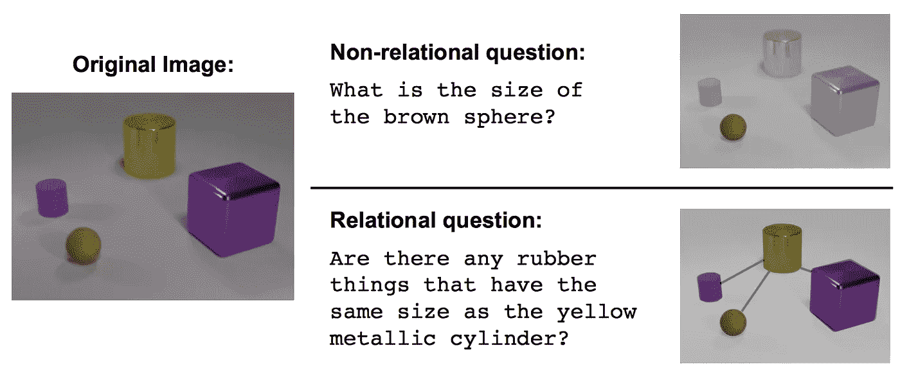
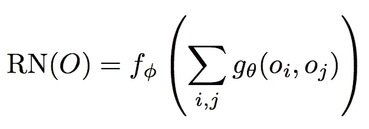
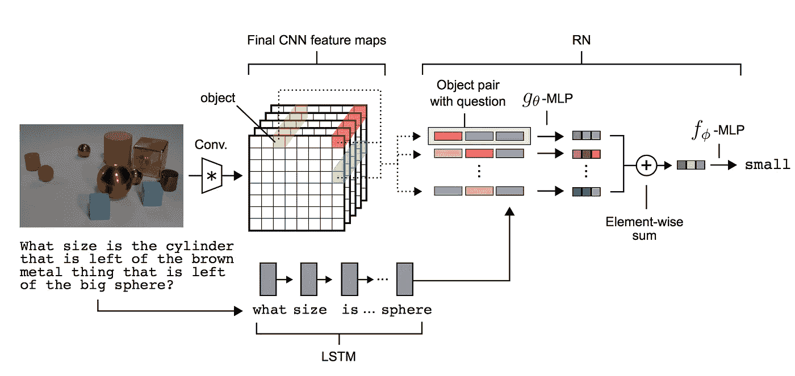
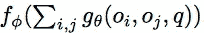
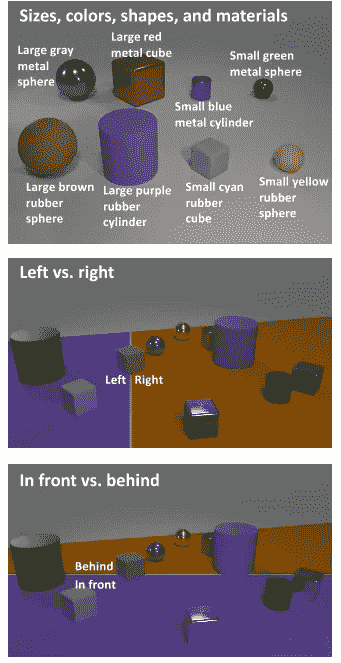

# DeepMind 的关系推理网络——去神秘化

> 原文：<https://medium.com/hackernoon/deepmind-relational-networks-demystified-b593e408b643>

> 这篇文章获得了 [KDNuggets 银奖](http://www.kdnuggets.com/2017/08/deepmind-relational-reasoning-networksdemystified.html)，也是 2017 年 8 月[最具病毒的帖子](http://www.kdnuggets.com/2017/09/top-stories-2017-aug.html)

每次 DeepMind 发表一篇新论文，都会有媒体疯狂报道。你经常会读到一些误导性的短语。例如，其关于关系推理网络的新论文有 [futurism](https://futurism.com/deepmind-develops-a-neural-network-that-can-make-sense-of-objects-around-it/) 这样报道

> DeepMind 开发了一个神经网络，可以理解周围的物体。

这不仅是误导，而且也让日常生活中的非博士人士感到害怕。在这篇文章中，我将浏览这篇文章，试图用简单的术语解释这个新的架构。

原文[可以在这里](https://arxiv.org/pdf/1706.01427.pdf)找到。

*本文假设关于* ***神经网络*** *的一些基础知识。*

# 这篇文章的结构

我会尽可能遵循论文的结构。我将在材料中加入我自己的想法。

# 什么是关系推理？

最简单的形式，关系推理就是[学习](https://hackernoon.com/tagged/learning)理解不同对象(想法)之间的关系。这被认为是智力的基本特征。作者提供了一个有用的信息图表来解释它是什么

*Figure1.0 The model has to look at objects of different shape/size/color, and be able to answer questions that are related between multiple such objects.*

# 关系网络

作者提出了一种神经[网络](https://hackernoon.com/tagged/network)，它被制作成固有地捕捉关系(例如，卷积神经网络被制作成捕捉图像的属性)。他们展示了一个这样定义的架构:

*Equation1.0 Definition of Relational Networks*

## 解释

o 的关系网络( *O 是你要学习的对象的集合*的关系)是一个函数 *fɸ.*

*gθ* 是另一个接受两个对象的函数:o *i* 和 o *j* 。 *gθ* 的输出就是我们关注的‘关系’。

σI，j 的意思是，对所有可能的物体对计算 gθ，然后求和。

# 神经网络和功能

当学习神经网络、反向传播等时，很容易忘记这一点。但是神经网络实际上是一个**单一的数学函数**！因此，我在等式 1.0 中描述的函数是一个神经网络！。更准确地说，有两个神经网络:

1.  *gθ，*计算一对对象之间的关系
2.  *fɸ，*，取所有 *gθ，*之和，计算模型的最终输出

在最简单的情况下， *gθ* 和 *fɸ* 都是多层感知器。

# 关系神经网络是灵活的

作者将关系神经网络呈现为一个模块。它可以接受编码对象并从中学习关系，但更重要的是，它们可以插入卷积神经网络和长短期记忆网络(LSTM)。

卷积网络可以用来学习使用图像的对象。这使得它对应用程序更有用，因为在图像上推理比在用户定义的对象数组上推理更有用。

LSTMs 连同单词嵌入可用于理解模型被询问的查询的含义。这也是更有用的，因为模型现在可以接受一个英语句子，而不是编码的数组。

作者提出了一种结合关系网络、卷积网络和 LSTMs 来构建能够学习对象之间关系的端到端神经网络的方法。

*Figure 2.0 An end to end relational reasoning neural network.*

# **图 2.0 说明**

图像通过一个标准的卷积神经网络(CNN)，它可以在 *k* 过滤器中提取图像的特征。关系网络的“对象”是网格中每个点的特征向量。例如，一个“对象”是黄色矢量。

该问题通过 LSTM 传递，后者产生该问题的特征向量。这大致就是那个问题的‘思路’。

这稍微修改了原来的等式 1.0。它增加了另一个术语

Equation1.0 Relational Network conditioned using LSTM

注意等式 1.0 中多出来的 *q* 。那个 *q* 是 LSTM 的最终状态。这些关系现在由*使用 *q* 来限定*。

之后，来自 CNN 的“对象”和来自 LSTM 的向量被用于训练关系网络。每个对象对与来自 LSTM 的问题向量一起被提取，并且这些被用作 *gθ(* 这是一个神经网络*)的输入。*

然后将 gθ的输出相加，并用作 fɸ(which 另一个神经网络的输入。然后 fɸ选择了这个问题的答案。

# 基准

作者在几个数据集上证明了该模型的有效性。我将介绍其中一个(在我看来也是最值得注意的)——CLEVR 数据集。

CLEVR 数据集由不同形状、大小和颜色的对象图像组成。模型被问到关于这些图像的问题，例如:

> 立方体和圆柱体是同一种材料吗？

*Figure 3.0* The types of objects(top),and the positioning scheme (centre&bottom)

作者指出，在准确性方面，其他系统远远落后于他们自己的模型。这是因为关系网络旨在捕捉关系。

他们的模型达到了前所未有的 96%以上的准确率，相比之下只有 75%(使用堆叠注意力模型)

Figure3.1 Comparison between different architectures on the CLEVR dataset using pixels(i.e. not matrix encoded)

# 结论

关系网络非常擅长学习关系。他们以数据高效的方式这样做。它们也很灵活，可以在使用 CNN 和/或 LSTMs 时作为解决方案的一部分。

这篇文章是关于揭穿由非常大的出版物引起的“人工智能已经接管”的炒作，并给出一些关于当前艺术状态的观点。

# 附言

如果你注意到任何错误，或者想要任何修改，请通过回复让我知道。欢迎你的建议。

如果你喜欢这篇文章，请点击❤按钮推荐给其他人。

> [黑客中午](http://bit.ly/Hackernoon)是黑客如何开始他们的下午。我们是 [@AMI](http://bit.ly/atAMIatAMI) 家庭的一员。我们现在[接受投稿](http://bit.ly/hackernoonsubmission)，并乐意[讨论广告&赞助](mailto:partners@amipublications.com)机会。
> 
> 如果你喜欢这个故事，我们推荐你阅读我们的[最新科技故事](http://bit.ly/hackernoonlatestt)和[趋势科技故事](https://hackernoon.com/trending)。直到下一次，不要把世界的现实想当然！

